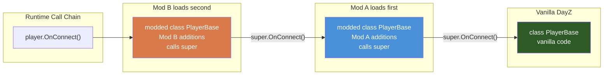

# Modded Classes (The Key to DayZ Modding)

> **Summary:** The `modded class` keyword lets your mod insert itself into the inheritance chain of any existing game class — adding fields, overriding methods, and chaining with other mods — without replacing the original files. This chapter covers the mechanics, the classes every mod hooks into, `#ifdef` guards for optional dependencies, and the rules that keep your mod from breaking everyone else's.

---

## Introduction

**Modded classes are the single most important concept in DayZ modding.** They are the mechanism that allows your mod to change the behavior of existing game classes without replacing the original files. Without modded classes, DayZ modding as we know it would not exist.

Large public mods such as Community Online Tools, VPP Admin Tools, and DayZ Expansion are built almost entirely from modded classes — and so is every trader mod, medical overhaul, and building system. When you mod `PlayerBase`, every player in the game gets your new behavior. When you mod `MissionServer`, your code runs as part of the server's mission lifecycle. When you mod `ItemBase`, every item in the game is affected.

This chapter is intentionally the longest and most detailed in Part 1 because getting modded classes right is what separates a working mod from one that crashes servers or breaks other mods.

---

## How Modded Classes Work

### The Basic Idea

Normally, `class Child extends Parent` creates a new class named `Child` that inherits from `Parent`. But `modded class Parent` does something fundamentally different: it **replaces** the original `Parent` class in the engine's class hierarchy, inserting your code into the inheritance chain.

```
Before modding:
  Parent -> (all code that creates Parent gets the original)

After modded class:
  Original Parent -> Your Modded Parent
  (all code that creates Parent now gets YOUR version)
```

Every `new Parent()` call anywhere in the game --- vanilla code, other mods, everywhere --- now creates an instance of your modded version.

### Syntax

```c
modded class ClassName
{
    // Your additions and overrides go here
}
```

That is it. No `extends`, no new name. The `modded` keyword tells the engine: "I am modifying the existing class `ClassName`."

### The Canonical Example

```c
// === Original vanilla class (in DayZ's scripts) ===
class ModMe
{
    void Say()
    {
        Print("Hello from the original");
    }
}

// === Your mod's script file ===
modded class ModMe
{
    override void Say()
    {
        Print("Hello from the mod");
        super.Say();  // Call the original
    }
}

// === What happens at runtime ===
void Test()
{
    ModMe obj = new ModMe();
    obj.Say();
    // Output:
    //   "Hello from the mod"
    //   "Hello from the original"
}
```

---

## Chaining: Multiple Mods Modding the Same Class

The real power of modded classes is that **multiple mods can modify the same class**, and they all chain together automatically. The engine processes mods in load order, and each `modded class` inherits from the previous one.

```c
// === Vanilla ===
class ModMe
{
    void Say()
    {
        Print("Original");
    }
}

// === Mod A (loaded first) ===
modded class ModMe
{
    override void Say()
    {
        Print("Mod A");
        super.Say();  // Calls original
    }
}

// === Mod B (loaded second) ===
modded class ModMe
{
    override void Say()
    {
        Print("Mod B");
        super.Say();  // Calls Mod A's version
    }
}

// === At runtime ===
void Test()
{
    ModMe obj = new ModMe();
    obj.Say();
    // Output (reverse load order):
    //   "Mod B"
    //   "Mod A"
    //   "Original"
}
```

This is why **always calling `super`** is critical. If Mod A does not call `super.Say()`, then the original `Say()` never runs. If Mod B does not call `super.Say()`, then Mod A's `Say()` never runs. One mod skipping `super` breaks the entire chain.

### Visual Representation

```
new ModMe() creates an instance with this inheritance chain:

  ModMe (Mod B's version)      <-- Instantiated
    |
    super -> ModMe (Mod A's version)
               |
               super -> ModMe (Original vanilla)
```

### How Modded Classes Work



---

## What You Can Do in a Modded Class

### 1. Override Existing Methods

The most common use. Add behavior before or after the vanilla code.

```c
modded class PlayerBase
{
    override void Init()
    {
        super.Init();  // Let vanilla initialization happen first
        Print("[Lantern] Player initialized: " + GetType());
    }
}
```

### 2. Add New Fields (Member Variables)

Extend the class with new data. Every instance of the modded class will have these fields.

```c
modded class PlayerBase
{
    protected int m_LNT_KillStreak;
    protected float m_LNT_LastKillTime;
    protected ref array<string> m_LNT_Achievements;

    override void Init()
    {
        super.Init();
        m_LNT_KillStreak = 0;
        m_LNT_LastKillTime = 0;
        m_LNT_Achievements = new array<string>;
    }
}
```

### 3. Add New Methods

Add entirely new functionality that other parts of your mod can call.

```c
modded class PlayerBase
{
    protected int m_LNT_Reputation;

    override void Init()
    {
        super.Init();
        m_LNT_Reputation = 0;
    }

    void LNT_AddReputation(int amount)
    {
        m_LNT_Reputation += amount;
        if (m_LNT_Reputation > 1000 && GetIdentity())
            Print("[Lantern] " + GetIdentity().GetName() + " is now a legend!");
    }

    int LNT_GetReputation()
    {
        return m_LNT_Reputation;
    }

    bool LNT_IsHeroStatus()
    {
        return m_LNT_Reputation >= 500;
    }
}
```

### 4. Access Private Members of the Original Class

Unlike normal inheritance where `private` members are inaccessible, **modded classes CAN access private members** of the original class. This is a special rule of the `modded` keyword.

```c
// Vanilla class
class VanillaClass
{
    private int m_SecretValue;

    private void DoSecretThing()
    {
        Print("Secret!");
    }
}

// Modded class CAN access private members
modded class VanillaClass
{
    void ExposeSecret()
    {
        Print(m_SecretValue);  // OK! Modded classes bypass private
        DoSecretThing();       // OK! Can call private methods too
    }
}
```

This is powerful but should be used carefully. Private members are private for a reason --- they may change between DayZ updates.

### 5. Add New Constants

A modded class can declare new constants alongside the original ones. Shipped mods use this heavily to extend vanilla registries (particle lists, RPC ID tables, and similar) with `static const` members:

```c
// Vanilla
class GameTuning
{
    const int MAX_SLOTS = 4;
}

// Modded
modded class GameTuning
{
    const int LNT_EXTRA_SLOTS = 2;  // New constant added by the mod

    int LNT_GetTotalSlots()
    {
        return MAX_SLOTS + LNT_EXTRA_SLOTS;
    }
}
```

If you need to change a value that vanilla code derives from one of its own constants, do not try to redefine the constant --- override the **method** that uses it instead. That keeps the change visible, chainable by other mods, and independent of how the engine resolves constant lookups.

---

## Common Modded Targets

These are the classes that virtually every DayZ mod hooks into. Understanding what each one offers is essential.

### MissionServer

Runs on the dedicated server. Handles server startup, player connections, and the game loop.

```c
modded class MissionServer
{
    override void OnInit()
    {
        super.OnInit();

        // Initialize your server-side systems here
        Print("[Lantern] Server systems initialized");
    }

    override void OnMissionStart()
    {
        super.OnMissionStart();
        Print("[Lantern] Mission started");
    }

    override void OnMissionFinish()
    {
        // Clean up BEFORE super (super may tear down systems we depend on)
        Print("[Lantern] Mission shutting down");

        super.OnMissionFinish();
    }

    // Called when a player connects
    override void InvokeOnConnect(PlayerBase player, PlayerIdentity identity)
    {
        super.InvokeOnConnect(player, identity);

        if (identity)
            Print("[Lantern] Player connected: " + identity.GetName());
    }

    // Called when a player disconnects
    override void InvokeOnDisconnect(PlayerBase player)
    {
        if (player && player.GetIdentity())
            Print("[Lantern] Player disconnected: " + player.GetIdentity().GetName());

        super.InvokeOnDisconnect(player);
    }

    // Called every server tick
    override void OnUpdate(float timeslice)
    {
        super.OnUpdate(timeslice);

        // Per-tick server work goes here (keep it cheap!)
    }
}
```

### MissionGameplay

Runs on the client. Handles client-side UI, input, and rendering hooks.

```c
// A minimal client-side helper so the example below is complete
class LNT_HintPanel
{
    protected bool m_Visible;

    void Toggle()
    {
        m_Visible = !m_Visible;
        if (m_Visible)
            Print("[Lantern] Hint panel shown");
        else
            Print("[Lantern] Hint panel hidden");
    }

    void Update(float timeslice)
    {
        // Animate widgets, drain a message queue, etc.
    }
}

modded class MissionGameplay
{
    protected ref LNT_HintPanel m_LNT_HintPanel;

    override void OnInit()
    {
        super.OnInit();

        m_LNT_HintPanel = new LNT_HintPanel();
        Print("[Lantern] Client HUD initialized");
    }

    override void OnUpdate(float timeslice)
    {
        super.OnUpdate(timeslice);

        if (m_LNT_HintPanel)
            m_LNT_HintPanel.Update(timeslice);
    }

    override void OnKeyPress(int key)
    {
        super.OnKeyPress(key);

        // Toggle the custom panel on F5
        if (key == KeyCode.KC_F5)
        {
            if (m_LNT_HintPanel)
                m_LNT_HintPanel.Toggle();
        }
    }

    override void OnMissionFinish()
    {
        m_LNT_HintPanel = null;

        super.OnMissionFinish();
    }
}
```

### PlayerBase

The player class. Every living player in the game is an instance of `PlayerBase` (or a subclass like `SurvivorBase`). Modding this class is how you add per-player features.

```c
modded class PlayerBase
{
    protected bool m_LNT_GodMode;
    protected float m_LNT_MinuteTimer;

    override void Init()
    {
        super.Init();
        m_LNT_GodMode = false;
        m_LNT_MinuteTimer = 0;
    }

    // Called every frame for this player
    override void CommandHandler(float pDt, int pCurrentCommandID, bool pCurrentCommandFinished)
    {
        super.CommandHandler(pDt, pCurrentCommandID, pCurrentCommandFinished);

        // Server-side per-player tick
        if (GetGame().IsServer())
        {
            m_LNT_MinuteTimer += pDt;
            if (m_LNT_MinuteTimer >= 60.0)  // Every 60 seconds
            {
                m_LNT_MinuteTimer = 0;
                LNT_OnMinuteElapsed();
            }
        }
    }

    void LNT_SetGodMode(bool enabled)
    {
        m_LNT_GodMode = enabled;
    }

    // Override damage to implement god mode
    override void EEHitBy(TotalDamageResult damageResult, int damageType, EntityAI source, int component, string dmgZone, string ammo, vector modelPos, float speedCoef)
    {
        if (m_LNT_GodMode)
            return;  // Skip damage entirely

        super.EEHitBy(damageResult, damageType, source, component, dmgZone, ammo, modelPos, speedCoef);
    }

    protected void LNT_OnMinuteElapsed()
    {
        // Custom periodic logic
    }
}
```

### ItemBase

The base class for all items. Modding this affects every item in the game.

```c
modded class ItemBase
{
    override void SetActions()
    {
        super.SetActions();

        // This is where user actions are registered with AddAction(...).
        // Because this override runs for EVERY item type in the game,
        // anything you register here appears on all items. Writing a
        // custom action class is a topic of its own.
    }

    override void EEItemLocationChanged(notnull InventoryLocation oldLoc, notnull InventoryLocation newLoc)
    {
        super.EEItemLocationChanged(oldLoc, newLoc);

        // Track when items move
        Print(string.Format("[Lantern] %1 moved from %2 to %3", GetType(), oldLoc.GetType(), newLoc.GetType()));
    }
}
```

### DayZGame

The global game class. Available throughout the entire game lifecycle.

```c
modded class DayZGame
{
    void DayZGame()
    {
        // Constructor: very early initialization
        Print("[Lantern] DayZGame constructor - extremely early init");
    }

    override void OnUpdate(bool doSim, float timeslice)
    {
        super.OnUpdate(doSim, timeslice);

        // Global update tick (both client and server)
    }
}
```

### CarScript

The base vehicle class. Mod it to change all vehicle behavior.

```c
modded class CarScript
{
    protected float m_LNT_BoostMultiplier;

    override void OnEngineStart()
    {
        super.OnEngineStart();
        m_LNT_BoostMultiplier = 1.0;
        Print("[Lantern] Vehicle engine started: " + GetType());
    }

    override void OnEngineStop()
    {
        super.OnEngineStop();
        Print("[Lantern] Vehicle engine stopped: " + GetType());
    }
}
```

---

## `#ifdef` Guards for Optional Dependencies

When your mod optionally supports another mod, use preprocessor guards. If the other mod declares a symbol in its `config.cpp` (via the `defines[]` array in `CfgMods`), you can check for it at compile time.

> **A note on the examples:** the guarded code below references `LNT_*` classes from the **Lantern framework** — the fictional mod family this wiki uses for all worked examples (its subsystems are built out in full in Part 7). Those classes are deliberately *not* defined in this chapter: that is exactly what the guard is for. A guarded line only compiles when the mod that defines the symbol (and ships the class) is actually loaded.

### How It Works

A mod declares its preprocessor symbols explicitly through the `defines[]` array inside its `CfgMods` entry. For example, if the Lantern AI package has:

```cpp
class CfgMods
{
    class Lantern_AI
    {
        type = "mod";
        defines[] = { "LANTERN_AI" };
        // ...
    };
};
```

Then `#ifdef LANTERN_AI` will be `true` when that mod is loaded.

Note that `CfgPatches` class names register a mod's addon content but do **not** create `#ifdef` symbols --- only `defines[]` does. The symbol names are chosen by the mod author and need not match any class name, so the convention varies --- check the mod's documentation or `config.cpp`.

### Basic Pattern

```c
modded class PlayerBase
{
    override void Init()
    {
        super.Init();

        // This code ONLY compiles when a mod defining LANTERN_AI is present
        #ifdef LANTERN_AI
        LNT_AIManager manager = LNT_AIManager.GetInstance();
        if (manager)
            manager.RegisterPlayer(this);
        #endif
    }
}
```

### Server vs Client Guards

```c
modded class MissionBase
{
    override void OnInit()
    {
        super.OnInit();

        // Server-only code
        #ifdef SERVER
            InitServerSystems();
        #endif

        // Client-only code (also runs on listen-server host)
        #ifndef SERVER
            InitClientHUD();
        #endif
    }

    #ifdef SERVER
    protected void InitServerSystems()
    {
        Print("[Lantern] Server systems started");
    }
    #endif

    #ifndef SERVER
    protected void InitClientHUD()
    {
        Print("[Lantern] Client HUD started");
    }
    #endif
}
```

### Multi-Mod Compatibility

Here is the same mechanic used across two mods. **NightPatrol** (a second fictional mod, prefix `NP_`) adds a bounty system, and optionally integrates with the Lantern framework when it is loaded:

```c
modded class PlayerBase
{
    protected int m_NP_BountyPoints;

    override void Init()
    {
        super.Init();
        m_NP_BountyPoints = 0;
    }

    void NP_AddBounty(int amount)
    {
        m_NP_BountyPoints += amount;

        // If Lantern is loaded, use its toast helper for a styled notification
        #ifdef LANTERN_CORE
        LNT_Toast.Show(this, "Bounty", string.Format("+%1 points", amount));
        #else
        // Fallback: vanilla notification system
        NotificationSystem.SendNotificationToPlayerExtended(this, 5, "Bounty", string.Format("+%1 points", amount), "");
        #endif

        // If Lantern's market mod is loaded, credit the player's balance
        #ifdef LANTERN_MARKET
        // Call the market API here - the block only compiles when
        // the mod that defines LANTERN_MARKET (and its classes) is loaded.
        #endif
    }
}
```

---

## Production Patterns

The four patterns below are the shapes you will meet again and again in working mods. All the example code belongs to **Lantern**, this wiki's constructed teaching framework (built out fully in Part 7) --- each example defines the minimal version of the helper classes it needs, so the code is complete as shown.

### Pattern 1: Non-Destructive Method Wrapping

Do work *around* `super`, never instead of it. The modded class stays a thin hook; the real logic lives in a plain class that is easy to test and reuse:

```c
class LNT_SessionTracker
{
    protected ref map<string, float> m_ConnectTimes;

    void LNT_SessionTracker()
    {
        m_ConnectTimes = new map<string, float>;
    }

    void OnPlayerConnecting(PlayerIdentity identity)
    {
        // Record when the connection began (tick time in seconds)
        m_ConnectTimes.Set(identity.GetId(), GetGame().GetTickTime());
    }

    void OnPlayerReady(PlayerIdentity identity)
    {
        Print("[Lantern] Session started for " + identity.GetName());
    }
}

modded class MissionServer
{
    protected ref LNT_SessionTracker m_LNT_Sessions;

    override void OnInit()
    {
        super.OnInit();  // All vanilla init happens first

        m_LNT_Sessions = new LNT_SessionTracker();
    }

    override void InvokeOnConnect(PlayerBase player, PlayerIdentity identity)
    {
        // Pre-processing, before vanilla and other mods
        if (identity)
            m_LNT_Sessions.OnPlayerConnecting(identity);

        // Then let vanilla (and every other mod in the chain) handle it
        super.InvokeOnConnect(player, identity);

        // Post-processing
        if (identity)
            m_LNT_Sessions.OnPlayerReady(identity);
    }
}
```

### Pattern 2: Conditional Compilation of a Whole Override

Sometimes an entire `modded class` should only exist in certain load-outs. Suppose Lantern bundles a lightweight notification panel, but a standalone "Lantern Notifications" mod (which defines `LANTERN_NOTIFICATIONS`) ships a full-featured replacement. Guarding the whole modded class prevents the two from colliding:

```c
class LNT_NotificationPanel
{
    void OnUpdate(float timeslice)
    {
        // Drain a queue, fade widgets, etc.
    }
}

#ifndef LANTERN_NOTIFICATIONS
modded class MissionGameplay
{
    protected ref LNT_NotificationPanel m_LNT_Panel;

    override void OnInit()
    {
        super.OnInit();
        m_LNT_Panel = new LNT_NotificationPanel();
    }

    override void OnUpdate(float timeslice)
    {
        super.OnUpdate(timeslice);

        if (m_LNT_Panel)
            m_LNT_Panel.OnUpdate(timeslice);
    }
}
#endif
```

Note the `#ifndef LANTERN_NOTIFICATIONS` guard --- when the standalone notifications mod is loaded, this fallback override is never compiled at all, so there is no duplicate panel and no wasted per-frame work.

### Pattern 3: Event Injection

Instead of letting every feature mod override `EEKilled` itself, inject the event **once** and broadcast it through a `ScriptInvoker`. Other systems subscribe without ever touching `PlayerBase`:

```c
class LNT_EventBus
{
    protected static ref LNT_EventBus s_Instance;

    ref ScriptInvoker OnPlayerKilled = new ScriptInvoker();

    static LNT_EventBus Get()
    {
        if (!s_Instance)
            s_Instance = new LNT_EventBus();
        return s_Instance;
    }
}

modded class PlayerBase
{
    override void EEKilled(Object killer)
    {
        super.EEKilled(killer);

        // Broadcast to every subscriber - none of them need to mod PlayerBase
        LNT_EventBus.Get().OnPlayerKilled.Invoke(this, killer);
    }
}

// Any system can now listen without touching PlayerBase:
class LNT_KillFeed
{
    void LNT_KillFeed()
    {
        LNT_EventBus.Get().OnPlayerKilled.Insert(OnPlayerKilled);
    }

    void OnPlayerKilled(PlayerBase victim, Object killer)
    {
        Print("[Lantern] Kill feed: " + victim.GetType() + " was killed");
    }
}
```

The event-bus pattern (including cleanup and unsubscription rules) is covered in depth in [Events & ScriptInvoker](../07-patterns/06-events.md).

### Pattern 4: Feature Registration

Keep initialization centralized: features register themselves with a manager, and a single modded hook initializes them all in one place. Constructors run when the class is first created, so they are the earliest safe place to register:

```c
class LNT_Module
{
    void OnServerInit()
    {
    }
}

class LNT_WeatherModule : LNT_Module
{
    override void OnServerInit()
    {
        Print("[Lantern] Weather module online");
    }
}

class LNT_ModuleManager
{
    protected static ref array<ref LNT_Module> s_Modules = new array<ref LNT_Module>;

    static void Register(LNT_Module module)
    {
        s_Modules.Insert(module);
    }

    static void InitAll()
    {
        foreach (LNT_Module module : s_Modules)
        {
            module.OnServerInit();
        }
    }
}

modded class MissionServer
{
    void MissionServer()
    {
        // Constructor: runs when the mission object is created,
        // before OnInit(). Register features as early as possible.
        LNT_ModuleManager.Register(new LNT_WeatherModule());
    }

    override void OnInit()
    {
        super.OnInit();

        // One central place initializes every registered feature
        LNT_ModuleManager.InitAll();
    }
}
```

The full module-manager design (lifecycle, ordering, client/server splits) is covered in [Module Systems](../07-patterns/02-module-systems.md).

---

## Rules and Best Practices

### Rule 1: ALWAYS Call `super`

Unless you have a deliberate, well-understood reason to completely replace parent behavior, always call `super`. Failing to do so breaks the mod chain and can crash servers.

```c
// The GOLDEN RULE of modded classes
modded class AnyClass
{
    override void AnyMethod()
    {
        super.AnyMethod();  // ALWAYS unless you intentionally replace
        // Your code here
    }
}
```

When you do intentionally skip `super`, document why:

```c
modded class PlayerBase
{
    // Intentionally NOT calling super to completely disable fall damage
    // WARNING: This will also prevent other mods from running their fall damage code
    override void EEHitBy(TotalDamageResult damageResult, int damageType, EntityAI source, int component, string dmgZone, string ammo, vector modelPos, float speedCoef)
    {
        // Check if this is fall damage
        if (ammo == "FallDamage")
            return;  // Silently ignore

        // For all other damage, call the normal chain
        super.EEHitBy(damageResult, damageType, source, component, dmgZone, ammo, modelPos, speedCoef);
    }
}
```

### Rule 2: Initialize New Fields in the Right Override

When adding fields to a modded class, initialize them in the appropriate lifecycle method, not just anywhere:

| Class | Initialize in | Why |
|-------|--------------|-----|
| `PlayerBase` | `override void Init()` | Called from the constructor when the player entity is created |
| `ItemBase` | constructor or `override void InitItemVariables()` | Item creation |
| `MissionServer` | `override void OnInit()` | Server mission startup |
| `MissionGameplay` | `override void OnInit()` | Client mission startup |
| `DayZGame` | constructor `void DayZGame()` | Earliest possible point |
| `CarScript` | constructor or `override void EOnInit(IEntity other, int extra)` | Vehicle creation |

### Rule 3: Guard Against Null

In modded classes, you often work with objects that may not be initialized yet (because you are running before or after other code):

```c
modded class PlayerBase
{
    override void CommandHandler(float pDt, int pCurrentCommandID, bool pCurrentCommandFinished)
    {
        super.CommandHandler(pDt, pCurrentCommandID, pCurrentCommandFinished);

        // Always check: is this running on the server?
        if (!GetGame().IsServer())
            return;

        // Always check: is the player alive?
        if (!IsAlive())
            return;

        // Always check: does the player have an identity?
        PlayerIdentity identity = GetIdentity();
        if (!identity)
            return;

        // Now it is safe to use identity
        string uid = identity.GetPlainId();
    }
}
```

### Rule 4: Do Not Break Other Mods

Your modded class is part of a chain. Respect the contract:

- Do not swallow events silently (always call `super` unless deliberately overriding)
- Do not overwrite fields that other mods might have set (add your own fields instead)
- Use `#ifdef` guards for optional dependencies
- Test with other popular mods loaded

### Rule 5: Use Descriptive Field Prefixes

When adding fields to a modded class, prefix them with your mod's tag to avoid collisions with other mods adding fields to the same class. The Lantern examples in this wiki use `m_LNT_*`; pick your own short prefix and use it everywhere:

```c
modded class PlayerBase
{
    // BAD: generic name, might collide with another mod
    protected int m_Points;

    // GOOD: mod-specific prefix
    protected int m_LNT_Points;
    protected float m_LNT_LastSync;
    protected ref array<string> m_LNT_Unlocks;
}
```

---

## Common Mistakes

### 1. Not Calling `super` (The #1 Mod-Breaking Bug)

This cannot be emphasized enough. Every time you see a bug report that says "Mod X broke when I added Mod Y," the first thing to check is whether someone forgot to call `super`.

```c
// THIS BREAKS EVERYTHING DOWNSTREAM
modded class MissionServer
{
    override void OnInit()
    {
        // NO super.OnInit() call!
        // Every mod loaded before this one has its OnInit skipped
        Print("My mod started!");
    }
}
```

### 2. Overriding a Method That Does Not Exist

If you try to `override` a method that does not exist in the parent class, you get a compile error. This usually happens when:
- You misspelled the method name
- You are overriding a method from the wrong class
- A DayZ update renamed or removed the method

```c
modded class PlayerBase
{
    // ERROR: no such method in PlayerBase
    // override void OnPlayerSpawned()

    // CORRECT method name:
    override void OnConnect()
    {
        super.OnConnect();
    }
}
```

### 3. Modding the Wrong Class

A common beginner mistake is modding a class that seems right by name but is in the wrong script layer:

```c
// WRONG: MissionBase is the abstract base -- your hooks here may not fire
// when you expect them to
modded class MissionBase
{
    override void OnInit()
    {
        super.OnInit();
        // This runs for ALL mission types -- but is it what you want?
    }
}

// RIGHT: Choose the specific class for your target
// For server logic:
modded class MissionServer
{
    override void OnInit() { super.OnInit(); /* server code */ }
}

// For client UI:
modded class MissionGameplay
{
    override void OnInit() { super.OnInit(); /* client code */ }
}
```

### 4. Heavy Processing in Per-Frame Overrides

Methods like `OnUpdate()` and `CommandHandler()` run every tick or every frame. Adding expensive logic here destroys server/client performance:

```c
modded class PlayerBase
{
    // BAD: runs every frame for every player
    override void CommandHandler(float pDt, int pCurrentCommandID, bool pCurrentCommandFinished)
    {
        super.CommandHandler(pDt, pCurrentCommandID, pCurrentCommandFinished);

        // This creates and destroys an array EVERY FRAME for EVERY PLAYER
        array<Man> players = new array<Man>;
        GetGame().GetPlayers(players);
        foreach (Man m : players)
        {
            // O(n^2) per frame!
        }
    }
}

// GOOD: use a timer to throttle expensive operations
modded class PlayerBase
{
    protected float m_LNT_Timer;

    override void CommandHandler(float pDt, int pCurrentCommandID, bool pCurrentCommandFinished)
    {
        super.CommandHandler(pDt, pCurrentCommandID, pCurrentCommandFinished);

        if (!GetGame().IsServer())
            return;

        m_LNT_Timer += pDt;
        if (m_LNT_Timer < 5.0)  // Every 5 seconds, not every frame
            return;

        m_LNT_Timer = 0;
        LNT_DoExpensiveWork();
    }

    protected void LNT_DoExpensiveWork()
    {
        // Periodic logic here
    }
}
```

### 5. Forgetting `#ifdef` Guards for Optional Dependencies

If your mod references a class from another mod without `#ifdef` guards, it will fail to compile when that mod is not loaded. Here NightPatrol references Lantern's toast helper:

```c
modded class PlayerBase
{
    override void Init()
    {
        super.Init();

        // BAD: compile error when Lantern_Core is not loaded
        // LNT_Toast.Show(this, "Welcome", "NightPatrol is active");

        // GOOD: guarded with #ifdef
        #ifdef LANTERN_CORE
        LNT_Toast.Show(this, "Welcome", "NightPatrol is active");
        #endif
    }
}
```

### 6. Destructors: Clean Up Before `super`

When overriding destructors or cleanup methods, do your cleanup **before** calling `super`, since `super` may destroy resources you depend on:

```c
class LNT_SaveManager
{
    void Save()
    {
        Print("[Lantern] Data saved");
    }

    void Shutdown()
    {
        Print("[Lantern] Manager shut down");
    }
}

modded class MissionServer
{
    protected ref LNT_SaveManager m_LNT_SaveManager;

    override void OnInit()
    {
        super.OnInit();
        m_LNT_SaveManager = new LNT_SaveManager();
    }

    override void OnMissionFinish()
    {
        // Clean up YOUR stuff first
        if (m_LNT_SaveManager)
        {
            m_LNT_SaveManager.Save();
            m_LNT_SaveManager.Shutdown();
        }
        m_LNT_SaveManager = null;

        // THEN let vanilla and other mods clean up
        super.OnMissionFinish();
    }
}
```

---

## File Naming and Organization

Where modded class files live inside your mod, and how to name them so you can tell at a glance what class is being modded, is covered in [File Organization](../02-mod-structure/05-file-organization.md).

---

## Practice Exercises

### Exercise 1: Player Join Logger
Create a `modded class MissionServer` that prints a message to the server log whenever a player connects or disconnects, including their name and UID. Make sure to call `super`.

### Exercise 2: Item Inspection
Create a `modded class ItemBase` that adds a method `string GetInspectInfo()` which returns a formatted string showing the item's class name, health, and whether it is ruined. Override an appropriate method to print this info when the item is placed in a player's hands.

### Exercise 3: Admin God Mode
Create a `modded class PlayerBase` that:
1. Adds a god-mode flag field (with your own mod prefix)
2. Adds `EnableGodMode()` and `DisableGodMode()` methods
3. Overrides the damage method `EEHitBy` to skip damage when god mode is active
4. Always calls `super` for normal (non-god-mode) damage

### Exercise 4: Vehicle Speed Logger
Create a `modded class CarScript` that tracks the maximum speed reached during each engine session. Override `OnEngineStart()` and `OnEngineStop()` to begin/end tracking. Print the max speed when the engine stops.

### Exercise 5: Optional Mod Integration
Create a `modded class PlayerBase` that adds a reputation system. When a player kills a zombie, they gain 1 point. Use `#ifdef` guards to:
- If the Lantern framework is loaded (`#ifdef LANTERN_CORE`), show a styled notification
- If the Lantern market mod is loaded (`#ifdef LANTERN_MARKET`), add currency
- If neither is available, fall back to a simple `Print()` message

---

## Summary

| Concept | Details |
|---------|---------|
| Syntax | `modded class ClassName { }` |
| Effect | Replaces the original class globally for all `new` calls |
| Chaining | Multiple mods can mod the same class; they chain in load order |
| `super` | **Always call it** unless deliberately replacing behavior |
| New fields | Add with mod-specific prefixes (`m_LNT_FieldName`) |
| New methods | Fully supported; callable from anywhere that has a reference |
| New constants | Can be added; to change a vanilla value, override the method that uses it |
| Private access | Modded classes **can** access private members of the original |
| `#ifdef` guards | Use for optional dependencies on other mods |
| Common targets | `MissionServer`, `MissionGameplay`, `PlayerBase`, `ItemBase`, `DayZGame`, `CarScript` |

### The Three Commandments of Modded Classes

1. **Always call `super`** --- unless you have a documented reason not to
2. **Guard optional dependencies with `#ifdef`** --- your mod should work standalone
3. **Prefix your fields and methods** --- avoid name collisions with other mods
