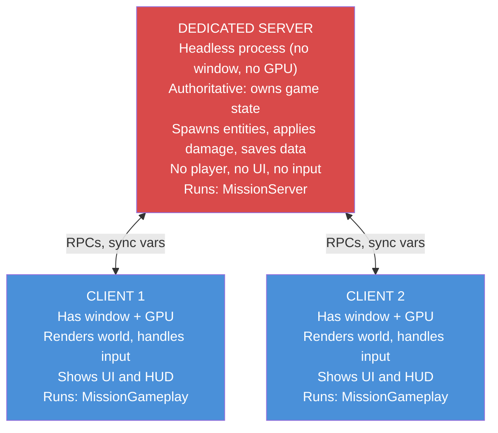
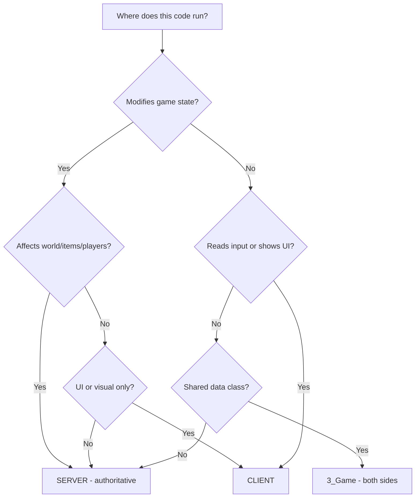
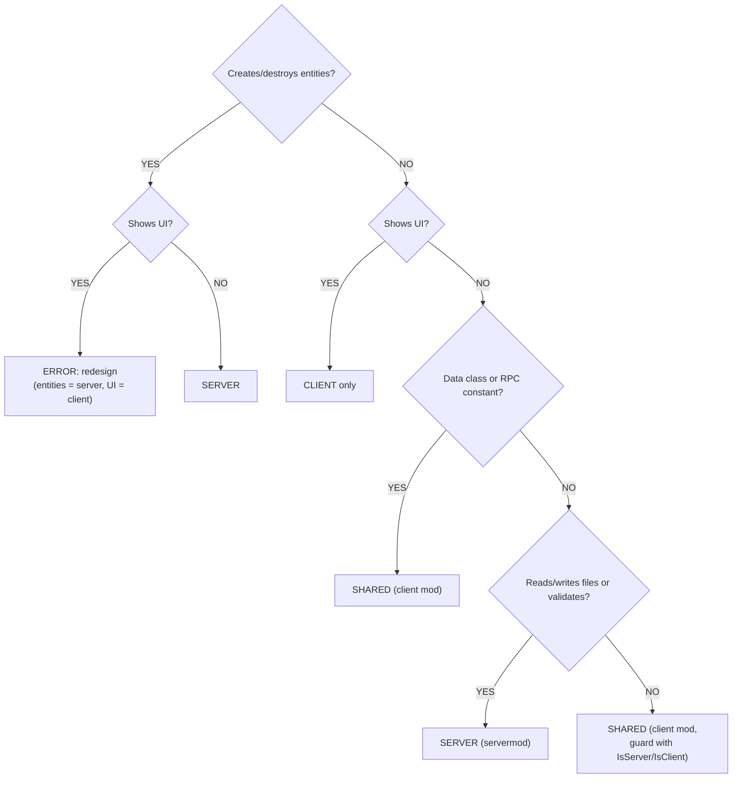

# Server vs Client Architecture


---

> **Summary:** DayZ is a client-server game. Every line of code you write runs in a specific context -- server, client, or both. Understanding this split is essential for writing secure, functional mods. This chapter explains where code runs, how to detect which side you are on, how to structure multi-package mods, and the patterns that keep server and client code properly separated.

---

## Table of Contents

- [The Fundamental Split](#the-fundamental-split)
- [The Three Execution Contexts](#the-three-execution-contexts)
- [Checking Where Your Code Runs](#checking-where-your-code-runs)
- [The mod.cpp type Field](#the-modcpp-type-field)
- [The config.cpp type Field](#the-configcpp-type-field)
- [Multi-Package Mod Architecture](#multi-package-mod-architecture)
- [The Golden Rules](#the-golden-rules)
- [Script Layer and Side Matrix](#script-layer-and-side-matrix)
- [Preprocessor Guards](#preprocessor-guards)
- [Common Server-Client Patterns](#common-server-client-patterns)
- [Listen Server Gotchas](#listen-server-gotchas)
- [Dependency Between Split Mods](#dependency-between-split-mods)
- [Worked Split Examples](#worked-split-examples)
- [Common Mistakes](#common-mistakes)
- [Decision Flowchart](#decision-flowchart)
- [Summary Checklist](#summary-checklist)

---

## The Fundamental Split

DayZ uses a **dedicated server** model. The server and the client are separate processes running separate executables. They communicate over the network, and the engine handles synchronization of entities, variables, and RPCs.

This means your mod code runs in one of three contexts, and the rules for each are fundamentally different.



---

## The Three Execution Contexts

### 1. Dedicated Server

The dedicated server is a **headless process**. It has no window, no graphics card output, no monitor, no keyboard, no mouse. It exists only to run game logic.

Key characteristics:
- **Authoritative** -- the server's state is the truth. If the server says a player has 50 health, the player has 50 health.
- **No player object** -- `GetGame().GetPlayer()` always returns `null` on a dedicated server. The server manages ALL players but IS none of them.
- **No UI** -- any code that creates widgets, shows menus, or renders HUD elements will crash or silently fail.
- **No input** -- there is no keyboard or mouse. Input-handling code is meaningless here.
- **File system access** -- the server can read and write files to its profile directory (`$profile:`), which is where configs, player data, and logs are stored.
- **Mission class** -- the server instantiates `MissionServer`, not `MissionGameplay`.

### 2. Client

The client is the player's game. It has a window, renders 3D graphics, plays audio, and handles input.

Key characteristics:
- **Presentation layer** -- the client renders what the server tells it to render. It does not decide what exists in the world.
- **Has a player** -- `GetGame().GetPlayer()` returns the local player's `PlayerBase` instance.
- **UI and HUD** -- all widget creation, layout loading, and menu code runs here.
- **Input** -- keyboard, mouse, and gamepad input is processed here.
- **Limited authority** -- the client can REQUEST actions (via RPC), but the server DECIDES whether they happen.
- **Mission class** -- the client instantiates `MissionGameplay`, not `MissionServer`.

### 3. Listen Server (Development/Testing)

A listen server is both server AND client in the same process. This is what you get when you launch DayZ through the Workbench or use the `-server` launch parameter with a local game.

Key characteristics:
- **Both `IsServer()` and `IsClient()` return true** -- this is the critical difference from dedicated servers.
- **Has a player AND manages all players** -- `GetGame().GetPlayer()` returns the host player.
- **Both `MissionServer` and `MissionGameplay` hooks run** -- your modded classes for both will execute.
- **Used for development only** -- production servers are always dedicated.
- **Can mask bugs** -- code that works on a listen server may break on dedicated because the listen server has access to both server and client types.

---

## Checking Where Your Code Runs

The `GetGame()` global function returns the game instance, which provides methods to detect the execution context:

```c
// ---------------------------------------------------------------
// Runtime context checks
// ---------------------------------------------------------------

if (GetGame().IsServer())
{
    // TRUE on: dedicated server, listen server
    // FALSE on: client connected to a remote server
    // Use for: server-side logic (spawning, damage, saving)
}

if (GetGame().IsClient())
{
    // TRUE on: client connected to a remote server, listen server
    // FALSE on: dedicated server
    // Use for: UI code, input handling, visual effects
}

if (GetGame().IsDedicatedServer())
{
    // TRUE on: dedicated server ONLY
    // FALSE on: client, listen server
    // Use for: code that must NEVER run on a listen server
}

if (GetGame().IsMultiplayer())
{
    // TRUE on: any multiplayer session (dedicated server, remote client)
    // FALSE on: singleplayer/offline mode
    // Use for: disabling features in offline testing
}
```

### Truth Table

| Method | Dedicated Server | Client (Remote) | Listen Server (LAN) | Offline Singleplayer |
|--------|:---:|:---:|:---:|:---:|
| `IsServer()` | true | false | true | true |
| `IsClient()` | false | true | true | true |
| `IsDedicatedServer()` | true | false | false | false |
| `IsMultiplayer()` | true | true | true | false |
| `GetPlayer()` returns | null | PlayerBase | PlayerBase | PlayerBase |

> **Note on IsMultiplayer():** A LAN listen server (launched with `-server`) returns `true` for `IsMultiplayer()` because it accepts network connections from other players. Only true offline singleplayer (no networking) returns `false`. The distinction is whether the session involves networking, not whether the process acts as a server.

> **Source:** All four methods are declared on the game instance in `3_game/global/game.c` (`IsMultiplayer`, `IsClient`, `IsServer`, `IsDedicatedServer`). The engine header notes that `IsDedicatedServer()` is a "robust check ... valid much sooner" and, where a compile-time answer suffices, points to the `SERVER` define instead (see [Preprocessor Guards](#preprocessor-guards)).

### Common Patterns

```c
// Guard: server-only logic
void SpawnLoot(vector position)
{
    if (!GetGame().IsServer())
        return;

    // Only the server creates entities
    EntityAI item = EntityAI.Cast(GetGame().CreateObjectEx("AK101", position, ECE_PLACE_ON_SURFACE));
}

// Guard: client-only logic
void ShowNotification(string text)
{
    if (!GetGame().IsClient())
        return;

    // Only the client can display UI
    NotificationSystem.AddNotificationExtended(5, text, "", "set:dayz_gui image:icon_pin");
}

// Guard: handle both sides correctly
void OnPlayerAction(PlayerBase player, int actionID)
{
    if (GetGame().IsServer())
    {
        // Validate and execute the action
        ValidateAndApply(player, actionID);
    }

    if (GetGame().IsClient())
    {
        // Play a local sound effect
        PlayActionSound(actionID);
    }
}
```

---

## The mod.cpp type Field

The `mod.cpp` file at the root of your mod folder commonly carries a `type` field. Treat it as **declarative metadata that should match how you actually launch the mod, not the mechanism that places it there**: what determines whether a PBO reaches clients or stays server-only is which launch flag loads it -- `-mod=` versus `-servermod=`. Bohemia's [Modding Structure](https://community.bistudio.com/wiki/DayZ:Modding_Structure) page documents `-mod=` as how a mod is loaded, and documents `type` under `CfgMods` in a PBO's `config.cpp` rather than as a `mod.cpp` key, so the `mod.cpp` copy is convention. Launcher and build tooling decides which launch list a package goes into from its own bookkeeping; the `type` field is where you record that intent so the launcher display and Workshop categorization stay consistent with it. Ship a `type = "servermod"` package but launch it with `-mod=` and you are not exercising some documented "servermod behavior" -- you are just launching a mod, with whatever that package's code assumes about being server-only left unverified.

### type = "mod" (Both Sides)

```
name = "My Mod";
type = "mod";
```

The mod is loaded on **both server and client**. The server loads it, clients download and load it. Both sides compile and execute the scripts.

**When to use:** Most mods use this. Any mod that has shared types (entity definitions, config classes, RPC data structures) needs to be `type = "mod"` so both sides know about the same types.

**Example:** This wiki's teaching mod **Lantern AI** --- a designed example, not a shipped product --- uses `type = "mod"` for its client package because both server and client need the AI entity class definitions, RPC constants, and sync data structures:

```cpp
// Lantern_AI/mod.cpp
name = "Lantern AI";
type = "mod";
```

### type = "servermod" (Server Only)

```
name = "My Mod Server";
type = "servermod";
```

The mod is loaded on the **server only**. Clients never see it, never download it, never know it exists. The server does not send it in the mod list.

**When to use:** Server-side logic that clients should never have access to. This includes:
- Spawn algorithms (prevents players from predicting loot)
- AI brain logic (prevents exploit analysis)
- Admin commands and server management
- Database connections and external API calls
- Anti-cheat validation logic

**Example:** The **Lantern AI Server** package uses `type = "servermod"` because clients should never see the AI brain, perception, combat, or spawning logic:

```cpp
// Lantern_AIServer/mod.cpp
name = "Lantern AI Server";
type = "servermod";
```

### Why This Matters for Security

If your spawn logic is in a `type = "mod"` package, **every player downloads it**. They can decompile the PBO and read your spawn algorithms, loot tables, admin passwords, or anti-cheat logic. Always put sensitive server logic in a `type = "servermod"` package.

---

## The config.cpp type Field

Inside `config.cpp` (in the `CfgMods` section), there is also a `type` field. This one controls how the engine treats the mod internally:

```cpp
class CfgMods
{
    class MyMod
    {
        type = "mod";          // or "servermod"
        // ...
    };
};
```

This field should match your `mod.cpp` type field for the same reason covered above: neither field is the mechanism that routes the PBO to server or client -- the launch flag (`-mod=` vs `-servermod=`) is. Two details are worth knowing before you lean on the declaration. Bohemia's `CfgMods` reference annotates `type = "mod";` as *required* and documents no other value. And in the vanilla scripts, `CfgMods` is read by `ModLoader` and `ModStructure` (`3_game/client/mods/modloader.c:17-23`), which enumerate the mod entries for the in-game mod list and never read `type` at all; the string `"servermod"` does not appear anywhere in the script extraction. That is not proof the engine ignores it -- the config is also read natively -- but it does mean no script-visible behaviour hangs on it. Keep the two fields consistent as hygiene and as documentation of intent; no specific engine error is documented for a mismatch.

The `config.cpp` also contains the `defines[]` array, which is how you enable preprocessor symbols for cross-mod detection:

```cpp
class CfgMods
{
    class Lantern_AI
    {
        type = "mod";
        defines[] = { "LANTERN_AI" };    // Other mods can use #ifdef LANTERN_AI
    };
};

class CfgMods
{
    class Lantern_AIServer
    {
        type = "servermod";
        defines[] = { "LANTERN_AI", "LANTERN_AISERVER" };  // Both defines available
    };
};
```

Notice that the server mod re-declares `LANTERN_AI` and adds `LANTERN_AISERVER`. Treat this as the defensive pattern rather than a guaranteed engine rule. `defines[]` is not documented on Bohemia's `CfgMods` reference at all, so there is no published contract for how a symbol declared in one package is scoped when another package compiles -- and community reports of cross-mod `#ifdef` detection describe it as inconsistent. Re-declaring every symbol your own code tests in that package's own `defines[]`, as done here, sidesteps the question entirely and is correct whatever the underlying mechanism turns out to be.

---

## Multi-Package Mod Architecture

### Why Split Into Multiple Packages?

A single mod folder with `type = "mod"` ships everything to clients. For many mods, this is fine. But for mods with sensitive server logic, you need to split:

```
@MyMod/                          <-- Client package (type = "mod")
  mod.cpp                        <-- type = "mod"
  Addons/
    MyMod_Scripts.pbo            <-- Shared: RPCs, config classes, entity defs
    MyMod_Data.pbo               <-- Shared: models, textures
    MyMod_GUI.pbo                <-- Client-only: layouts, imagesets

@MyModServer/                    <-- Server package (type = "servermod")
  mod.cpp                        <-- type = "servermod"
  Addons/
    MyModServer_Scripts.pbo      <-- Server-only: spawning, brain, admin
```

The server loads BOTH `@MyMod` and `@MyModServer`. Clients only load `@MyMod`.

### What Goes Where

**Client package** (`type = "mod"`) contains:
- Entity class definitions (both sides need to know the class exists)
- RPC ID constants and data structures (both sides send/receive)
- Config classes for settings that affect client display
- GUI layouts, imagesets, and styles
- Client-side UI code (wrapped in `#ifndef SERVER`)
- Models, textures, sounds
- `stringtable.csv` for localization

**Server package** (`type = "servermod"`) contains:
- Manager/controller classes (spawn logic, AI brains)
- Server-side validation and anti-cheat
- Config loading and file I/O (JSON configs, player data)
- Admin command handlers
- External service integration (webhooks, APIs)
- `MissionServer` hooks

### The Dependency Chain

The server package depends on the client package, never the other way around:

```cpp
// Client mod: config.cpp
class CfgPatches
{
    class MyMod_Scripts
    {
        requiredAddons[] = { "DZ_Scripts" };  // No dependency on server
    };
};

// Server mod: config.cpp
class CfgPatches
{
    class MyModServer_Scripts
    {
        requiredAddons[] = { "DZ_Scripts", "MyMod_Scripts" };  // Depends on client
    };
};
```

This ensures the client package compiles first, and the server package can reference all types defined in the client package.

---

## The Golden Rules

These rules govern every decision about where code belongs:

### Rule 1: Server is AUTHORITATIVE

The server owns the game state. It decides what exists, where it exists, and what happens to it. Never let the client make authoritative decisions.

### Rule 2: Client handles PRESENTATION

The client renders the world, plays sounds, shows UI, and collects input. It does not decide game outcomes.

### Rule 3: RPC is the BRIDGE

Remote Procedure Calls (RPCs) are the only structured way for server and client to communicate. The client sends requests, the server sends responses and state updates.

### Rule 4: Never Trust the Client

Any data coming from a client could be tampered with. Always validate on the server.

### Decision Tree



### Responsibility Matrix

| Task | Where | Why |
|------|-------|-----|
| Spawn entities | Server | Prevents item duplication |
| Apply damage | Server | Prevents god mode hacks |
| Delete entities | Server | Prevents grief exploits |
| Save player data | Server | Persistent server-side storage |
| Load configs | Server | Server controls game rules |
| Validate actions | Server | Anti-cheat enforcement |
| Check permissions | Server | Client cannot self-authorize |
| Show UI panels | Client | Server has no display |
| Read keyboard/mouse | Client | Server has no input devices |
| Play sounds | Client | Server has no audio output |
| Render effects | Client | Server has no GPU |
| Display notifications | Client | Visual feedback for the player |
| Send chat messages | Both | Client sends, server broadcasts |
| Sync config to client | Both | Server sends, client stores locally |
| Track nearby entities | Both | Server spawns, client renders |

---

## Script Layer and Side Matrix

The 5-layer hierarchy (Chapter 2.1) intersects with the server-client split. Not all layers run on all sides in the same way:

### Full Matrix

| Layer | Dedicated Server | Client | Listen Server | Notes |
|-------|:---:|:---:|:---:|-------|
| `1_Core` | Compiled | Compiled | Compiled | Identical on all sides |
| `2_GameLib` | Compiled | Compiled | Compiled | Identical on all sides |
| `3_Game` | Compiled | Compiled | Compiled | Shared types, configs, RPCs |
| `4_World` | Compiled | Compiled | Compiled | Entities exist on both sides |
| `5_Mission` (MissionServer) | Runs | Skipped | Runs | Server startup/shutdown |
| `5_Mission` (MissionGameplay) | Skipped | Runs | Runs | Client UI/HUD init |

### What This Means in Practice

Layers 1 through 4 compile and run on **all sides**. The code is the same. This is why entity class definitions, config classes, and RPC constants all live in `3_Game` or `4_World` -- both sides need them.

Layer 5 (`5_Mission`) is where the split becomes explicit:
- `MissionServer` is only *instantiated* on the server (and listen server). It handles server-side initialization, update loops, and cleanup.
- `MissionGameplay` is only *instantiated* on the client (and listen server). It handles client-side UI, HUD, and player-facing features.

Both classes are **compiled into every build** -- they live in the vanilla `5_mission` module (`5_mission/mission/missionserver.c:5` and `missiongameplay.c:1`, both extending `MissionBase`). What differs per side is which one the engine creates, not which one exists. That distinction matters when you decide whether a `modded class` needs a preprocessor guard -- see [Preprocessor Guards](#preprocessor-guards).

When you write `modded class MissionServer`, that code runs on the dedicated server. When you write `modded class MissionGameplay`, that code runs on the client.

```c
// Server-side mission hook -- runs on dedicated server and listen server
modded class MissionServer
{
    override void OnInit()
    {
        super.OnInit();
        // Initialize server-side managers
        Print("Server starting up");
    }
};

// Client-side mission hook -- runs on client and listen server
modded class MissionGameplay
{
    override void OnInit()
    {
        super.OnInit();
        // Initialize client-side UI
        Print("Client starting up");
    }
};
```

---

## Preprocessor Guards

Enforce Script supports preprocessor directives that let you conditionally compile code based on the execution context.

### The SERVER Define

The engine defines `SERVER` in the **dedicated server build only**. The vanilla header is explicit: the `ServerDefines` group is "Defines for dedicated server code", noted as "Only defined when CGame.IsDedicatedServer equals true", and `SERVER` itself is documented as a "Define always present on dedicated servers" that "should be preferred over using CGame.IsDedicatedServer when possible" (`1_core/defines.c:104-115`). Because `IsDedicatedServer()` is false on a **listen server**, `SERVER` is **not** defined there --- `#ifndef SERVER` client code compiles into a listen server host exactly as it does into a remote client. This is a **compile-time** distinction, not a runtime one:

```c
#ifdef SERVER
    // Compiled ONLY into the dedicated server binary
    // It does not exist in the client binary -- or a listen server host -- at all
#endif

#ifndef SERVER
    // Compiled into the client binary -- this includes a listen server host
    // The dedicated server will not see this code
#endif
```

### When to Use Preprocessor Guards vs Runtime Checks

| Approach | When to Use | Example |
|----------|-------------|---------|
| `#ifndef SERVER` | Wrapping your own client-only helper classes (typically UI logic) that you deliberately keep out of the server build | Your own UI helper classes, `MissionGameplay` bodies that reference them |
| `#ifdef SERVER` | Wrapping entire class definitions that should only exist on server | Server-only helper classes |
| `GetGame().IsServer()` | Runtime branching within code that runs on both sides | Entity update logic that differs per side |
| `GetGame().IsClient()` | Runtime branching within code that runs on both sides | Playing effects only on client |

### Worked Example: Client Mission Hook in a Shared Mod

`MissionGameplay` compiles into **both** the server and the client build -- the class exists in every vanilla script module (`5_mission/mission/missiongameplay.c`), it is simply only *instantiated* on the client and the listen server host. You do NOT need `#ifndef SERVER` just to mod `MissionGameplay`. The guard is only required when the modded class body references a type that is genuinely unavailable on the server -- almost always one of **your own** helper classes that you chose to compile out with its own `#ifndef SERVER`. It is not because vanilla widget or UI types are missing there: `Widget` itself is declared unguarded at `1_core/proto/enwidgets.c:107`, and every built-in widget subclass with it, so they resolve on the server exactly as `MissionGameplay` does. The guard is still useful for keeping client-only *logic* -- input handling, HUD updates -- out of the server build even when the vanilla types involved would compile fine there.

Several large public mods mod `MissionGameplay` without any `#ifndef SERVER` guard, and that is correct: the vanilla `MissionGameplay` type is unguarded, so it resolves on every build. You only need the guard once your modded body pulls in a type that is actually unavailable on the server -- typically one you wrapped in a guard yourself.

```c
// SAFE: No #ifndef SERVER needed because the body uses no client-only types
modded class MissionGameplay
{
    override void OnInit()
    {
        super.OnInit();
        Print("[MyMod] MissionGameplay.OnInit");
    }
};
```

```c
// NEEDS #ifndef SERVER: MyClientUI is a UI helper class of your own, not a
// vanilla widget type -- vanilla widgets like `Widget` are declared unguarded
// (1_core/proto/enwidgets.c:107) and resolve on every build. MyClientUI is
// unresolvable on the server precisely because you would declare/use it only
// inside a guard like this one. Without the guard here, the server cannot
// resolve the MyClientUI type and compilation fails.

#ifndef SERVER
modded class MissionGameplay
{
    protected ref MyClientUI m_MyUI;

    override void OnInit()
    {
        super.OnInit();
        m_MyUI = new MyClientUI();
    }

    override void OnUpdate(float timeslice)
    {
        super.OnUpdate(timeslice);
        if (m_MyUI)
            m_MyUI.Update(timeslice);
    }
};
#endif
```

The rule is simple: if the **body** of your modded `MissionGameplay` (or `MissionServer`) references types that only exist on one side, wrap it. If it only calls `super` and `Print`, no guard is needed.

### Combining Guards for Optional Dependencies

You can stack preprocessor guards for fine-grained control:

```c
// Only compile if Lantern Core is loaded AND we are on the client
#ifdef LANTERN_CORE
#ifndef SERVER
modded class MissionGameplay
{
    override void OnInit()
    {
        super.OnInit();
        // Register with Core's admin panel -- client side only
        LanternCore core = LanternCore.GetInstance();
        if (core)
        {
            ref LNT_ModInfo info = new LNT_ModInfo("MyMod", "My Mod", "1.0");
            core.RegisterMod(info);
        }
    }
};
#endif
#endif
```

The `LanternCore.RegisterMod()` API and the `LNT_ModInfo` descriptor are covered in Chapter 7.2. Here the only point is the guard: the two nested directives mean this block compiles solely when Lantern Core is present **and** the build is a client build.

---

## Common Server-Client Patterns

Once you know which side your code runs on, a handful of patterns cover almost all cross-side communication. Every one of them is an RPC pattern, so the full worked implementations live in the RPC chapters rather than being duplicated here:

- **Request, validate, respond** --- the client asks, the server validates and executes, then replies. See [Chapter 7.3: RPC Communication Patterns](../07-patterns/03-rpc-patterns.md#request-validate-respond).
- **Config sync (server to client)** --- the server pushes display settings to each client as it becomes ready. See [Config Sync](../07-patterns/03-rpc-patterns.md#config-sync-server-to-client).
- **Entity state sync** --- the server computes authoritative entity state and broadcasts it to nearby clients. See [Entity State Sync](../07-patterns/03-rpc-patterns.md#entity-state-sync).
- **Permission checking** --- privileged actions are authorized on the server before they run. See [Chapter 7.5: Permissions](../07-patterns/05-permissions.md).

The rule under all four is the one from [The Golden Rules](#the-golden-rules): the client requests, the server decides, and nothing the client sends is trusted until the server validates it.

---

## Listen Server Gotchas

The listen server is the most treacherous environment because it blurs the line between server and client. Here are the pitfalls:

### 1. Both IsServer() and IsClient() Are True

```c
void MyFunction()
{
    if (GetGame().IsServer())
    {
        // This runs on listen server
        DoServerThing();
    }

    if (GetGame().IsClient())
    {
        // This ALSO runs on listen server
        DoClientThing();
    }

    // On listen server, BOTH branches execute!
}
```

**Fix:** If you need exclusive branches, use `else if` or check `IsDedicatedServer()`:

```c
void MyFunction()
{
    if (GetGame().IsDedicatedServer())
    {
        // Dedicated server only
        DoServerOnlyThing();
    }
    else if (GetGame().IsClient())
    {
        // Client OR listen server
        DoClientThing();
    }
}
```

### 2. MissionServer AND MissionGameplay Both Run

On a listen server, both `modded class MissionServer` and `modded class MissionGameplay` execute their hooks. If you initialize the same manager in both, you get two instances:

```c
// BAD: Creates two instances on listen server
modded class MissionServer
{
    override void OnInit()
    {
        super.OnInit();
        m_Manager = new MyManager();  // Instance 1
    }
}

modded class MissionGameplay
{
    override void OnInit()
    {
        super.OnInit();
        m_Manager = new MyManager();  // Instance 2 on listen server!
    }
}
```

**Fix:** Use server/client specific subclasses or guard with context checks:

```c
modded class MissionServer
{
    override void OnInit()
    {
        super.OnInit();
        m_ServerManager = new MyServerManager();  // Server-side only
    }
}

#ifndef SERVER
modded class MissionGameplay
{
    override void OnInit()
    {
        super.OnInit();
        m_ClientUI = new MyClientUI();  // Client-side only
    }
}
#endif
```

### 3. GetGame().GetPlayer() Works on Listen Server

On a dedicated server, `GetGame().GetPlayer()` always returns null. On a listen server, it returns the host player. Code that accidentally relies on this will work during testing but crash on a real server:

```c
// BAD: Works on listen server, crashes on dedicated
void DoServerThing()
{
    PlayerBase player = PlayerBase.Cast(GetGame().GetPlayer());
    // player is null on dedicated server!
    player.SetHealth(100);  // NULL REFERENCE CRASH
}

// GOOD: Get the player through proper server-side methods
void DoServerThing(PlayerBase player)
{
    if (!player)
        return;

    player.SetHealth(100);
}
```

### 4. Testing on Listen Server Masks Bugs

A common trap: you test your mod on a listen server, everything works, you publish it, and it crashes on every dedicated server. This happens because:

- Types that exist only in `MissionGameplay` are available on listen server
- `GetPlayer()` returns a value on listen server
- Both server and client code paths run in the same process, so missing RPCs do not show errors (the data is already local)

**Always test on a dedicated server before publishing.** Listen server testing is useful for rapid iteration, but it is not a substitute for proper dedicated server testing.

---

## Dependency Between Split Mods

### requiredAddons[] Controls Load Order

The server package must declare the client package in its `requiredAddons[]`, exactly as shown in [The Dependency Chain](#the-dependency-chain) above. That single dependency does three things:

1. The client package compiles first.
2. The server package can reference every type defined in the client package.
3. Entity class definitions from the client package are available to server logic.

Applied to Lantern AI, the client package `Lantern_AI_Scripts` requires only the base scripts and Core, while the server package `Lantern_AIServer_Scripts` additionally requires the client package:

```cpp
// Client package (config.cpp)
requiredAddons[] = { "DZ_Scripts", "Lantern_Core_Scripts" };

// Server package (config.cpp)
requiredAddons[] = { "DZ_Scripts", "Lantern_AI_Scripts", "Lantern_Core_Scripts" };
//                                  ^^^^^^^^^^^^^^^^^ server depends on client
```

### defines[] for Optional Dependency Detection

The `defines[]` array in `CfgMods` creates preprocessor symbols other mods can test with `#ifdef`:

```cpp
// Lantern AI client mod defines:
defines[] = { "LANTERN_AI" };

// Lantern AI server mod defines:
defines[] = { "LANTERN_AI", "LANTERN_AISERVER" };
```

Another mod can then compile integration code only when the AI mod is present:

```c
// In another mod that optionally integrates with Lantern AI
#ifdef LANTERN_AI
void OnPatrolSpawned(LNT_PatrolEntity ai)
{
    // React to patrol spawns
}
#endif
```

### Soft vs Hard Dependencies

**Hard dependency** --- listed in `requiredAddons[]`. The engine refuses to load your mod if the dependency is missing. Use it for mods that MUST be present:

```cpp
requiredAddons[] = { "DZ_Scripts", "Lantern_Core_Scripts" };
// If Lantern_Core_Scripts is missing, this mod will not load
```

**Soft dependency** --- detected via `#ifdef` at compile time. The mod loads regardless, and enables extra features only when the dependency is present:

```c
// Soft dependency on Lantern Core
#ifdef LANTERN_CORE
class LNT_AIAdminConfig : LNT_ConfigBase
{
    // Only exists if Core is loaded
};
#endif

// Fallback when Core is not available
#ifndef LANTERN_CORE
class LNT_AIAdminConfig
{
    // Standalone version without Core integration
};
#endif
```

---

## Worked Split Examples

The mods below --- **Lantern AI**, **NightPatrol**, and **Lantern Missions** --- are this wiki's designed teaching examples, not shipped products. Each shows the same idea from a different angle: shared and client-facing code lives in a `type = "mod"` package, and the sensitive logic lives in a `type = "servermod"` package the client never receives.

### Example 1: Lantern AI (Client + Server)

Lantern AI splits into two packages with a clear separation of concerns. The client package carries only what both sides must agree on plus the UI; everything that decides behavior is server-side and invisible to players.

```
Lantern_AI/                             <-- Client package (type = "mod")
  mod.cpp                               <-- type = "mod"
  Scripts/
    config.cpp                          <-- defines[] = { "LANTERN_AI" }
    3_Game/                             <-- shared: config class, constants, RPC ids + data
    4_World/                            <-- LNT_PatrolEntity (exists on both sides)
    5_Mission/                          <-- client UI, wrapped in #ifndef SERVER
  GUI/layouts/                          <-- client-only: interaction prompt, voice bubble

Lantern_AIServer/                       <-- Server package (type = "servermod")
  mod.cpp                               <-- type = "servermod"
  Scripts/
    config.cpp                          <-- requiredAddons[] includes Lantern_AI_Scripts
    3_Game/                             <-- server config loader, admin config bridge
    4_World/                            <-- brain, perception, combat, navigation, spawner
    5_Mission/                          <-- modded MissionServer hook
```

The shape is deliberate: the client package holds a few shared and UI files; the server package holds the entire decision-making system --- brain, perception, combat, spawning --- none of which ships to clients.

### Example 2: NightPatrol (a second split mod)

**NightPatrol** (class prefix `NP_`) is a smaller content mod that patrols spawn points at night. It uses the same two-package split, which shows the pattern does not depend on one mod's file names:

```
NightPatrol/                            <-- Client package (type = "mod")
  Scripts/
    config.cpp                          <-- defines[] = { "NIGHTPATROL" }
    3_Game/                             <-- NP_Constants, NP_RPC (shared ids + data)
    4_World/                            <-- NP_PatrolMarker (rendered on both sides)
    5_Mission/                          <-- NP_ClientHud (#ifndef SERVER)

NightPatrol_Server/                     <-- Server package (type = "servermod")
  Scripts/
    config.cpp                          <-- requiredAddons[] includes NightPatrol_Scripts
    4_World/                            <-- NP_Scheduler, NP_SpawnDirector (night logic)
    5_Mission/                          <-- modded MissionServer hook
```

The client renders patrol markers and a HUD; the server decides *when* and *where* patrols appear. A player who decompiles the client PBO learns nothing about the spawn schedule, because that code was never sent to them.

### Example 3: Lantern Missions (Client + Server)

```
Lantern_Missions/                       <-- Client package (type = "mod")
  Scripts/
    3_Game/                             <-- mission type enums, RPC ids, display settings
    4_World/                            <-- proximity / radio helpers
    5_Mission/                          <-- client mission UI, admin panel module

Lantern_MissionsServer/                 <-- Server package (type = "servermod")
  Scripts/
    3_Game/                             <-- server config loader, mission data structures
    4_World/                            <-- active mission instance, loot/objective spawner
    5_Mission/                          <-- modded MissionServer hook
```

---

## Common Mistakes

### Mistake 1: Running Server Logic on Client

```c
// WRONG: This runs on the client -- any player can spawn items!
void OnButtonClick()
{
    GetGame().CreateObjectEx("M4A1", GetGame().GetPlayer().GetPosition(), ECE_PLACE_ON_SURFACE);
}

// RIGHT: Client requests, server validates and spawns
void OnButtonClick()
{
    // Client sends request
    ScriptRPC rpc = new ScriptRPC();
    rpc.Write("M4A1");
    rpc.Send(null, MyRPC.SPAWN_REQUEST, true);
}

// Server handler
void OnSpawnRequest(PlayerIdentity sender, ParamsReadContext ctx)
{
    if (!GetGame().IsServer())
        return;

    // Validate: is this player an admin?
    if (!IsAdmin(sender.GetId()))
        return;

    string className;
    ctx.Read(className);

    // Server spawns the item
    GetGame().CreateObjectEx(className, GetPlayerPosition(sender), ECE_PLACE_ON_SURFACE);
}
```

### Mistake 2: UI Code in Server-Only Mod

```c
// WRONG: This is in a type = "servermod" package
// The server has no display -- widget creation fails silently or crashes
class MyServerPanel
{
    Widget m_Root;

    void Show()
    {
        m_Root = GetGame().GetWorkspace().CreateWidgets("MyMod/GUI/layouts/panel.layout");
        // CRASH: GetWorkspace() returns null on dedicated server
    }
}
```

**Fix:** All UI code belongs in the client package (`type = "mod"`), wrapped in `#ifndef SERVER`.

### Mistake 3: GetGame().GetPlayer() on Server

```c
// WRONG: GetPlayer() is ALWAYS null on dedicated server
modded class MissionServer
{
    override void OnInit()
    {
        super.OnInit();
        PlayerBase player = PlayerBase.Cast(GetGame().GetPlayer());
        // player is null on dedicated!
        string name = player.GetIdentity().GetName();  // NULL CRASH
    }
}
```

**Fix:** On the server, players are passed to you through events, RPCs, or iteration:

```c
modded class MissionServer
{
    override void InvokeOnConnect(PlayerBase player, PlayerIdentity identity)
    {
        super.InvokeOnConnect(player, identity);
        // 'player' and 'identity' are provided by the engine
        if (identity)
            Print("Player connected: " + identity.GetName());
    }
}
```

### Mistake 4: Forgetting Listen Server Compatibility

```c
// WRONG: Assumes IsServer() and IsClient() are mutually exclusive
void OnEntityCreated(EntityAI entity)
{
    if (GetGame().IsServer())
    {
        RegisterEntity(entity);
        return;  // Early return skips client code
    }

    // On listen server, this never runs because IsServer() was true
    UpdateClientDisplay(entity);
}

// RIGHT: Handle both sides independently
void OnEntityCreated(EntityAI entity)
{
    if (GetGame().IsServer())
    {
        RegisterEntity(entity);
    }

    if (GetGame().IsClient())
    {
        UpdateClientDisplay(entity);
    }
}
```

### Mistake 5: Not Using #ifdef for Optional Mod Detection

```c
// WRONG: fails to COMPILE when Lantern Core is absent.
// LanternCore and LNT_ModInfo do not exist in the build unless the mod is
// loaded, so the compiler cannot resolve them -- a build error, not a crash.
class MyModInit
{
    void Init()
    {
        LanternCore core = LanternCore.GetInstance();   // unresolved type if Core absent
        ref LNT_ModInfo info = new LNT_ModInfo("MyMod", "My Mod", "1.0");
        core.RegisterMod(info);
    }
}

// RIGHT: guard with a preprocessor directive
class MyModInit
{
    void Init()
    {
        #ifdef LANTERN_CORE
        LanternCore core = LanternCore.GetInstance();
        if (core)
        {
            ref LNT_ModInfo info = new LNT_ModInfo("MyMod", "My Mod", "1.0");
            core.RegisterMod(info);
        }
        #endif
    }
}
```

The failure is at **compile time**, not run time. Without Lantern Core in the build, its types are not present, so the references never resolve. That is why the fix is a **preprocessor** guard (`#ifdef`, evaluated during compilation) and not a runtime `if` --- a runtime null check cannot rescue code that never compiled in the first place.

### Mistake 6: Putting Shared Types Only in the Server Package

```c
// WRONG: RPC data class defined only in servermod
// Client cannot deserialize the RPC because it does not know the class

// In MyModServer (type = "servermod"):
class MyStateData  // Client has never heard of this class
{
    int m_State;
    float m_Value;
}
```

**Fix:** Shared data structures (RPC data, entity definitions, config classes) go in the client package (`type = "mod"`) so both sides have them:

```c
// In MyMod (type = "mod") -- 3_Game layer:
class MyStateData  // Now both server and client know this class
{
    int m_State;
    float m_Value;
}
```

### Mistake 7: Hardcoded Server File Paths on Client

```c
// WRONG: Client cannot access server's profile directory
void LoadConfig()
{
    string path = "$profile:MyMod/config.json";
    // On client, $profile: points to the CLIENT's profile, not the server's
    // The config file does not exist there
}
```

**Fix:** The server loads configs and sends relevant data to clients via RPC. Clients never read server config files directly.

---

## Decision Flowchart

Use this to determine where a piece of code belongs:



---

## Summary Checklist

Before publishing a split mod, verify:

- [ ] Client package uses `type = "mod"` in both `mod.cpp` and `config.cpp`
- [ ] Server package uses `type = "servermod"` in both `mod.cpp` and `config.cpp`
- [ ] Server `config.cpp` lists client package in `requiredAddons[]`
- [ ] All shared types (RPC data, entity classes, enums) are in the client package
- [ ] All server logic (spawning, validation, AI brains) is in the server package
- [ ] `MissionGameplay` modded classes that reference your own client-only helper types (UI logic you compile out of the server build) are wrapped in `#ifndef SERVER`
- [ ] No `GetGame().GetPlayer()` calls on server without null checks
- [ ] No UI/widget code in the server package
- [ ] Optional dependencies use `#ifdef` guards, not direct references
- [ ] `defines[]` is declared in each package's `config.cpp` `CfgMods` (not in `mod.cpp`), and lists every symbol that package's own code tests
- [ ] Tested on a **dedicated server**, not just a listen server
- [ ] Server config files are loaded server-side and synced via RPC, not read by clients
