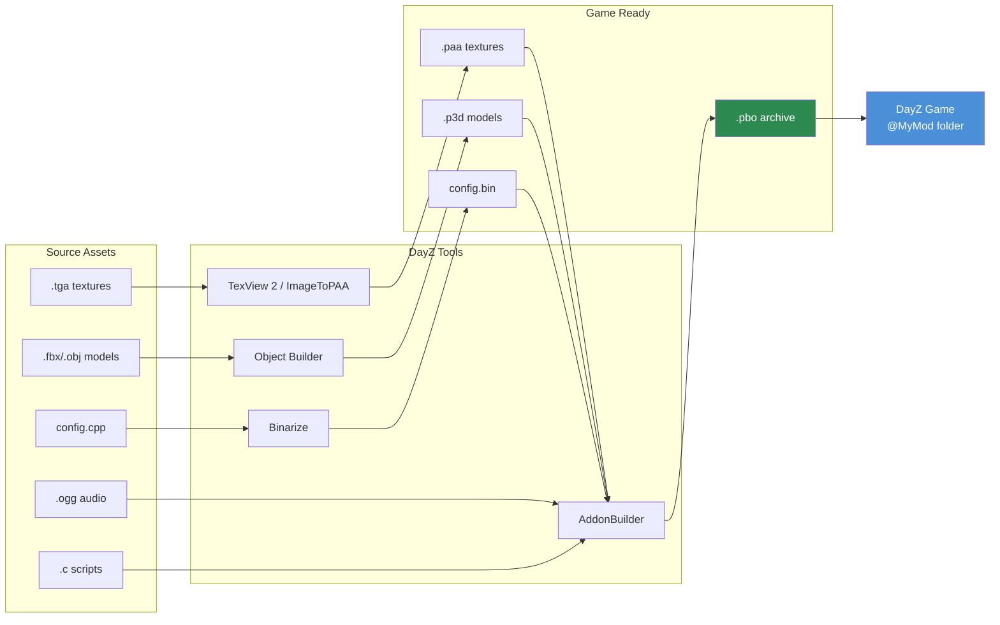

# DayZ Tools Workflow

> **Summary:** A guided tour of the DayZ Tools suite and how the individual tools fit together: the P: workdrive convention that everything depends on, what each tool does, and the end-to-end pipeline from source assets to a packed mod. This chapter is the hub — each major tool has a dedicated deep-dive chapter linked from its section.

---

## Introduction

DayZ Tools is a free suite of development applications distributed through Steam, provided by Bohemia Interactive for modders. It contains everything needed to create, convert, and package game assets: a 3D model editor, texture tools, a terrain editor, a script IDE with debugger, and the binarization pipeline that transforms human-readable source files into optimized game-ready formats. No DayZ mod can be built without at least some interaction with these tools.

This chapter provides an overview of each tool in the suite, explains the P: drive (workdrive) system that underpins the entire workflow, and walks through the complete asset pipeline from source files to playable mod. Topics with their own chapter — 3D modeling, PBO packing, and Workbench — are summarized here and covered in depth in their owning chapters.

---

## Table of Contents

- [DayZ Tools Suite Overview](#dayz-tools-suite-overview)
- [Installation and Setup](#installation-and-setup)
- [P: Drive (Workdrive)](#p-drive-workdrive)
- [Object Builder](#object-builder)
- [TexView 2 and ImageToPAA](#texview-2-and-imagetopaa)
- [Terrain Builder](#terrain-builder)
- [Binarize](#binarize)
- [AddonBuilder](#addonbuilder)
- [Workbench](#workbench)
- [File Patching](#file-patching)
- [Complete Workflow: Source to Game](#complete-workflow-source-to-game)
- [Common Mistakes](#common-mistakes)
- [Best Practices](#best-practices)
- [Common Toolchain Practices](#common-toolchain-practices)
- [Compatibility & Impact](#compatibility--impact)

---

## DayZ Tools Suite Overview

DayZ Tools is available as a free download on Steam under the **Tools** category. It installs a collection of applications, each serving a specific role in the modding pipeline.

| Tool | Purpose | Deep dive |
|------|---------|-----------|
| **Object Builder** | 3D model creation and editing (.p3d) | [3D Models](02-models.md) |
| **TexView 2** | Texture viewing and inspection (.paa, .tga, .png) | [Textures](01-textures.md) |
| **ImageToPAA** | Command-line texture conversion to .paa | [Textures](01-textures.md) |
| **Terrain Builder** | Terrain/map creation and editing | This chapter (overview only) |
| **Binarize** | Source-to-game format conversion | [PBO Packing](06-pbo-packing.md) |
| **AddonBuilder** | PBO packing with optional binarization | [PBO Packing](06-pbo-packing.md) |
| **Workbench** | Script editing, debugging, profiling | [Workbench Guide](07-workbench-guide.md) |
| **DayZ Tools Launcher** | Central hub for launching tools and configuring the P: drive | This chapter |

The suite also includes several smaller utilities:

- **WorkDrive** — creates and mounts the P: drive (invoked by the launcher's workdrive setup).
- **CfgConvert** — converts configs between text (`config.cpp`) and binary (`config.bin`) form.
- **DSUtils** — key generation and signing (`DSCreateKey`, `DSSignFile`, `DSCheckSignatures`); see [Key Signing](06-pbo-packing.md#key-signing).
- **PboUtils** — `FileBank` (pack) and `BankRev` (unpack) for working with PBO archives directly.
- **Publisher** — uploads finished mods to the Steam Workshop.
- **Central Economy Editor** and **NavMesh Generator** — specialized tools for economy editing and AI navigation meshes.

### Where They Live on Disk

After Steam installation, the tools live inside your Steam library (the exact drive depends on which library you installed to):

```
<Steam library>\steamapps\common\DayZ Tools\
  Bin\
    AddonBuilder\AddonBuilder.exe        <-- PBO packer
    Binarize\binarize.exe                <-- Asset converter
    ImageToPAA\ImageToPAA.exe            <-- Command-line texture converter
    ImageToPAA\TexView.exe               <-- Texture viewer (TexView 2)
    ObjectBuilder\ObjectBuilder.exe      <-- 3D model editor
    TerrainBuilder\terrainBuilder.exe    <-- Terrain editor
    Workbench\workbenchApp.exe           <-- Script IDE / debugger
    WorkDrive\WorkDrive.exe              <-- P: drive setup
    CfgConvert\CfgConvert.exe            <-- config.cpp <-> config.bin
    DsUtils\                             <-- Key generation and signing
    PboUtils\                            <-- FileBank / BankRev
    Publisher\Publisher.exe              <-- Steam Workshop upload
    Launcher\DayZToolsLauncher.exe       <-- Central hub
```

---

## Installation and Setup

### Step 1: Install DayZ Tools from Steam

1. Open Steam Library.
2. Enable **Tools** filter in the dropdown.
3. Search for "DayZ Tools".
4. Install (free, approximately 2 GB).

### Step 2: Launch DayZ Tools

1. Launch "DayZ Tools" from Steam.
2. The DayZ Tools Launcher opens -- a central hub application.
3. From here you can launch any individual tool and configure settings.

### Step 3: Configure P: Drive

The launcher provides a button to create and mount the P: drive (workdrive). Under the hood this runs the WorkDrive utility. The P: drive is the virtual drive that all DayZ tools use as their root path.

1. Click **Setup Workdrive** (or the P: drive configuration button).
2. The tool creates a subst-mapped P: drive pointing to a directory on your real disk.
3. Extract or symlink vanilla DayZ data to P: so the tools can reference game assets.

---

## P: Drive (Workdrive)

The **P: drive** is a Windows virtual drive (created via `subst` or junction) that serves as the unified root path for all DayZ modding. Every path in P3D models, RVMAT materials, config.cpp references, and build scripts is relative to P:.

### Why P: Drive Exists

DayZ's asset pipeline was designed around a fixed root path. When a material references `MyMod\data\texture_co.paa`, the engine looks for `P:\MyMod\data\texture_co.paa`. This convention ensures:

- All tools agree on where files are.
- Paths in packed PBOs match paths during development.
- Multiple mods can coexist under one root.

### Structure

```
P:\
  DZ\                          <-- Vanilla DayZ extracted data
    characters\
    weapons\
    data\
    ...
  DayZ Tools\                  <-- Tools installation (or symlink)
  MyMod\                       <-- Your mod source
    config.cpp
    Scripts\
    data\
  AnotherMod\                  <-- Another mod's source
    ...
```

### SetupWorkdrive.bat

Many mod projects include a `SetupWorkdrive.bat` script that automates P: drive creation and junction setup. A typical script:

```batch
@echo off
REM Create P: drive pointing to the workspace
subst P: "D:\DayZModding"

REM Create junctions for vanilla game data
mklink /J "P:\DZ" "C:\Program Files (x86)\Steam\steamapps\common\DayZ\dta"

REM Create junction for tools
mklink /J "P:\DayZ Tools" "C:\Program Files (x86)\Steam\steamapps\common\DayZ Tools"

echo Workdrive P: configured.
pause
```

> **Tip:** The workdrive must be mounted before launching any DayZ tool. If Object Builder or Binarize cannot find files, the first thing to check is whether P: is mounted.

---

## Object Builder

Object Builder is the 3D model editor for P3D files. It is covered in detail in [3D Models](02-models.md); here is a summary of its role in the toolchain.

### Key Capabilities

- Create and edit P3D model files.
- Define LODs (Level of Detail) for visual, collision, and shadow meshes.
- Assign materials (RVMAT) and textures (PAA) to model faces.
- Create named selections for animations and texture swaps.
- Place memory points and proxy objects.
- Import geometry from FBX, OBJ, and 3DS formats.

### In the Toolchain

- **Reads** vanilla P3D files from `P:\DZ\` for reference.
- **Outputs** MLOD P3D files, which Binarize converts to the optimized ODOL format during packing.
- **Previews** textures via TexView 2 (double-click a texture in face properties).

Launch it from the DayZ Tools Launcher, or directly via `ObjectBuilder.exe` in the tools' `Bin\ObjectBuilder\` folder.

---

## TexView 2 and ImageToPAA

TexView 2 (the executable is `TexView.exe`, located in the `Bin\ImageToPAA\` folder of the tools installation) is the texture viewing and inspection utility. Its command-line sibling **ImageToPAA** (`ImageToPAA.exe`, same folder) converts source images to PAA in batch and is what automated build pipelines use. The PAA format itself is covered in [Textures](01-textures.md).

### Key Capabilities

- Open and preview PAA, TGA, and PNG files.
- Convert between formats (TGA/PNG to PAA, PAA to TGA).
- View individual channels (R, G, B, A) separately.
- Display mipmap levels.
- Show texture dimensions and compression type.
- Batch conversion via ImageToPAA on the command line.

### Common Operations

**Convert TGA to PAA (GUI):**
1. File --> Open --> select your TGA file.
2. Verify the image looks correct.
3. File --> Save As --> choose PAA format.
4. Save. Compression (DXT1 for opaque, DXT5 for alpha) is chosen based on the image content.

**Inspect a vanilla PAA texture:**
1. File --> Open --> browse to `P:\DZ\...` and select a PAA file.
2. View the image. Click channel buttons (R, G, B, A) to inspect individual channels.
3. Note the dimensions and compression type shown in the status bar.

**Batch conversion:** point ImageToPAA at a source file or folder and it produces the corresponding `.paa` files. Build scripts typically call it for every texture in the mod's `data\` directory before packing.

---

## Terrain Builder

Terrain Builder is a specialized tool for creating custom maps (terrains). Map making is one of the most complex modding tasks in DayZ, involving satellite imagery, height maps, surface masks, and object placement.

### Key Capabilities

- Import satellite imagery and height maps.
- Define terrain layers (grass, dirt, rock, sand, etc.).
- Place objects (buildings, trees, rocks) on the map.
- Configure surface textures and materials.
- Export terrain data for Binarize.

### When You Need Terrain Builder

- Creating a new map from scratch.
- Modifying an existing terrain (adding/removing objects, changing terrain shape).
- Terrain Builder is NOT needed for item mods, weapon mods, UI mods, or script-only mods.

> **Note:** Terrain creation is an advanced topic that warrants its own dedicated guide. This chapter covers Terrain Builder only as part of the tools overview.

---

## Binarize

Binarize is the core conversion engine that transforms human-readable source files into optimized, game-ready binary formats. You almost never invoke it yourself -- AddonBuilder runs it automatically as part of PBO packing. See [Binarization: When Needed vs. Not](06-pbo-packing.md#binarization-when-needed-vs-not) for the decision table of which content types require it.

### What Binarize Converts

| Source Format | Output Format | Description |
|---------------|---------------|-------------|
| MLOD `.p3d` | ODOL `.p3d` | Optimized 3D model |
| `.tga` / `.png` | `.paa` | Compressed texture |
| `.cpp` (config) | `.bin` | Binarized config (faster parsing) |
| `.rvmat` | `.rvmat` (processed) | Material with resolved paths |
| `.wrp` | `.wrp` (optimized) | Terrain world |

Scripts (`.c` files), audio (`.ogg`), and layouts (`.layout`) are never binarized -- they are packed as-is.

---

## AddonBuilder

AddonBuilder is the PBO packing tool. It takes a source directory on P: and creates a `.pbo` archive, optionally running Binarize on the content first. It has both a GUI mode (visual file browser and option checkboxes) and a command-line mode used by automated build scripts.

The full treatment -- command-line flags, the `-prefix` and `-packonly` options, key signing, `@mod` folder structure, and automated multi-PBO builds -- lives in [PBO Packing](06-pbo-packing.md).

---

## Workbench

Workbench is the script development environment included with DayZ Tools. It provides script editing, debugging, and profiling for Enforce Script, and it has its own dedicated chapter: [Workbench Guide](07-workbench-guide.md).

### Key Capabilities

- **Script editing** with syntax highlighting and code completion for Enforce Script.
- **Debugging** with breakpoints, step execution, and variable inspection (requires the DayZDiag executable).
- **Profiling** to identify performance bottlenecks in scripts.
- **Script console** for evaluating expressions and testing snippets live.
- **Resource browser** for inspecting game data.

Many modders write code in an external editor (VS Code with a community Enforce Script extension) and use Workbench for debugging and profiling. Setup, `.gproj` project files, the debugging workflow, and known limitations are all covered in the [Workbench Guide](07-workbench-guide.md).

---

## File Patching

**File patching** is a development mode that lets the game load loose files from the P: drive instead of requiring them to be packed into PBOs, cutting the iteration loop from a full rebuild to a simple restart. It requires the diagnostic executable (`DayZDiag_x64.exe`) launched with `-filePatching` -- the retail executable ignores the flag.

File patching is covered in depth in [Workbench Guide: Integration with File Patching](07-workbench-guide.md#integration-with-file-patching), including setup, the rapid iteration loop, and which asset types still need a rebuild. For the release-side comparison of file patching versus PBO loading, see [PBO Packing](06-pbo-packing.md#testing-file-patching-vs-pbo-loading).

---

## Complete Workflow: Source to Game

Here is the end-to-end pipeline for turning source assets into a playable mod:

### Complete Asset Pipeline



### Phase 1: Create Source Assets

```
3D Software (Blender/3dsMax)  -->  FBX export
Image Editor (Photoshop/GIMP) -->  TGA/PNG export
Audio Editor (Audacity)       -->  OGG export
Text Editor (VS Code)         -->  .c scripts, config.cpp, .layout files
```

### Phase 2: Import and Convert

```
FBX  -->  Object Builder       -->  P3D (with LODs, selections, materials)
TGA  -->  TexView 2/ImageToPAA -->  PAA (compressed texture)
PNG  -->  TexView 2/ImageToPAA -->  PAA (compressed texture)
OGG  -->  (no conversion needed, game-ready)
```

### Phase 3: Organize on P: Drive

```
P:\MyMod\
  config.cpp                    <-- Mod configuration
  Scripts\
    3_Game\                     <-- Early-load scripts
    4_World\                    <-- Entity/manager scripts
    5_Mission\                  <-- UI/mission scripts
  data\
    models\
      my_item.p3d               <-- 3D model
    textures\
      my_item_co.paa            <-- Diffuse texture
      my_item_nohq.paa          <-- Normal map
      my_item_smdi.paa          <-- Specular map
    materials\
      my_item.rvmat             <-- Material definition
  sound\
    my_sound.ogg                <-- Audio file
  GUI\
    layouts\
      my_panel.layout           <-- UI layout
```

### Phase 4: Test with File Patching (Development)

```
Launch DayZDiag with -filePatching
  |
  |--> Engine reads loose files from P:\MyMod\
  |--> Test in-game
  |--> Edit files directly on P:
  |--> Restart to pick up changes
  |--> Iterate rapidly
```

See [Workbench Guide: Integration with File Patching](07-workbench-guide.md#integration-with-file-patching) for the full setup.

### Phase 5: Pack PBO (Release)

```
AddonBuilder / build script
  |
  |--> Reads source from P:\MyMod\
  |--> Binarize converts: P3D-->ODOL, TGA-->PAA, config.cpp-->.bin
  |--> Packs everything into MyMod.pbo
  |--> Signs with key: MyMod.pbo.MyKey.bisign
  |--> Output: @MyMod\addons\MyMod.pbo
```

### Phase 6: Distribute

```
@MyMod\
  addons\
    MyMod.pbo                   <-- The packed mod
    MyMod.pbo.MyKey.bisign      <-- Signature for server verification
  keys\
    MyKey.bikey                 <-- Public key for server admins
  mod.cpp                       <-- Mod metadata (name, author, etc.)
```

Players subscribe to the mod on Steam Workshop, or server admins install it manually.

---

## Common Mistakes

### 1. P: Drive Not Mounted

**Symptom:** All tools report "file not found" errors. Object Builder shows blank textures.
**Fix:** Run your `SetupWorkdrive.bat` or mount P: via DayZ Tools Launcher before launching any tool.

### 2. Wrong Tool for the Job

**Symptom:** Trying to edit a PAA file in a text editor, or opening a P3D in Notepad.
**Fix:** PAA is binary -- use TexView 2. P3D is binary -- use Object Builder. Config.cpp is text -- use any text editor.

### 3. Forgetting to Extract Vanilla Data

**Symptom:** Object Builder cannot display vanilla textures on referenced models. Materials show pink/magenta.
**Fix:** Extract vanilla DayZ data to `P:\DZ\` so tools can resolve cross-references to game content.

### 4. File Patching with Retail Executable

**Symptom:** Changes to files on P: drive are not reflected in-game.
**Fix:** Use `DayZDiag_x64.exe`, not `DayZ_x64.exe`. Only the Diag build supports `-filePatching`.

### 5. Building Without P: Drive

**Symptom:** AddonBuilder or Binarize fails with path resolution errors.
**Fix:** Mount P: drive before running any build tool. All paths in models and materials are P:-relative.

---

## Best Practices

1. **Always use the P: drive.** Resist the temptation to use absolute paths. P: is the standard and all tools expect it.

2. **Use file patching during development.** It cuts iteration time from minutes (PBO rebuild) to seconds (game restart). Only build PBOs for release testing and distribution.

3. **Automate your build pipeline.** Use a build script (a batch file or a Python script) to automate the AddonBuilder invocation. Manual GUI packing is error-prone and slow for multi-PBO mods.

4. **Keep source and output separate.** Source files live on P:. Built PBOs go to a separate output directory. Never mix them.

5. **Learn keyboard shortcuts.** Object Builder and TexView 2 have extensive keyboard shortcuts that dramatically speed up work. Invest time learning them.

6. **Extract and study vanilla data.** The best way to learn how DayZ assets are structured is to examine existing ones. Extract vanilla PBOs and open models, materials, and textures in the appropriate tools.

7. **Use Workbench for debugging, external editors for writing.** VS Code with Enforce Script extensions provides better editing. Workbench provides better debugging. Use both.

---

## Common Toolchain Practices

Patterns you will see across well-run mod projects:

- **A workdrive setup batch file.** Many mods ship a batch script that creates the P: drive and junction links from the mod source into it, so every contributor gets identical path resolution.
- **Workbench project files in the repo.** Some frameworks include `.gproj` Workbench project files so contributors can debug Enforce Script with breakpoints and variable inspection out of the box.
- **A build orchestrator script.** Teams commonly write a Python or batch script that wraps AddonBuilder calls, manages multi-PBO builds, launches the server/client, and monitors logs -- see [Automated Build Scripts](06-pbo-packing.md#automated-build-scripts).

---

## Compatibility & Impact

- **Multi-Mod:** All DayZ tools share the P: drive. Multiple mod projects coexist under `P:\` without conflict as long as folder names differ. Junction collisions happen if two mods use the same P: path.
- **Performance:** Binarization is CPU-intensive. Large mods with many P3D models and textures can take several minutes to build. Splitting content into multiple PBOs and using `-packonly` for script-only PBOs reduces build time significantly.
- **Version:** DayZ Tools are updated alongside major DayZ patches. Object Builder and Binarize occasionally receive fixes, but the overall workflow has been stable since DayZ 1.0. Always keep DayZ Tools updated via Steam.
