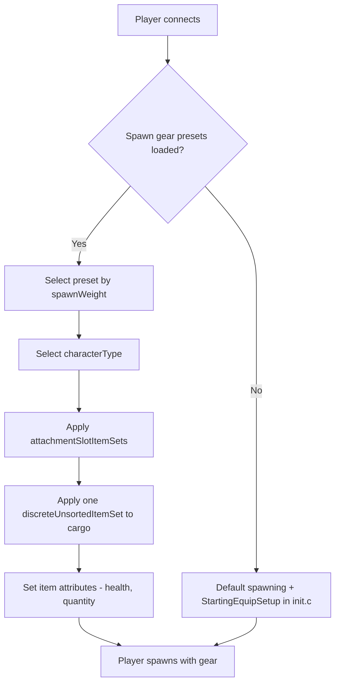

# Spawning Gear Configuration


---

> **Summary:** Spawn gear presets are weighted JSON files that control **what equipment** a fresh character carries — character model, clothing, weapons, cargo, and quickbar layout — with no script code required. This chapter covers enabling the system, the full preset schema, validation behavior, and worked examples.

> **Looking for spawn *positions*?** Where a character appears on the map is a separate system (`cfgplayerspawnpoints.xml`), covered in [Player Spawning](../09-server-admin/06-player-spawning.md).

---

## Table of Contents

- [Overview](#overview)
- [Enabling Spawn Gear Presets](#enabling-spawn-gear-presets)
- [Preset Structure](#preset-structure)
  - [attachmentSlotItemSets](#attachmentslotitemsets)
  - [discreteItemSets](#discreteitemsets)
  - [discreteUnsortedItemSets](#discreteunsorteditemsets)
  - [complexChildrenTypes](#complexchildrentypes)
  - [simpleChildrenTypes](#simplechildrentypes)
  - [simpleChildrenUseDefaultAttributes](#simplechildrenusedefaultattributes)
  - [Attributes](#attributes)
- [Validation and Failure Behavior](#validation-and-failure-behavior)
- [Practical Examples](#practical-examples)
  - [Full Example: Default Survivor Loadout](#full-example-default-survivor-loadout)
  - [Variation: Weighted Weapon Variants](#variation-weighted-weapon-variants)
  - [Variation: Alternative Cargo Sets](#variation-alternative-cargo-sets)
- [Probability Math](#probability-math)
- [Integration with Mods](#integration-with-mods)
- [Best Practices](#best-practices)
- [Common Mistakes](#common-mistakes)
- [Data Flow Summary](#data-flow-summary)

---

## Overview



The spawn gear preset system was introduced as an alternative to scripting loadouts in `init.c`, allowing server admins to define multiple weighted presets in JSON without writing any Enforce Script code. It is server-side only: clients never see these configuration files and cannot tamper with them.

> **Important:** When valid presets are loaded, the preset system **completely bypasses** the `StartingEquipSetup()` method in your mission `init.c` — the method is never called. Similarly, `characterTypes` defined in a preset override the character model chosen in the main menu.

---

## Enabling Spawn Gear Presets

Spawn gear presets are **not** enabled by default. To use them, you must:

1. Create one or more JSON preset files in your mission folder (e.g., `mpmissions/dayzOffline.chernarusplus/`).
2. Register them in `cfggameplay.json` under `PlayerData.spawnGearPresetFiles`.
3. Ensure `enableCfgGameplayFile = 1` is set in `serverDZ.cfg`.

```json
{
  "version": 122,
  "PlayerData": {
    "spawnGearPresetFiles": [
      "survivalist.json",
      "casual.json",
      "military.json"
    ]
  }
}
```

Paths are resolved relative to the mission folder (the engine prefixes them with `$mission:`), so preset files can be nested in subdirectories:

```json
"spawnGearPresetFiles": [
  "custom/survivalist.json",
  "custom/casual.json",
  "custom/military.json"
]
```

Each JSON file contains a single preset object. All registered presets are pooled together, and the server selects one based on `spawnWeight` each time a fresh character spawns.

---

## Preset Structure

A preset is the top-level JSON object with these fields:

| Field | Type | Description |
|-------|------|-------------|
| `name` | string | Human-readable name for the preset (any string, used for identification only) |
| `spawnWeight` | integer | Weight for random selection. Minimum is `1` — presets with a lower value fail validation and are skipped. Higher values make this preset more likely to be chosen |
| `characterTypes` | array | Array of character type classnames (e.g., `"SurvivorM_Mirek"`). One is picked at random when this preset spawns |
| `attachmentSlotItemSets` | array | Defines what the character wears — one entry per attachment slot (clothing, weapons on shoulders, etc.) |
| `discreteUnsortedItemSets` | array | Weighted cargo variants. One is selected and its items are placed into any available inventory space |

> **Note:** If `characterTypes` is empty or omitted, the engine falls back to the character type it would otherwise use — the model selected in the main menu, or a random survivor model, depending on the server's respawn mode settings.

Minimal example:

```json
{
  "spawnWeight": 1,
  "name": "Basic Survivor",
  "characterTypes": [
    "SurvivorM_Mirek",
    "SurvivorF_Eva"
  ],
  "attachmentSlotItemSets": [],
  "discreteUnsortedItemSets": []
}
```

### attachmentSlotItemSets

This array defines items that go into specific character attachment slots --- body, legs, feet, head, back, vest, shoulders, eyewear, etc.

Each entry targets one slot:

| Field | Type | Description |
|-------|------|-------------|
| `slotName` | string | The attachment slot name. Derived from CfgSlots. Common values: `"Body"`, `"Legs"`, `"Feet"`, `"Head"`, `"Back"`, `"Vest"`, `"Eyewear"`, `"Gloves"`, `"Hips"`, `"shoulderL"`, `"shoulderR"` |
| `discreteItemSets` | array | Array of item variants that can fill this slot (one is chosen based on `spawnWeight`). Must contain at least one entry |

> **Shoulder shortcuts:** You can use `"shoulderL"` and `"shoulderR"` as slot names. The engine translates them to the internal slot names — `shoulderL` becomes the `Shoulder` slot (rifles) and `shoulderR` becomes the `Melee` slot.

```json
{
  "slotName": "Body",
  "discreteItemSets": [
    {
      "itemType": "TShirt_Beige",
      "spawnWeight": 1,
      "attributes": {
        "healthMin": 0.45,
        "healthMax": 0.65,
        "quantityMin": 1.0,
        "quantityMax": 1.0
      },
      "quickBarSlot": -1
    },
    {
      "itemType": "TShirt_Black",
      "spawnWeight": 1,
      "attributes": {
        "healthMin": 0.45,
        "healthMax": 0.65,
        "quantityMin": 1.0,
        "quantityMax": 1.0
      },
      "quickBarSlot": -1
    }
  ]
}
```

### discreteItemSets

Each entry in `discreteItemSets` represents one possible item for that slot. The server picks one entry at random, weighted by `spawnWeight`.

| Field | Type | Description |
|-------|------|-------------|
| `itemType` | string | Item classname (typename). Use `""` (empty string) to represent "nothing" --- the slot remains empty |
| `spawnWeight` | integer | Weight for selection. Minimum `1` — entries with a lower value fail validation and are excluded from the pool |
| `attributes` | object | Health and quantity ranges for this item. **Required** — an entry without an `attributes` block fails validation, even when `itemType` is empty. See [Attributes](#attributes) |
| `quickBarSlot` | integer | Quick bar slot assignment (0-based). Use `-1` for no quickbar assignment. **Always set this explicitly** — an omitted integer defaults to `0`, which is the first quickbar slot |
| `complexChildrenTypes` | array | Items to spawn nested inside this item. See [complexChildrenTypes](#complexchildrentypes) |
| `simpleChildrenTypes` | array | Item classnames to spawn inside this item. See [simpleChildrenTypes](#simplechildrentypes) |
| `simpleChildrenUseDefaultAttributes` | bool | Controls which attributes the simple children receive. See [simpleChildrenUseDefaultAttributes](#simplechildrenusedefaultattributes) |

**Empty item trick:** To make a slot have a 50/50 chance of being empty or filled, use an empty `itemType`. Note that the empty entry still needs an `attributes` block to pass validation:

```json
{
  "slotName": "Eyewear",
  "discreteItemSets": [
    {
      "itemType": "AviatorGlasses",
      "spawnWeight": 1,
      "attributes": {
        "healthMin": 1.0,
        "healthMax": 1.0
      },
      "quickBarSlot": -1
    },
    {
      "itemType": "",
      "spawnWeight": 1,
      "attributes": {
        "healthMin": 1.0,
        "healthMax": 1.0
      },
      "quickBarSlot": -1
    }
  ]
}
```

### discreteUnsortedItemSets

This top-level array defines items that go into the character's **cargo** --- any available inventory space across all attached clothing and containers. Unlike `attachmentSlotItemSets`, these items are not placed into a specific slot; the engine finds room automatically.

Each entry represents one cargo variant, and the server selects **one** based on `spawnWeight`.

| Field | Type | Description |
|-------|------|-------------|
| `name` | string | Human-readable name (for identification only) |
| `spawnWeight` | integer | Weight for selection. Minimum `1` |
| `attributes` | object | Default health/quantity ranges, applied to simple children when `simpleChildrenUseDefaultAttributes` is `false` |
| `complexChildrenTypes` | array | Items to spawn into cargo, each with their own attributes and nesting |
| `simpleChildrenTypes` | array | Item classnames to spawn into cargo |
| `simpleChildrenUseDefaultAttributes` | bool | See [simpleChildrenUseDefaultAttributes](#simplechildrenusedefaultattributes) |

```json
{
  "name": "Cargo1",
  "spawnWeight": 1,
  "attributes": {
    "healthMin": 1.0,
    "healthMax": 1.0,
    "quantityMin": 1.0,
    "quantityMax": 1.0
  },
  "complexChildrenTypes": [
    {
      "itemType": "BandageDressing",
      "attributes": {
        "healthMin": 1.0,
        "healthMax": 1.0,
        "quantityMin": 1.0,
        "quantityMax": 1.0
      },
      "quickBarSlot": 2
    }
  ],
  "simpleChildrenUseDefaultAttributes": false,
  "simpleChildrenTypes": [
    "Rag",
    "Apple"
  ]
}
```

### complexChildrenTypes

Complex children are items spawned **inside** a parent item with full control over their attributes, quickbar assignment, and their own nested children (the structure is recursive). The primary use case is spawning items with contents --- for example, a weapon with attachments, or a first aid kit with supplies inside.

| Field | Type | Description |
|-------|------|-------------|
| `itemType` | string | Item classname. **Required** — an empty `itemType` here is skipped with a log message |
| `attributes` | object | Health/quantity ranges for this specific item |
| `quickBarSlot` | integer | Quick bar slot assignment. `-1` = don't assign. Set explicitly (omitted = `0`) |
| `complexChildrenTypes` | array | Further nested complex children |
| `simpleChildrenTypes` | array | Item classnames to spawn inside this item |
| `simpleChildrenUseDefaultAttributes` | bool | See [simpleChildrenUseDefaultAttributes](#simplechildrenusedefaultattributes) |

Example --- a weapon with attachments and magazine:

```json
{
  "itemType": "AKM",
  "attributes": {
    "healthMin": 0.5,
    "healthMax": 1.0,
    "quantityMin": 1.0,
    "quantityMax": 1.0
  },
  "quickBarSlot": 1,
  "complexChildrenTypes": [
    {
      "itemType": "AK_PlasticBttstck",
      "attributes": {
        "healthMin": 0.4,
        "healthMax": 0.6
      },
      "quickBarSlot": -1
    },
    {
      "itemType": "PSO1Optic",
      "attributes": {
        "healthMin": 0.1,
        "healthMax": 0.2
      },
      "quickBarSlot": -1,
      "simpleChildrenUseDefaultAttributes": true,
      "simpleChildrenTypes": [
        "Battery9V"
      ]
    },
    {
      "itemType": "Mag_AKM_30Rnd",
      "attributes": {
        "healthMin": 0.5,
        "healthMax": 0.5,
        "quantityMin": 1.0,
        "quantityMax": 1.0
      },
      "quickBarSlot": -1
    }
  ],
  "simpleChildrenUseDefaultAttributes": false,
  "simpleChildrenTypes": [
    "AK_PlasticHndgrd",
    "AK_Bayonet"
  ]
}
```

In this example, the AKM spawns with a buttstock, optic (with battery inside), and a loaded magazine as complex children, plus a handguard and bayonet as simple children. Because `simpleChildrenUseDefaultAttributes` is `false`, the handguard and bayonet use the AKM entry's `attributes`.

### simpleChildrenTypes

Simple children are a shorthand for spawning items inside a parent without specifying individual attributes. They are a plain array of item classnames (strings).

Simple children cannot have their own nested children or quickbar assignments. For those capabilities, use `complexChildrenTypes` instead.

### simpleChildrenUseDefaultAttributes

Every item set structure (slot item sets, cargo sets, and complex children) carries this flag, and it always means the same thing — it controls which attributes are applied to the `simpleChildrenTypes` listed in that same structure:

| Value | Attributes applied to simple children |
|-------|----------------------------------------|
| `true` | None — items keep the engine's configuration defaults (typically full health and quantity) |
| `false` | The `attributes` block of the structure that lists them (the parent item set) |

The flag only affects **simple** children. Complex children always use their own `attributes` block.

### Attributes

Attributes control the condition and quantity of spawned items. All values are floating point between `0.0` and `1.0`:

| Field | Type | Description |
|-------|------|-------------|
| `healthMin` | float | Minimum health percentage. `1.0` = pristine, `0.0` = ruined |
| `healthMax` | float | Maximum health percentage. A random value between min and max is applied |
| `quantityMin` | float | Minimum quantity percentage. For magazines: ammo fill level. For consumables: remaining quantity |
| `quantityMax` | float | Maximum quantity percentage |

When both min and max are specified, the engine picks a random value in that range. This creates natural variation --- for example, health between `0.45` and `0.65` means items spawn in worn to damaged condition.

```json
"attributes": {
  "healthMin": 0.45,
  "healthMax": 0.65,
  "quantityMin": 1.0,
  "quantityMax": 1.0
}
```

For magazines, the quantity range is mapped to ammo count (`0.5` on a 30-round magazine yields 15 rounds). For stackable or consumable items, the engine rounds the resulting quantity and bumps it above the minimum if the item would otherwise be destroyed at minimum quantity.

---

## Validation and Failure Behavior

The preset system validates its data when the mission loads and logs problems to the server script log. Knowing what each failure does saves debugging time:

| Problem | Behavior |
|---------|----------|
| Malformed JSON in **any** registered preset file | Loading aborts — the **entire preset system is disabled** for the session. The server logs the JSON error and falls back to default spawning and `StartingEquipSetup()` |
| Preset `spawnWeight` below `1` | The preset fails validation and is skipped (logged: "Invalid spawn weight, skipping preset") |
| Item set `spawnWeight` below `1` | That variant is excluded from the weighted pool (logged) |
| Slot item set without an `attributes` block | That variant fails validation and is excluded |
| Unknown `slotName` | The slot entry is skipped (logged: "Wrong slot name used") |
| Slot not present on the character (e.g., a slot added by a mod that is not loaded) | The slot entry is skipped (logged) |
| Item classname that does not exist or does not fit | That item silently fails to spawn (logged); the rest of the preset still applies |
| Invalid `characterTypes` classname | Character creation fails and the server falls back to the default spawning method for that player (logged) |

---

## Practical Examples

### Full Example: Default Survivor Loadout

A complete preset matching the vanilla fresh-spawn experience: a random t-shirt, canvas pants, athletic shoes, plus cargo containing a bandage, a chemlight, and a piece of fruit. All clothing spawns in worn-to-damaged condition.

```json
{
  "spawnWeight": 1,
  "name": "Player",
  "characterTypes": [
    "SurvivorM_Mirek",
    "SurvivorM_Boris",
    "SurvivorM_Denis",
    "SurvivorF_Eva",
    "SurvivorF_Frida",
    "SurvivorF_Gabi"
  ],
  "attachmentSlotItemSets": [
    {
      "slotName": "Body",
      "discreteItemSets": [
        {
          "itemType": "TShirt_Beige",
          "spawnWeight": 1,
          "attributes": {
            "healthMin": 0.45,
            "healthMax": 0.65,
            "quantityMin": 1.0,
            "quantityMax": 1.0
          },
          "quickBarSlot": -1
        },
        {
          "itemType": "TShirt_Black",
          "spawnWeight": 1,
          "attributes": {
            "healthMin": 0.45,
            "healthMax": 0.65,
            "quantityMin": 1.0,
            "quantityMax": 1.0
          },
          "quickBarSlot": -1
        }
      ]
    },
    {
      "slotName": "Legs",
      "discreteItemSets": [
        {
          "itemType": "CanvasPantsMidi_Beige",
          "spawnWeight": 1,
          "attributes": {
            "healthMin": 0.45,
            "healthMax": 0.65,
            "quantityMin": 1.0,
            "quantityMax": 1.0
          },
          "quickBarSlot": -1
        }
      ]
    },
    {
      "slotName": "Feet",
      "discreteItemSets": [
        {
          "itemType": "AthleticShoes_Black",
          "spawnWeight": 1,
          "attributes": {
            "healthMin": 0.45,
            "healthMax": 0.65,
            "quantityMin": 1.0,
            "quantityMax": 1.0
          },
          "quickBarSlot": -1
        }
      ]
    }
  ],
  "discreteUnsortedItemSets": [
    {
      "name": "Cargo1",
      "spawnWeight": 1,
      "attributes": {
        "healthMin": 1.0,
        "healthMax": 1.0,
        "quantityMin": 1.0,
        "quantityMax": 1.0
      },
      "complexChildrenTypes": [
        {
          "itemType": "BandageDressing",
          "attributes": {
            "healthMin": 1.0,
            "healthMax": 1.0,
            "quantityMin": 1.0,
            "quantityMax": 1.0
          },
          "quickBarSlot": 2
        },
        {
          "itemType": "Chemlight_Red",
          "attributes": {
            "healthMin": 1.0,
            "healthMax": 1.0,
            "quantityMin": 1.0,
            "quantityMax": 1.0
          },
          "quickBarSlot": 1
        },
        {
          "itemType": "Pear",
          "attributes": {
            "healthMin": 1.0,
            "healthMax": 1.0,
            "quantityMin": 1.0,
            "quantityMax": 1.0
          },
          "quickBarSlot": 3
        }
      ]
    }
  ]
}
```

### Variation: Weighted Weapon Variants

The remaining examples show only the parts that differ from the full example above; the surrounding preset structure is identical.

To give a military preset an AKM in the left shoulder slot with two rarity tiers, put two entries in one slot's `discreteItemSets` with different weights. The `spawnWeight: 3` variant (plastic furniture, optic with battery) spawns three times as often as the `spawnWeight: 1` variant (wood furniture, no optic):

```json
{
  "slotName": "shoulderL",
  "discreteItemSets": [
    {
      "itemType": "AKM",
      "spawnWeight": 3,
      "attributes": {
        "healthMin": 0.5,
        "healthMax": 1.0,
        "quantityMin": 1.0,
        "quantityMax": 1.0
      },
      "quickBarSlot": 1,
      "complexChildrenTypes": [
        {
          "itemType": "AK_PlasticBttstck",
          "attributes": { "healthMin": 0.4, "healthMax": 0.6 },
          "quickBarSlot": -1
        },
        {
          "itemType": "PSO1Optic",
          "attributes": { "healthMin": 0.1, "healthMax": 0.2 },
          "quickBarSlot": -1,
          "simpleChildrenUseDefaultAttributes": true,
          "simpleChildrenTypes": ["Battery9V"]
        },
        {
          "itemType": "Mag_AKM_30Rnd",
          "attributes": {
            "healthMin": 0.5,
            "healthMax": 0.5,
            "quantityMin": 1.0,
            "quantityMax": 1.0
          },
          "quickBarSlot": -1
        }
      ],
      "simpleChildrenUseDefaultAttributes": false,
      "simpleChildrenTypes": ["AK_PlasticHndgrd", "AK_Bayonet"]
    },
    {
      "itemType": "AKM",
      "spawnWeight": 1,
      "attributes": {
        "healthMin": 1.0,
        "healthMax": 1.0,
        "quantityMin": 1.0,
        "quantityMax": 1.0
      },
      "quickBarSlot": 1,
      "complexChildrenTypes": [
        {
          "itemType": "AK_WoodBttstck",
          "attributes": { "healthMin": 1.0, "healthMax": 1.0 },
          "quickBarSlot": -1
        },
        {
          "itemType": "Mag_AKM_30Rnd",
          "attributes": {
            "healthMin": 1.0,
            "healthMax": 1.0,
            "quantityMin": 1.0,
            "quantityMax": 1.0
          },
          "quickBarSlot": -1
        }
      ],
      "simpleChildrenUseDefaultAttributes": false,
      "simpleChildrenTypes": ["AK_WoodHndgrd"]
    }
  ]
}
```

The same technique applies to any slot --- give a `Back` slot two backpack entries with different contents, or a `Vest` slot a rare plate carrier next to a common press vest.

### Variation: Alternative Cargo Sets

Because the server picks exactly **one** entry from `discreteUnsortedItemSets`, listing several cargo sets creates loadout variety within a single preset. Here a medic preset has two cargo variants --- the first aid kit contains a blood bag in one and antibiotics in the other:

```json
"discreteUnsortedItemSets": [
  {
    "name": "Medic Cargo 1",
    "spawnWeight": 1,
    "attributes": {
      "healthMin": 0.5,
      "healthMax": 1.0,
      "quantityMin": 0.6,
      "quantityMax": 0.8
    },
    "complexChildrenTypes": [
      {
        "itemType": "FirstAidKit",
        "attributes": {
          "healthMin": 0.7,
          "healthMax": 0.8,
          "quantityMin": 0.05,
          "quantityMax": 0.1
        },
        "quickBarSlot": 3,
        "simpleChildrenUseDefaultAttributes": false,
        "simpleChildrenTypes": ["BloodBagIV", "BandageDressing"]
      }
    ],
    "simpleChildrenUseDefaultAttributes": false,
    "simpleChildrenTypes": ["Rag", "SheepSteakMeat"]
  },
  {
    "name": "Medic Cargo 2",
    "spawnWeight": 1,
    "attributes": {
      "healthMin": 0.5,
      "healthMax": 1.0,
      "quantityMin": 0.6,
      "quantityMax": 0.8
    },
    "complexChildrenTypes": [
      {
        "itemType": "FirstAidKit",
        "attributes": {
          "healthMin": 0.7,
          "healthMax": 0.8,
          "quantityMin": 0.05,
          "quantityMax": 0.1
        },
        "quickBarSlot": 3,
        "simpleChildrenUseDefaultAttributes": false,
        "simpleChildrenTypes": ["TetracyclineAntibiotics", "BandageDressing"]
      }
    ],
    "simpleChildrenUseDefaultAttributes": false,
    "simpleChildrenTypes": ["Canteen", "Rag", "Apple"]
  }
]
```

If a preset omits `characterTypes` entirely, it uses whatever character the player selected in the main menu --- useful for role-themed presets that should not force a model.

---

## Probability Math

Randomization happens at two levels: **which preset** is chosen, then **which variant** within each slot or cargo pool.

**File: `cfggameplay.json`**

```json
"spawnGearPresetFiles": [
  "presets/common_survivor.json",
  "presets/rare_military.json",
  "presets/uncommon_hunter.json"
]
```

**Preset-level selection:**

| Preset File | spawnWeight | Chance |
|-------------|------------|--------|
| `common_survivor.json` | 5 | 5/8 = 62.5% |
| `uncommon_hunter.json` | 2 | 2/8 = 25.0% |
| `rare_military.json` | 1 | 1/8 = 12.5% |

Within each preset, each slot also has its own randomization. If the Body slot has three t-shirt options with `spawnWeight: 1` each, each has a 33% chance. A shirt with `spawnWeight: 3` in a pool with two `spawnWeight: 1` items would have a 60% chance (3/5).

---

## Integration with Mods

### Using the JSON Preset System from Mods

The spawn gear preset system is designed for mission-level configuration. Mods that want to provide custom loadouts should:

1. **Ship a template JSON** file with the mod's documentation, not embedded in the PBO.
2. **Document the classnames** so server admins can add mod items to their own preset files.
3. Let server admins register the preset file through their `cfggameplay.json`.

### Overriding with init.c

If you need programmatic control over spawning (e.g., role selection, database-driven loadouts, or conditional gear based on player state), override `StartingEquipSetup()` in `init.c` instead:

```c
override void StartingEquipSetup(PlayerBase player, bool clothesChosen)
{
    player.RemoveAllItems();

    EntityAI jacket = player.GetInventory().CreateInInventory("GorkaEJacket_Flat");
    player.GetInventory().CreateInInventory("GorkaPants_Flat");
    player.GetInventory().CreateInInventory("MilitaryBoots_Bluerock");

    if (jacket)
    {
        jacket.GetInventory().CreateInInventory("BandageDressing");
        jacket.GetInventory().CreateInInventory("Rag");
    }

    EntityAI weapon = player.GetHumanInventory().CreateInHands("AKM");
    if (weapon)
    {
        weapon.GetInventory().CreateInInventory("Mag_AKM_30Rnd");
        weapon.GetInventory().CreateInInventory("AK_PlasticBttstck");
        weapon.GetInventory().CreateInInventory("AK_PlasticHndgrd");
    }
}
```

> **Remember:** If valid presets are loaded through `spawnGearPresetFiles`, the JSON presets take priority and `StartingEquipSetup()` will not be called.

### Mod Items in Presets

Modded items work identically to vanilla items in preset files. Use the item's classname as defined in the mod's `config.cpp`:

```json
{
  "itemType": "MyMod_CustomRifle",
  "spawnWeight": 1,
  "attributes": {
    "healthMin": 1.0,
    "healthMax": 1.0
  },
  "quickBarSlot": 1,
  "simpleChildrenUseDefaultAttributes": false,
  "simpleChildrenTypes": [
    "MyMod_CustomMag_30Rnd",
    "MyMod_CustomOptic"
  ]
}
```

If the mod is not loaded on the server, items with unknown classnames fail to spawn (with a script log entry). The rest of the preset still applies.

---

## Best Practices

1. **Start from vanilla.** Copy the vanilla preset from the official documentation as your base and modify it, rather than writing from scratch.

2. **Use multiple preset files.** Separate presets by theme (survivor, military, medic) in individual JSON files. This makes maintenance easier than a single monolithic file.

3. **Test incrementally.** Add one preset at a time and verify in-game. A JSON syntax error in any registered file disables the entire preset system for that session.

4. **Use weighted probabilities deliberately.** Plan your spawn weight distribution on paper. With 5 presets, a `spawnWeight: 10` on one will dominate all others.

5. **Validate JSON syntax before deploying.** Use a JSON validator. The engine reports parse errors in the server script log, but only after the preset system has already shut down for the session.

6. **Assign quickbar slots intentionally.** Quickbar slots are 0-indexed. Assigning multiple items to the same slot will overwrite. Use `-1` for items that should not be on the quickbar, and never omit the field.

7. **Match clothing and cargo capacity.** Unsorted cargo items can only spawn if the player has inventory space. If you define too many cargo items but only give the player a t-shirt (small inventory), excess items will not spawn.

---

## Common Mistakes

| Mistake | Consequence | Fix |
|---------|-------------|-----|
| Forgetting `enableCfgGameplayFile = 1` in `serverDZ.cfg` | `cfggameplay.json` is not loaded, presets are ignored | Add the flag and restart the server |
| Invalid JSON syntax (trailing comma, missing bracket) in any preset file | The whole preset system is disabled for the session; the server falls back to default spawning | Validate JSON with an external tool before deploying |
| Using `spawnGearPresetFiles` without removing `StartingEquipSetup()` code | The scripted loadout is silently bypassed. When valid presets are active, `StartingEquipSetup()` is never called at all | This is expected behavior, not a bug. Remove or comment out the init.c loadout code to avoid confusion |
| Setting `spawnWeight: 0` | The preset (or item set) fails validation and is skipped, with a log entry | Always use `spawnWeight: 1` or higher |
| Omitting `quickBarSlot` | The field defaults to `0`, assigning the item to the first quickbar slot | Always set it explicitly; use `-1` for no assignment |
| Omitting `attributes` on a slot item set | The variant fails validation and is excluded — even the "empty slot" variant needs it | Give every `discreteItemSets` entry an `attributes` block |
| Referencing a classname that does not exist | That specific item fails to spawn (logged), but the rest of the preset works | Double-check classnames against the mod's `config.cpp` or types.xml |
| Assigning an item to a slot it cannot occupy | Item does not spawn; a validation message is logged | Verify the item's `inventorySlot[]` in config.cpp matches the `slotName` |
| Spawning too many cargo items for available inventory space | Excess items are silently dropped (not spawned) | Ensure clothing has enough capacity, or reduce the number of cargo items |
| Using `characterTypes` classnames that do not exist | Character creation fails; the server falls back to the default spawning method for that player | Use only valid survivor classnames from CfgVehicles |

---

## Data Flow Summary

```
serverDZ.cfg
  └─ enableCfgGameplayFile = 1
       └─ cfggameplay.json
            └─ PlayerData.spawnGearPresetFiles: ["preset1.json", "preset2.json"]
                 ├─ preset1.json  (spawnWeight: 3)  ── 75% chance
                 └─ preset2.json  (spawnWeight: 1)  ── 25% chance
                      ├─ characterTypes[]         → random character model
                      ├─ attachmentSlotItemSets[] → slot-based equipment
                      │    └─ discreteItemSets[]  → weighted random per slot
                      │         ├─ complexChildrenTypes[] → nested items with attributes
                      │         └─ simpleChildrenTypes[]  → nested items, simple
                      └─ discreteUnsortedItemSets[] → ONE weighted cargo set
                           ├─ complexChildrenTypes[]
                           └─ simpleChildrenTypes[]
```

Spawn **positions** (`cfgplayerspawnpoints.xml` --- fresh/hop/travel sections, distance scoring, position bubbles, and spawn groups) are covered in [Player Spawning](../09-server-admin/06-player-spawning.md).
