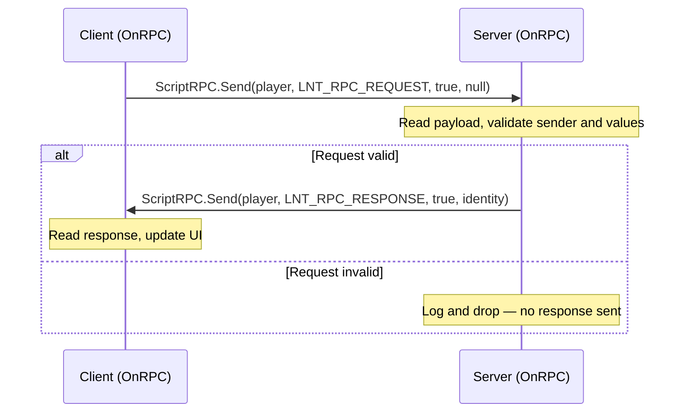

# Networking & RPC

> **Summary:** How data moves between DayZ clients and the server: `ScriptRPC` for sending, the `OnRPC` callback for receiving, the legacy `CGame.RPC()` API, `ScriptInputUserData` for input-channel messages, and net-sync variables for continuous entity state.

---

## Table of Contents

- [Client-Server Architecture](#client-server-architecture)
- [ScriptRPC](#scriptrpc)
- [Receiving RPCs](#receiving-rpcs)
- [Legacy RPC API](#legacy-rpc-api)
- [ScriptInputUserData](#scriptinputuserdata)
- [Choosing RPC IDs](#choosing-rpc-ids)
- [Network Sync Variables](#network-sync-variables)
- [Security Considerations](#security-considerations)
- [Summary](#summary)
- [Best Practices](#best-practices)
- [Multi-Mod Considerations](#multi-mod-considerations)

---

DayZ is a client-server game. All authoritative logic runs on the server, and clients communicate with it through Remote Procedure Calls (RPCs). This chapter covers the raw engine API surface. The higher-level routing architectures built on top of it — per-feature ID blocks versus a single string-routed dispatcher — are compared and implemented in [RPC Communication Patterns](../07-patterns/03-rpc-patterns.md).

Throughout this chapter, examples use the wiki's fictional **Lantern** teaching framework (`LNT_` prefix); every `LNT_` symbol used is defined in the chapter itself.

---

## Client-Server Architecture


### Environment Checks

These methods are defined on `CGame` (`3_Game/global/game.c`) and are called through `GetGame()`:

```c
// Declarations inside class CGame — 3_Game/global/game.c
proto native bool IsMultiplayer();      // true in any multiplayer session
proto native bool IsClient();           // true where a local player exists
proto native bool IsServer();           // true on a dedicated server and on a listen-server host
proto native bool IsDedicatedServer();  // true only on a dedicated server
```

The vanilla source notes that `IsDedicatedServer()` is the most robust of these checks — it becomes valid much sooner during startup than the others. On server-only script builds, the preprocessor check `#ifdef SERVER` can replace it for a slight performance gain.

**Typical guard pattern:**

```c
if (GetGame().IsServer())
{
    // Server-only logic
}

if (!GetGame().IsServer())
{
    // Client-only logic
}
```

### RPC Communication Flow

A typical request/response exchange between a client and the server:



---

## ScriptRPC

**File:** `3_Game/gameplay.c:104`

The primary RPC class for sending custom data between client and server. `ScriptRPC` extends `ParamsWriteContext`, so you call `.Write()` on it directly to serialize data.

### Class Definition

```c
class ScriptRPC : ParamsWriteContext
{
    void ScriptRPC();
    void ~ScriptRPC();
    proto native void Reset();
    proto native void Send(Object target, int rpc_type, bool guaranteed, PlayerIdentity recipient = NULL);
}
```

> **Note:** `Send()` does not reset the internal buffer. If you call `Send()` several times in a row, the same previously written data is sent again and again until you call `Reset()`. This is documented in the vanilla source.

### Send Parameters

| Parameter | Description |
|-----------|-------------|
| `target` | The object this RPC is associated with (`null` = global RPC, evaluated by `CGame` — see [Receiving RPCs](#receiving-rpcs)) |
| `rpc_type` | Integer RPC ID (must match between sender and receiver) |
| `guaranteed` | `true` = reliable delivery; `false` = unreliable (faster, may be dropped) |
| `recipient` | `PlayerIdentity` of the target client; `null` = broadcast to all clients (server only). Specifying a recipient increases security and decreases network traffic |

### Writing Data

`ParamsWriteContext` is a typedef for `Serializer` (`1_Core/proto/serializer.c`), which provides:

```c
proto bool Write(void value_out);
```

Supports all primitive types, arrays, and serializable objects:

```c
ScriptRPC rpc = new ScriptRPC();
rpc.Write(42);                          // int
rpc.Write(3.14);                        // float
rpc.Write(true);                        // bool
rpc.Write("hello");                     // string
rpc.Write(Vector(100, 0, 200));         // vector

array<string> names = {"Alice", "Bob"};
rpc.Write(names);                       // array<string>
```

### Shared Constants for the Examples Below

```c
// 3_Game layer — compiled on both client and server
const int LNT_RPC_MESSAGE  = 1000101;
const int LNT_RPC_REQUEST  = 1000102;
const int LNT_RPC_RESPONSE = 1000103;
const int LNT_RPC_SCORE    = 1000104;
```

### Sending: Server to Client

```c
// Send to a specific player
void SendDataToPlayer(PlayerBase player, int value, string message)
{
    if (!GetGame().IsServer())
        return;

    ScriptRPC rpc = new ScriptRPC();
    rpc.Write(value);
    rpc.Write(message);
    rpc.Send(player, LNT_RPC_MESSAGE, true, player.GetIdentity());
}

// Broadcast to all players (recipient = null)
void BroadcastData(PlayerBase player, string message)
{
    if (!GetGame().IsServer())
        return;

    ScriptRPC rpc = new ScriptRPC();
    rpc.Write(message);
    rpc.Send(player, LNT_RPC_MESSAGE, true, null);  // null recipient = all clients
}
```

### Sending: Client to Server

```c
void SendRequestToServer(int requestType)
{
    if (!GetGame().IsClient())
        return;

    PlayerBase player = PlayerBase.Cast(GetGame().GetPlayer());
    if (!player)
        return;

    ScriptRPC rpc = new ScriptRPC();
    rpc.Write(requestType);
    rpc.Send(player, LNT_RPC_REQUEST, true, null);
    // When sent from client, recipient is ignored — it always goes to server
}
```

---

## Receiving RPCs

RPCs sent with an object as `target` are received by overriding `OnRPC` on that object (or any parent class in its hierarchy).

### OnRPC Signature

Declared on `Object` (`3_Game/entities/object.c`):

```c
override void OnRPC(PlayerIdentity sender, int rpc_type, ParamsReadContext ctx)
{
    super.OnRPC(sender, rpc_type, ctx);

    if (rpc_type == LNT_RPC_MESSAGE)
    {
        // Read data in the same order it was written
        int value;
        string message;

        if (!ctx.Read(value))
            return;
        if (!ctx.Read(message))
            return;

        Print(string.Format("Received %1 / %2", value, message));
    }
}
```

### ParamsReadContext

`ParamsReadContext` is a typedef for `Serializer`:

```c
typedef Serializer ParamsReadContext;
typedef Serializer ParamsWriteContext;
```

The `Read` method:

```c
proto bool Read(void value_in);
```

Returns `true` on success, `false` if the read fails (wrong type, insufficient data). Always check the return value.

### Where RPCs Arrive

| Target Object | Receives RPCs Via |
|---------------|-------------------|
| `PlayerBase` | `OnRPC` override on the player (RPCs sent with `target = player`) |
| `ItemBase` | `OnRPC` override on the item (RPCs sent with `target = item`) |
| Any `Object` | `OnRPC` override on that object |
| Global (`target = null`) | `DayZGame.OnRPC()` (`3_Game/dayzgame.c`) — see below |

**Global RPCs:** every incoming RPC first passes through `DayZGame.OnRPC(PlayerIdentity sender, Object target, int rpc_type, ParamsReadContext ctx)` — note the extra `target` parameter at this level. If `target` is set, the engine-side handler forwards the call to `target.OnRPC()`; if it is `null`, vanilla routes the ID through its `ERPCs` switch. `DayZGame` also exposes a static `ScriptInvoker` named `Event_OnRPC` that is invoked for every RPC, which lets you observe global traffic without modding `DayZGame`:

```c
const int LNT_RPC_ANNOUNCE = 1000105;

class LNT_GlobalRpcListener
{
    void LNT_GlobalRpcListener()
    {
        DayZGame.Event_OnRPC.Insert(OnGlobalRPC);
    }

    void OnGlobalRPC(PlayerIdentity sender, Object target, int rpc_type, ParamsReadContext ctx)
    {
        if (rpc_type != LNT_RPC_ANNOUNCE)
            return;

        string text;
        if (!ctx.Read(text))
            return;

        Print("Announcement: " + text);
    }
}
```

### Example — Full Client-Server Exchange

```c
// Server-side: send data to client (4_World or 5_Mission)
class LNT_ScoreService
{
    void SendScore(PlayerBase player, int score)
    {
        ScriptRPC rpc = new ScriptRPC();
        rpc.Write(score);
        rpc.Send(player, LNT_RPC_SCORE, true, player.GetIdentity());
    }
}

// Client-side: receive data (modded PlayerBase)
modded class PlayerBase
{
    override void OnRPC(PlayerIdentity sender, int rpc_type, ParamsReadContext ctx)
    {
        super.OnRPC(sender, rpc_type, ctx);

        if (rpc_type == LNT_RPC_SCORE)
        {
            int score;
            if (!ctx.Read(score))
                return;

            Print(string.Format("Received score: %1", score));
        }
    }
}
```

---

## Legacy RPC API

The older array-based RPC system on `CGame`. Still used in vanilla code, but `ScriptRPC` is preferred for new mods.

### Signatures

```c
// Declarations inside class CGame — 3_Game/global/game.c
proto native void RPC(Object target, int rpcType, notnull array<ref Param> params, bool guaranteed, PlayerIdentity recipient = null);
proto native void RPCSingleParam(Object target, int rpc_type, Param param, bool guaranteed, PlayerIdentity recipient = null);

// Local-only variants: "not actually an RPC" (vanilla comment) — delivered
// only to the calling machine itself
proto native void RPCSelf(Object target, int rpcType, notnull array<ref Param> params);
proto native void RPCSelfSingleParam(Object target, int rpcType, Param param);
```

`Object` also has convenience wrappers `RPC()` and `RPCSingleParam()` (`3_Game/entities/object.c`) that pass `this` as the target.

### Param Classes

```c
class Param1<Class T1> extends Param { T1 param1; };
class Param2<Class T1, Class T2> extends Param { T1 param1; T2 param2; };
// ... up to Param8
```

**Example — legacy RPC:**

```c
const int LNT_RPC_GREETING = 1000106;

// Send (server side)
void SendGreeting(PlayerBase player)
{
    Param1<string> data = new Param1<string>("Hello World");
    GetGame().RPCSingleParam(player, LNT_RPC_GREETING, data, true, player.GetIdentity());
}

// Receive (inside an OnRPC override)
if (rpc_type == LNT_RPC_GREETING)
{
    Param1<string> data = new Param1<string>("");
    if (ctx.Read(data))
    {
        Print(data.param1);  // "Hello World"
    }
}
```

---

## ScriptInputUserData

**File:** `3_Game/gameplay.c`

A specialized write context for sending client-to-server input messages that go through the engine's input pipeline. Used by vanilla for inventory juggling and other input-driven operations.

```c
class ScriptInputUserData : ParamsWriteContext
{
    proto native void Reset();
    proto native void Send();
    proto native bool CopyFrom(ParamsReadContext other);
    proto native static bool CanStoreInputUserData();
}
```

### Usage Pattern

```c
// Client side
void SendAction(int actionId)
{
    if (!ScriptInputUserData.CanStoreInputUserData())
    {
        Print("Cannot send input data right now");
        return;
    }

    ScriptInputUserData ctx = new ScriptInputUserData();
    ctx.Write(actionId);
    ctx.Send();  // Automatically routed to server
}
```

> **Note:** the vanilla source documents `CanStoreInputUserData()` as returning `true` when the input channel is free **and** the input buffer is not full. The channel has limited capacity — always check it before sending, and expect it to return `false` under load.

---

## Choosing RPC IDs

Vanilla DayZ uses the `ERPCs` enum (`3_Game/enums/erpcs.c`) for built-in RPCs. Custom mods must use IDs that do not collide with vanilla — or with each other. If two mods pick the same integer, each receives the other's traffic and the mismatched `Read()` calls silently corrupt both.

**Per-feature ID block:**

```c
// Define in the 3_Game layer (shared between client and server)
const int LNT_RPC_BASE      = 1000100;  // large value, far away from vanilla ERPCs
const int LNT_RPC_FEATURE_A = LNT_RPC_BASE + 1;
const int LNT_RPC_FEATURE_B = LNT_RPC_BASE + 2;
const int LNT_RPC_FEATURE_C = LNT_RPC_BASE + 3;
```

### Single Engine ID Pattern

Frameworks with dozens of message types often reserve **one** engine RPC ID and route internally by a string (or enum) written as the first field of every payload:

```c
// The Lantern framework reserves a single engine ID for all of its traffic
const int LNT_RPC_ENGINE_ID = 1000042;
```

Pick one large, essentially random integer and never change it — the collision consequence is the same as above, but concentrated: another mod on the same ID would intercept your entire framework's traffic. The complete string-routed router built on this idea — handler registration, dispatch, and error handling — is developed step by step in [RPC Communication Patterns](../07-patterns/03-rpc-patterns.md), together with a comparison of the routing strategies.

---

## Network Sync Variables

For continuous entity state, net-sync variables are simpler and cheaper than RPCs. The server changes a registered member variable, marks the entity dirty, and the engine delivers the new value to clients automatically.

### Registration API

Declared on `EntityAI` (`3_Game/entities/entityai.c`):

```c
proto native void RegisterNetSyncVariableBool(string variableName);
proto native void RegisterNetSyncVariableBoolSignal(string variableName);
proto native void RegisterNetSyncVariableInt(string variableName, int minValue = 0, int maxValue = 0);
proto native void RegisterNetSyncVariableFloat(string variableName, float minValue = 0, float maxValue = 0, int precision = 1);
proto native void RegisterNetSyncVariableObject(string variableName);
```

| Variant | Notes (from the vanilla doc comments) |
|---------|---------------------------------------|
| `Bool` | Plain synced bool |
| `BoolSignal` | One-shot: when the bool becomes `true` it is sent to clients and reset to `false` again |
| `Int` / `Float` | `minValue`/`maxValue` define the quantization range; when `minValue == maxValue`, no quantization is done |
| `Float` | `precision` = number of digits after the decimal point |
| `Object` | Only synchronizes when the object has a network ID assigned; does not handle object despawn on the client |

### The Sync Lifecycle

1. **Register** the variable by name, in the entity's constructor.
2. **Change** the member variable — on the server.
3. Call **`SetSynchDirty()`** (`EntityAI`, "sets object synchronization dirty flag"; takes effect only in multiplayer, on the server side).
4. Clients receive the new value and the engine calls **`OnVariablesSynchronized()`** on the client-side instance.

### Adding a Synced Variable in a Modded Class

```c
modded class PlayerBase
{
    // 1. Declare the variable
    private bool m_LNT_Marked;

    // 2. Register it in the constructor (runs after the vanilla constructor)
    void PlayerBase()
    {
        RegisterNetSyncVariableBool("m_LNT_Marked");
    }

    // 3. Set on server and mark dirty
    void LNT_SetMarked(bool value)
    {
        m_LNT_Marked = value;
        SetSynchDirty();
    }

    // 4. React on client in OnVariablesSynchronized
    override void OnVariablesSynchronized()
    {
        super.OnVariablesSynchronized();

        if (m_LNT_Marked)
            Print("Marked flag is true on this client");
    }
}
```

The same pattern works on any `EntityAI`-derived class — items, vehicles, buildings. For the player-specific variables that vanilla `PlayerBase` already synchronizes this way, see [Player System](14-player-system.md).

### RPC or Net-Sync?

RPCs are better when:

- You need to send one-time events (not continuous state)
- The data does not belong to a specific entity
- You need to send complex or variable-length data
- You need client-to-server communication

Net sync variables are better when:

- You have a small number of variables on an entity that change periodically
- You want automatic delivery to every client that knows the entity
- The data naturally belongs to the entity

---

## Security Considerations

### Server-Side Validation

**Never trust client data.** Always validate RPC data on the server:

```c
modded class PlayerBase
{
    override void OnRPC(PlayerIdentity sender, int rpc_type, ParamsReadContext ctx)
    {
        super.OnRPC(sender, rpc_type, ctx);

        if (rpc_type == LNT_RPC_REQUEST && GetGame().IsServer())
        {
            int requestedAmount;
            if (!ctx.Read(requestedAmount))
                return;

            // VALIDATE: clamp to allowed range
            requestedAmount = Math.Clamp(requestedAmount, 0, 100);

            // VALIDATE: the sender must exist and be alive
            if (!sender)
                return;

            PlayerBase senderPlayer = PlayerBase.Cast(sender.GetPlayer());
            if (!senderPlayer || !senderPlayer.IsAlive())
                return;

            // VALIDATE: the request must target the sender's own entity
            if (senderPlayer != this)
                return;

            LNT_ProcessRequest(senderPlayer, requestedAmount);
        }
    }

    void LNT_ProcessRequest(PlayerBase player, int amount)
    {
        // Grant the validated request here (server-side)
    }
}
```

### Flooding and Bandwidth

Do not assume the engine rate-limits your `ScriptRPC` traffic — no such behavior is documented in the script API, and every `guaranteed = true` send produces a reliable network message. For high-frequency data:

- Use net sync variables instead
- Batch multiple values into a single RPC
- Throttle send frequency with a timer

`ScriptInputUserData` is the one place with a documented capacity limit: `CanStoreInputUserData()` reports whether the input channel can accept another message.

---

## Summary

| Concept | Key Point |
|---------|-----------|
| ScriptRPC | Primary RPC class: `Write()` data, then `Send(target, id, guaranteed, recipient)` |
| OnRPC | Override on target object to receive: `OnRPC(sender, rpc_type, ctx)` |
| Global RPCs | `target = null` → handled by `DayZGame.OnRPC()`; observable via `DayZGame.Event_OnRPC` |
| Read/Write | `ctx.Write(value)` / `ctx.Read(value)` — always check the Read return value |
| Direction | Client sends to server; server sends to specific client or broadcasts |
| Recipient | `null` = broadcast (server), ignored (client) |
| Guaranteed | `true` = reliable delivery, `false` = unreliable (faster) |
| Legacy | `GetGame().RPC()` / `RPCSingleParam()` with Param objects |
| Input data | `ScriptInputUserData` for input-channel client messages |
| Net-sync | `RegisterNetSyncVariable*` + `SetSynchDirty()` + `OnVariablesSynchronized()` |
| IDs | Use large values far from vanilla `ERPCs`; routing architectures in [RPC Communication Patterns](../07-patterns/03-rpc-patterns.md) |
| Security | Always validate client data on the server |

---

## Best Practices

- Always check `ctx.Read()` return values. Skipping the check leads to reading garbage data from the buffer, corrupting all subsequent reads.
- Define RPC ID constants in `3_Game` so both client and server compile them. Placing them in `4_World` or `5_Mission` means only one side sees them.
- Use `guaranteed = true` for state-changing RPCs, `false` only for cosmetic/frequent updates.
- Validate all client-sent data on the server. Clamp numeric ranges, verify identity, check permissions.
- Prefer `ScriptRPC` over the legacy `GetGame().RPC()` for new code. It avoids `Param` object allocation overhead and supports arbitrary data via `Write`.
- Remember that `ScriptRPC.Send()` does not clear the buffer — call `Reset()` before reusing an instance for different data.

---

## Multi-Mod Considerations

- **RPC ID collisions** are the primary risk. Two mods using the same integer RPC ID will intercept each other's messages, causing silent data corruption or crashes. Use large, distinctive base numbers.
- Always call `super.OnRPC()` in `modded class` overrides so other mods in the chain can process their own IDs. Forgetting `super` breaks all other mods' RPCs.
- Each `ScriptRPC.Send()` with `guaranteed = true` creates a reliable network packet. Batch data into fewer, larger RPCs to avoid saturating bandwidth.
- `ScriptRPC.Send()` from client always goes to server (recipient parameter is ignored). From server, `null` recipient broadcasts to all clients.
- For mods with many RPC types, a single reserved engine ID with internal routing avoids consuming many integer IDs — see [RPC Communication Patterns](../07-patterns/03-rpc-patterns.md).
- Custom net-sync variables add per-entity network overhead; keep the count low and prefer quantized ints/floats where possible.
