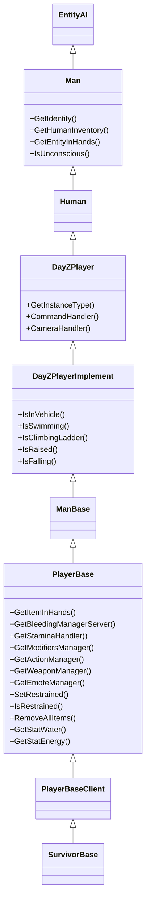

# Player System

> **Summary:** `PlayerBase` and the manager subsystems hanging off it --- identity, the
> three health pools, damage zones, stats, state checks, equipment access and net-sync
> variables. Every signature and default on this page was read out of the vanilla script
> dump and the character config; where client and server behave differently, the page says
> which side you are on.

---

## Introduction

`PlayerBase` is the single most important class in DayZ modding. Every gameplay system --- health, hunger, bleeding, stamina, inventory, restraints, unconsciousness --- lives on the player entity or one of its manager subsystems. Whether you are writing an admin tool, a survival mechanic, or a PvP mod, you will interact with PlayerBase constantly.

This chapter is an API reference for the player class hierarchy, its identity system, health pools, state checks, equipment access, and the manager objects that drive status effects. All method signatures are taken directly from the vanilla script source.

---

## Class Hierarchy

The player entity sits at the bottom of a deep inheritance chain. Each level adds capabilities:

```
Class (root of all Enforce Script classes)
└── Managed
    └── IEntity                        // 1_Core/proto/enentity.c
        └── Object                     // 3_Game/entities/object.c:64
            └── ObjectTyped            // 3_Game/entities/objecttyped.c:1
                └── Entity             // 3_Game/entities/entity.c:1
                    └── EntityAI       // 3_Game/entities/entityai.c:107
                        └── Man        // 3_Game/entities/man.c:15
                            └── Human  // 3_Game/human.c:1332  (class Human : Man)
                                └── DayZPlayer               // 3_Game/dayzplayer.c:1158
                                    └── DayZPlayerImplement  // 4_World/entities/dayzplayerimplement.c:86
                                        └── ManBase          // 4_World/entities/manbase.c:1
                                            └── PlayerBase       // 4_World/entities/manbase/playerbase.c:49
                                                └── PlayerBaseClient // 4_World/entities/manbase/playerbaseclient.c:1
                                                    └── SurvivorBase // 4_World/entities/manbase/playerbase/survivorbase.c:6
```

Two details that are easy to get wrong:

- `DayZPlayerImplement` **extends** `DayZPlayer` --- it is not a sibling of it.
- `SurvivorBase` is a real script class (`class SurvivorBase : PlayerBaseClient`), not a
  config-only entry, and it derives from `PlayerBaseClient`, not straight from
  `PlayerBase`. A matching `class SurvivorBase: Man` **does** also exist on the config
  side (`DZ/characters/data/config.cpp`); that is where the character's
  `DamageSystem` hitpoints live. The script class and the config class are two halves of
  the same type, not alternatives.

`Man` is declared conditionally: `class Man extends EntityAI` normally, and
`class Man extends Person` (with `Person extends Pawn`) when the engine is built with
`FEATURE_NETWORK_RECONCILIATION`. The chain shown above is the ordinary build.

### Hierarchy Diagram



### What Each Level Provides

| Class | Key Additions |
|-------|---------------|
| **Object** | `GetPosition()`, `SetPosition()`, `GetHealth()`, `SetHealth()`, `IsAlive()`, `SetAllowDamage()` |
| **EntityAI** | Inventory, attachments, damage zones, `EEInit()`, `EEKilled()`, `EEHitBy()`, net sync variables |
| **Man** | `GetIdentity()`, `GetHumanInventory()`, `GetEntityInHands()`, `IsUnconscious()` |
| **Human** | Script class in `3_Game/human.c` (`class Human : Man`). Provides low-level animation command interface between Man and DayZPlayer |
| **DayZPlayer** | Instance type, command system, camera system, animation commands |
| **DayZPlayerImplement** | Movement state checks (`IsInVehicle`, `IsSwimming`, `IsRaised`, `IsFalling`) |
| **ManBase** | Base implementation connecting DayZPlayerImplement to PlayerBase |
| **PlayerBase** | All gameplay systems: bleeding, stamina, modifiers, stats, actions, equipment |

---

## PlayerIdentity --- Who Is the Player?

**File:** `3_Game/gameplay.c`

`PlayerIdentity` represents the real person behind a player entity. It holds network and platform identifiers. Access it from any `Man`-derived class via `GetIdentity()` (declared on `Man` itself).

The methods below are actually declared on `PlayerIdentityBase`; `PlayerIdentity` is an
empty subclass of it (`class PlayerIdentity : PlayerIdentityBase`). The descriptions
quote the engine header's own comments.

### Key Methods

| Method | Return Type | Description (engine header comment) |
|--------|-------------|-------------|
| `GetName()` | `string` | "nick (short) name of player" |
| `GetPlainName()` | `string` | "nick without any processing" |
| `GetFullName()` | `string` | "full name of player" |
| `GetId()` | `string` | "unique id of player (hashed steamID, database Xbox id...) **can** be used in database or logs" |
| `GetPlainId()` | `string` | "plaintext unique id of player (**cannot** be used in database or logs)" |
| `GetPlayerId()` | `int` | "id of player in one session (is reused after player disconnects)" |
| `GetPlayer()` | `Man` | The player entity this identity belongs to |
| `GetPingAct()` / `GetPingMin()` / `GetPingMax()` / `GetPingAvg()` | `int` | "ping range estimation" --- the header does not promise an exact live ping |
| `GetBandwidthMin()` / `GetBandwidthMax()` / `GetBandwidthAvg()` | `int` | "bandwidth estimation (in kbps)" |

### Usage Example

```c
void LogPlayerInfo(PlayerBase player)
{
    PlayerIdentity identity = player.GetIdentity();
    if (!identity)
        return;

    string name      = identity.GetName();      // "PlayerNick"
    string plainId   = identity.GetPlainId();   // plaintext platform id
    string persistId = identity.GetId();        // hashed platform id -- use this for storage
    int peerId       = identity.GetPlayerId();  // 2 (session-only)

    // Only persistId belongs in a log line or a database key.
    Print("Player: " + name + " id: " + persistId);
}
```

### GetPlainId() vs GetId()

This is a common source of confusion, and the engine header is unambiguous about the
intended split:

| Method | What the header says | Intended use |
|--------|----------------------|--------------|
| `GetId()` | "unique id of player (hashed steamID, database Xbox id...) can be used in database or logs" | Persistent keys, admin logs, per-player save files |
| `GetPlainId()` | "plaintext unique id of player (cannot be used in database or logs)" | Runtime identification only |

> **Rule of thumb:** `GetId()` is the identifier Bohemia intends you to persist. Treat
> `GetPlainId()` as the plaintext platform ID and keep it out of anything you store or
> print, per the header's own wording.

**Two community claims worth flagging.** Neither is stated anywhere in the extracted
scripts, so this chapter does not assert them:

- That `GetId()` *is* the BattlEye GUID. It is widely repeated, and the shape matches,
  but the headers only say "hashed steamID, database Xbox id...". Nothing in vanilla
  script names BattlEye in this context.
- That `GetPlainId()` returns a Steam64 ID. On a PC server it does, in practice; but
  the header deliberately says "plaintext unique id", and the same method has to serve
  Xbox and PlayStation, where the value is not a Steam64 ID at all. Do not build a
  cross-platform feature on the assumption.

---

## Health System

Player health uses the same zone-based system as all `Object` entities, but with three separate pools that work together to determine survival.

### The Three Pools

| Pool | Zone/Type | Default Max | What Drains It |
|------|-----------|-------------|----------------|
| **Health** | `("", "Health")` | 100 | Starvation, dehydration, falling, melee, explosions |
| **Blood** | `("", "Blood")` | 5000 | Bullet wounds, bleeding, cuts |
| **Shock** | `("", "Shock")` | 100 | Bullet impacts, melee hits, flash grenades |

Those three maxima come from the config side, not from script: `DZ/characters/data/config.cpp`,
`class SurvivorBase: Man` -> `class DamageSystem` -> `class GlobalHealth`, which declares
`Health { hitpoints=100; }`, `Blood { hitpoints=5000; }` and `Shock { hitpoints=100; }`.
A mod that redefines `DamageSystem` on its own character class changes them, so read them
at runtime with `GetMaxHealth()` rather than hardcoding.

When **Health** reaches 0, the player dies. When **Blood** drops too low, the player loses consciousness and eventually dies. When **Shock** drops to 0, the player goes unconscious.

### Reading Health Values

```c
// Global health pools (empty string = global zone)
float health = player.GetHealth("", "Health");
float blood  = player.GetHealth("", "Blood");
float shock  = player.GetHealth("", "Shock");

// Maximum values
float maxHealth = player.GetMaxHealth("", "Health");
float maxBlood  = player.GetMaxHealth("", "Blood");
float maxShock  = player.GetMaxHealth("", "Shock");

// Normalized (0..1 range)
float health01 = player.GetHealth01("", "Health");

// Shorthand (equivalent to GetHealth("", ""))
float hp = player.GetHealth();
```

### Modifying Health

All health modification is **server-authoritative**. Only call these on the server.

```c
// Set absolute value
player.SetHealth("", "Health", 100.0);    // Full health
player.SetHealth("", "Blood", 5000.0);    // Full blood
player.SetHealth("", "Shock", 100.0);     // Full shock

// Add (positive) or subtract (negative)
player.AddHealth("", "Health", -25.0);    // Deal 25 damage
player.AddHealth("", "Blood", 500.0);     // Restore 500 blood

// Shorthand (sets global health)
player.SetHealth(100.0);
```

### Zone Health (Body Parts)

Players have damage zones for individual body parts. Each zone has its own "Health" property:

The full set declared under `class DamageZones` for `SurvivorBase` in
`DZ/characters/data/config.cpp` is **eleven** zones --- the hands and the `Brain` zone are
easy to miss:

```c
float headHp      = player.GetHealth("Head", "Health");
float brainHp     = player.GetHealth("Brain", "Health");
float torsoHp     = player.GetHealth("Torso", "Health");
float leftArmHp   = player.GetHealth("LeftArm", "Health");
float rightArmHp  = player.GetHealth("RightArm", "Health");
float leftHandHp  = player.GetHealth("LeftHand", "Health");
float rightHandHp = player.GetHealth("RightHand", "Health");
float leftLegHp   = player.GetHealth("LeftLeg", "Health");
float rightLegHp  = player.GetHealth("RightLeg", "Health");
float leftFootHp  = player.GetHealth("LeftFoot", "Health");
float rightFootHp = player.GetHealth("RightFoot", "Health");
```

Broken legs are triggered when any of the four leg/foot zones drops to **1 or below**
--- the literal test in `PlayerBase` is
`GetHealth("RightLeg","Health") <= 1 || GetHealth("LeftLeg","Health") <= 1 || GetHealth("RightFoot","Health") <= 1 || GetHealth("LeftFoot","Health") <= 1`
--- which activates the `MDF_BROKEN_LEGS` modifier. The modifier only deactivates again
once **both** `RightLeg` and `LeftLeg` are back at `100` (`BrokenLegsMdfr.HEALTHY_LEG`
in `4_World/classes/playermodifiers/modifiers/conditions/brokenlegs.c`), so partially
healed legs stay broken.

### Death and Hit Events

These events fire on the server and can be overridden in modded classes:

```c
// Called when the player is killed
override void EEKilled(Object killer)
{
    super.EEKilled(killer);
    // killer can be null (environment death), another player, or a zombie
    Print("Player died!");
}

// Called when the player takes a hit
override void EEHitBy(TotalDamageResult damageResult, int damageType,
    EntityAI source, int component, string dmgZone,
    string ammo, vector modelPos, float speedCoef)
{
    super.EEHitBy(damageResult, damageType, source, component,
        dmgZone, ammo, modelPos, speedCoef);

    float dmgDealt = damageResult.GetDamage(dmgZone, "Health");
    Print("Hit in " + dmgZone + " for " + dmgDealt + " damage");
}
```

---

## Status Effects and Stats

### Bleeding

Bleeding is managed by `BleedingSourcesManagerServer` (server) and `BleedingSourcesManagerRemote` (client visual). Each wound is a named "bleeding source" tied to a body selection.

```c
// Server only
BleedingSourcesManagerServer bleedMgr = player.GetBleedingManagerServer();
if (bleedMgr)
{
    // Add a bleeding source
    bleedMgr.AttemptAddBleedingSourceBySelection("RightForeArmRoll");

    // Remove all bleeding
    bleedMgr.RemoveAllSources();
}

// Both sides - count of active sources
int sourceCount = player.GetBleedingSourceCount();
```

### Food and Water

Food (energy) and water are stat objects, not health zones. They use a `PlayerStat<float>` wrapper.

```c
// Reading values -- SERVER-side values. See the warning below.
PlayerStat<float> waterStat = player.GetStatWater();
if (!waterStat)            // null if m_PlayerStats has not been built yet
    return;

float water     = waterStat.Get();
float waterMax  = waterStat.GetMax();

// Setting values (server only -- Set() has no network effect on a client)
waterStat.Set(waterMax);
player.GetStatEnergy().Set(player.GetStatEnergy().GetMax());
```

`GetStatWater()`, `GetStatEnergy()` and their siblings resolve lazily out of
`m_PlayerStats` and **return null** when that object is not available, so null-check
before chaining `.Get()`.

> **These stats are not replicated to the client.** `PlayerStatBase.Set()` only emits the
> `ERPCs.RPC_PLAYER_STAT` sync (inside `#ifdef SERVER`, addressed to the owning client)
> for stats registered with the `EPSstatsFlags.SYNCED` flag. In the current stats version
> (`PlayerStatsPCO_v115` in `4_World/classes/playerstats/playerstatspco.c`) the **only**
> stat carrying that flag is `HEATBUFFER`. Water, Energy, Diet, Stamina, Toxicity,
> HeatComfort, Tremor, Wet, Specialty and BloodType are all registered with
> `EPSstatsFlags.EMPTY`, so a client-side `GetStatWater().Get()` reads a local value the
> server never updated. Read these on the server, and push whatever the client needs
> yourself. The vanilla HUD works the same way --- it receives coarse badge states over
> `ERPCs.RPC_SYNC_DISPLAY_STATUS`, not raw stat numbers.
>
> Even on the server the sync is lossy by design: float changes smaller than `0.05` are
> skipped.

Default maximums for the current stats version:

| Stat | Max in `PlayerStatsPCO_v115` | Value |
|------|------------------------------|-------|
| Water | `PlayerConstants.SL_WATER_MAX` | 5000 (default start 600) |
| Energy | `PlayerConstants.SL_ENERGY_MAX` | 5000 (default start 600) |
| Diet | literal | 5000 (default start 2500) |
| Toxicity | literal | 100 |
| Stamina | `CfgGameplayHandler.GetStaminaMax()` | server-configurable, not a constant |
| HeatComfort | literal | range `-1 .. 1` |
| HeatBuffer | literal | range `-30 .. 30` |

Older `PlayerStatsPCO_v1xx` classes in the same file use different numbers (Energy was
`20000` in `v100`). Those exist for loading older saves --- do not read maxima off them.

### Temperature and Heat Comfort

```c
// Heat comfort: registered with range -1 .. 1 (negative = cold, positive = hot)
float heatComfort = player.GetStatHeatComfort().Get();

// Heat buffer: registered with range -30 .. 30 -- the one player stat that is
// flagged EPSstatsFlags.SYNCED, so this one IS readable on the owning client
float heatBuffer = player.GetStatHeatBuffer().Get();
```

### Stamina

Stamina is handled by a dedicated `StaminaHandler`:

```c
StaminaHandler staminaHandler = player.GetStaminaHandler();

// Check if player can perform an action
bool canSprint = staminaHandler.HasEnoughStaminaFor(EStaminaConsumers.SPRINT);
bool canJump   = staminaHandler.HasEnoughStaminaToStart(EStaminaConsumers.JUMP);
```

### Other Stats

```c
PlayerStat<float> tremor   = player.GetStatTremor();
PlayerStat<float> toxicity = player.GetStatToxicity();
PlayerStat<float> diet     = player.GetStatDiet();
PlayerStat<float> stamina  = player.GetStatStamina();
```

---

## Player State Checks

DayZPlayerImplement and PlayerBase provide a comprehensive set of state queries. These are safe to call on both client and server.

### Movement and Stance

```c
bool inVehicle  = player.IsInVehicle();
bool swimming   = player.IsSwimming();
bool climbing   = player.IsClimbing();       // Vault/climb obstacle
bool onLadder   = player.IsClimbingLadder();
bool falling    = player.IsFalling();
bool raised     = player.IsRaised();         // Weapon raised
```

### Vital States

```c
bool alive       = player.IsAlive();         // Health > 0
bool unconscious = player.IsUnconscious();   // Shock knocked out
bool restrained  = player.IsRestrained();    // Handcuffed
```

### Where These Methods Live

| Method | Defined In | How It Works |
|--------|-----------|--------------|
| `IsAlive()` | `Object` | Returns `!IsDamageDestroyed()` |
| `IsUnconscious()` | declared on `Man`, implemented in `PlayerBase` | True when the command type is `COMMANDID_UNCONSCIOUS` **or** the synced `m_IsUnconscious` flag is set. `IsUnconsciousStateOnly()` returns just the flag |
| `IsRestrained()` | declared on `DayZPlayerImplement`, implemented in `PlayerBase` | Returns `m_IsRestrained` (synced variable) |
| `IsInVehicle()` | `DayZPlayerImplement` | Checks `COMMANDID_VEHICLE` **or** `GetParent()` inherits `Transport` |
| `IsSwimming()` | `DayZPlayerImplement` | Checks `COMMANDID_SWIM` |
| `IsClimbing()` | `PlayerBase` | Checks `COMMANDID_CLIMB` |
| `IsClimbingLadder()` | `DayZPlayerImplement` | Checks `COMMANDID_LADDER` |
| `IsFalling()` | `PlayerBase` | Checks `COMMANDID_FALL` |
| `IsRaised()` | `DayZPlayerImplement` | Returns the cached `m_IsRaised` field --- **not** a live `m_MovementState.IsRaised()` call. `DayZPlayerImplement.CommandHandler()` refreshes that field once per tick from the movement state |

### Compound State Check Example

```c
bool CanPerformAction(PlayerBase player)
{
    if (!player || !player.IsAlive())
        return false;

    if (player.IsUnconscious())
        return false;

    if (player.IsRestrained())
        return false;

    if (player.IsSwimming() || player.IsClimbingLadder())
        return false;

    if (player.IsInVehicle())
        return false;

    return true;
}
```

This pattern mirrors how vanilla checks `CanBeRestrained()`:

```c
// Vanilla PlayerBase.CanBeRestrained(), reformatted for width.
// The real method is one long condition plus a second throwing check.
if (IsInVehicle() || IsRaised() || IsSwimming() || IsClimbing()
    || IsClimbingLadder() || IsRestrained()
    || !GetWeaponManager() || GetWeaponManager().IsRunning()
    || !GetActionManager() || GetActionManager().GetRunningAction() != null
    || IsMapOpen())
{
    return false;
}

if (GetThrowing() && GetThrowing().IsThrowingModeEnabled())
{
    return false;
}

return true;
```

---

## Equipment and Inventory

### Item in Hands

```c
// Returns ItemBase (cast of GetEntityInHands())
ItemBase itemInHands = player.GetItemInHands();

// Check if holding a weapon
if (itemInHands && itemInHands.IsWeapon())
{
    Weapon_Base weapon = Weapon_Base.Cast(itemInHands);
}

// The lower-level method (returns EntityAI)
EntityAI entityInHands = player.GetEntityInHands();
```

### Finding Attachments by Slot

Clothing and equipment are attached to named slots on the player entity. Use `FindAttachmentBySlotName()` (defined on `EntityAI`):

```c
EntityAI headgear  = player.FindAttachmentBySlotName("Headgear");
EntityAI vest      = player.FindAttachmentBySlotName("Vest");
EntityAI back      = player.FindAttachmentBySlotName("Back");
EntityAI body      = player.FindAttachmentBySlotName("Body");
EntityAI legs      = player.FindAttachmentBySlotName("Legs");
EntityAI feet      = player.FindAttachmentBySlotName("Feet");
EntityAI gloves    = player.FindAttachmentBySlotName("Gloves");
EntityAI armband   = player.FindAttachmentBySlotName("Armband");
EntityAI eyewear   = player.FindAttachmentBySlotName("Eyewear");
EntityAI mask      = player.FindAttachmentBySlotName("Mask");
EntityAI shoulder  = player.FindAttachmentBySlotName("Shoulder");
EntityAI melee     = player.FindAttachmentBySlotName("Melee");
```

### Inventory Access

```c
// Full inventory interface
HumanInventory inventory = player.GetHumanInventory();

// Iterate all attachments
GameInventory gi = player.GetInventory();
for (int i = 0; i < gi.AttachmentCount(); i++)
{
    EntityAI attachment = gi.GetAttachmentFromIndex(i);
    Print("Attachment: " + attachment.GetType());
}
```

---

## Player Actions (Server-Side Operations)

These operations must run on the server. Calling them on the client will either have no effect or cause desync.

### God Mode

```c
// Prevent all damage (defined on Object)
player.SetAllowDamage(false);    // Enable god mode
player.SetAllowDamage(true);     // Disable god mode
```

### Teleport

```c
// Teleport to coordinates
vector destination = Vector(6543.0, 0, 2872.0);
destination[1] = GetGame().SurfaceY(destination[0], destination[2]);
player.SetPosition(destination);
```

### Full Heal

```c
void HealPlayer(PlayerBase player)
{
    // Restore health pools.
    // Object.SetHealthMax(zone, type) is the built-in shorthand for
    // SetHealth(zone, type, GetMaxHealth(zone, type)).
    player.SetHealthMax("", "Health");
    player.SetHealthMax("", "Blood");
    player.SetHealthMax("", "Shock");

    // Restore food and water (both getters can return null)
    if (player.GetStatWater())
        player.GetStatWater().Set(player.GetStatWater().GetMax());
    if (player.GetStatEnergy())
        player.GetStatEnergy().Set(player.GetStatEnergy().GetMax());

    // Stop all bleeding
    if (player.GetBleedingManagerServer())
        player.GetBleedingManagerServer().RemoveAllSources();

    // Reset modifiers (disease, infection, etc.)
    player.GetModifiersManager().ResetAll();
}
```

### Kill

```c
player.SetHealth("", "Health", 0);
```

### Strip (Remove All Items)

```c
player.RemoveAllItems();
```

### Restrain / Unrestrain

```c
player.SetRestrained(true);    // Handcuff
player.SetRestrained(false);   // Release
```

### Disable Status Effects

```c
// SERVER ONLY. PlayerBase.SetModifiers() forwards straight to
// GetModifiersManager().SetModifiers(enable) with no null guard, and
// m_ModifiersManager is only constructed inside the constructor's
// `if (g_Game.IsServer())` block -- so calling this on a client is a
// null-pointer crash, not a silent no-op.
player.SetModifiers(false);    // Pause all modifiers
player.SetModifiers(true);     // Resume modifiers
```

---

## Networking and Synchronization

### Instance Type

Every player entity has an instance type that tells you whether the current machine is the server, the controlling client, or a remote observer:

```c
DayZPlayerInstanceType instType = player.GetInstanceType();

// Possible values:
// DayZPlayerInstanceType.INSTANCETYPE_SERVER      - Dedicated server
// DayZPlayerInstanceType.INSTANCETYPE_CLIENT      - Controlling client
// DayZPlayerInstanceType.INSTANCETYPE_AI_SERVER   - AI on server
// DayZPlayerInstanceType.INSTANCETYPE_AI_REMOTE   - AI on client
// DayZPlayerInstanceType.INSTANCETYPE_REMOTE      - Other players (remote proxy)
// DayZPlayerInstanceType.INSTANCETYPE_AI_SINGLEPLAYER - Offline AI
```

### What Syncs Automatically

PlayerBase registers numerous variables for automatic network synchronization via `RegisterNetSyncVariable*()`. When the server modifies these variables and calls `SetSynchDirty()`, clients receive updates through `OnVariablesSynchronized()`.

**Automatically synced variables include:**

| Variable | Type | What It Represents |
|----------|------|-------------------|
| `m_IsUnconscious` | `bool` | Unconscious state |
| `m_IsRestrained` | `bool` | Handcuffed state |
| `m_IsInWater` | `bool` | In water state |
| `m_BleedingBits` | `int` | Active bleeding source bitmask |
| `m_ShockSimplified` | `int` | Shock level (0..63) |
| `m_HealthLevel` | `int` | Injury animation level |
| `m_CorpseState` | `int` | Corpse decomposition stage |
| `m_StaminaState` | `int` | Stamina state for animations |
| `m_LifeSpanState` | `int` | Beard growth stage |
| `m_HasBloodTypeVisible` | `bool` | Blood type test done |
| `m_HasHeatBuffer` | `bool` | Heat buffer active |

### OnVariablesSynchronized

This is the client-side callback that fires whenever synced variables change:

```c
// Vanilla PlayerBase.OnVariablesSynchronized(), heavily abridged and reformatted for width.
// The real method runs from playerbase.c:5888 to past L5975 and also handles
// CheckSoundEvent(), the hair-selection refresh, the m_RefreshAnimStateIdx branch, the
// effect-area enter/leave branch, the m_SyncedModifiers XOR block, HandleBrokenLegsSync()
// and the in-hands item refresh. Only the three branches discussed here are shown.
override void OnVariablesSynchronized()
{
    super.OnVariablesSynchronized();

    // Update lifespan visuals (beard, bloody hands)
    if (m_ModuleLifespan)
        m_ModuleLifespan.SynchLifespanVisual(this, m_LifeSpanState,
            m_HasBloodyHandsVisible, m_HasBloodTypeVisible, m_BloodType);

    // Update bleeding particles on remote clients
    if (GetBleedingManagerRemote() && IsPlayerLoaded())
        GetBleedingManagerRemote().OnVariablesSynchronized(GetBleedingBits());

    // Update corpse visuals (playerbase.c:5910 -- the full condition, not simplified)
    if (m_CorpseStateLocal != m_CorpseState
        && (IsPlayerLoaded() || IsControlledPlayer()))
        UpdateCorpseState();
}
```

### Custom Synced Variables

Adding your own synced variable to a `modded class PlayerBase` uses the generic net-sync mechanism (`RegisterNetSyncVariable*` + `SetSynchDirty()` + `OnVariablesSynchronized()`). The full walkthrough — registration variants, quantization parameters, and a complete modded-class example — lives in [Networking & RPC](09-networking.md#network-sync-variables).

### Identity and PlayerBase Relationship

`PlayerIdentity` and `PlayerBase` are separate objects linked by the engine:

- `PlayerBase.GetIdentity()` returns the identity (can be null during connect/disconnect)
- `PlayerIdentity.GetPlayer()` returns the `Man` entity (cast to `PlayerBase`)
- A player entity can briefly exist without an identity during initial connection
- After disconnect, the identity is detached before the entity is cleaned up

---

## Manager Subsystems

PlayerBase owns several manager objects that handle specific gameplay systems. **They are
not all server-side, and not all are created in the constructor** --- getting this wrong is
a common source of null-reference crashes. The split in
`4_World/entities/manbase/playerbase.c` is:

| Created | Literal guard | Which managers |
|---------|---------------|----------------|
| In the constructor, unguarded | *(none)* | `StaminaHandler`, `InjuryAnimationHandler`, `ShockHandler`, `HeatComfortAnimHandler`, `PlayerStats`, `ArrowManagerPlayer`, `SymptomManager`, `TransferValues`, `EmoteManager`, `SoftSkillsManager`, `WeaponManager`, `RandomGeneratorSyncManager` |
| In the constructor, server side | `if (g_Game.IsServer())` (L414-427) | `PlayerStomach`, `NotifiersManager`, `PlayerAgentPool`, `BleedingSourcesManagerServer`, `Environment`, `ModifiersManager`, `PlayerSoundManagerServer` |
| In the constructor, anything that is not a dedicated server | `if (!g_Game.IsDedicatedServer())` (L439-450) | `InventoryActionHandler`, **`BleedingSourcesManagerRemote`**, `PlayerSoundManagerClient`, `StanceIndicator` |
| Later, by `GetInstanceType()` | `INSTANCETYPE_SERVER` / `INSTANCETYPE_CLIENT` (L6084-6100) | `ActionManagerServer` on `INSTANCETYPE_SERVER`; `ActionManagerClient` **and `CraftingManager`** on `INSTANCETYPE_CLIENT` |

**Read the guards literally, not as "client vs server."** `g_Game.IsServer()` is also true on
a listen server, and `!g_Game.IsDedicatedServer()` means *not a dedicated server* rather than
*client*. On a listen server both constructor branches run and both sets of managers exist.

So on a dedicated-server instance `GetCraftingManager()` and `GetBleedingManagerRemote()` are
null, and on a pure client `GetModifiersManager()`, `GetBleedingManagerServer()` and
`m_AgentPool` are null. Null-check whichever side you are not sure about.

### ModifiersManager

**Purpose:** Controls all status effect modifiers (disease, hunger, temperature effects, broken legs).

```c
ModifiersManager modMgr = player.GetModifiersManager();

// Activate a specific modifier.
// Full signature: ActivateModifier(int modifier_id, bool triggerEvent = EActivationType.TRIGGER_EVENT_ON_ACTIVATION)
modMgr.ActivateModifier(eModifiers.MDF_BROKEN_LEGS);

// Deactivate a modifier.
// Full signature: DeactivateModifier(int modifier_id, bool triggerEvent = true)
modMgr.DeactivateModifier(eModifiers.MDF_BROKEN_LEGS);

// Turn every modifier off in one call
modMgr.DeactivateAllModifiers();

// Check if active
bool isActive = modMgr.IsModifierActive(eModifiers.MDF_BROKEN_LEGS);

// Reset all modifiers
modMgr.ResetAll();

// Enable/disable the entire modifier system
modMgr.SetModifiers(false);  // Pause all
modMgr.SetModifiers(true);   // Resume all
```

### PlayerAgentPool

**Purpose:** Manages disease agents (cholera, influenza, salmonella, etc.).

```c
// Server only -- m_AgentPool is created inside the constructor's
// `if (g_Game.IsServer())` block and stays null on clients.
PlayerAgentPool agentPool = player.m_AgentPool;
```

Agents are typically added through contaminated food/water and removed by the immune system or medication.

### BleedingSourcesManagerServer

**Purpose:** Tracks individual wound locations and their bleeding rate.

```c
BleedingSourcesManagerServer bleedMgr = player.GetBleedingManagerServer();
if (bleedMgr)
{
    bleedMgr.AttemptAddBleedingSourceBySelection("LeftForeArmRoll");
    bleedMgr.RemoveAllSources();
}
```

Bleeding sources are tied to model bone selections (e.g., `"RightForeArmRoll"`, `"LeftLeg"`, `"RightFoot"`, `"Head"`). On the client side, `BleedingSourcesManagerRemote` handles particle effects.

### StaminaHandler

**Purpose:** Manages stamina pool, consumption, and recovery.

```c
StaminaHandler staminaHandler = player.GetStaminaHandler();
```

### ShockHandler

**Purpose:** Manages the shock damage pool and unconsciousness threshold.

```c
// Accessed via member variable
ShockHandler shockHandler = player.m_ShockHandler;
```

### ActionManagerBase

**Purpose:** Manages the action system (continuous actions like eating, bandaging, crafting).

```c
ActionManagerBase actionMgr = player.GetActionManager();
ActionBase runningAction = actionMgr.GetRunningAction();
if (runningAction)
    Print("Currently doing: " + runningAction.GetType().ToString());
```

### WeaponManager

**Purpose:** Handles weapon operations (reload, chamber, unjam).

```c
WeaponManager weaponMgr = player.GetWeaponManager();
bool isBusy = weaponMgr.IsRunning();
```

### EmoteManager

**Purpose:** Controls emote/gesture playback.

```c
EmoteManager emoteMgr = player.GetEmoteManager();
bool locked = emoteMgr.IsControllsLocked();
```

### Other Managers

| Manager | Member Variable | Purpose |
|---------|----------------|---------|
| `SymptomManager` | `m_SymptomManager` | Visual/audio symptoms (coughing, sneezing) |
| `SoftSkillsManager` | `m_SoftSkillsManager` | Soft skill progression |
| `Environment` | `m_Environment` | Temperature, wetness, wind effects |
| `PlayerStomach` | `m_PlayerStomach` | Food/liquid digestion simulation |
| `CraftingManager` | `m_CraftingManager` | Recipe-based crafting. **Client-side only** --- constructed only for `INSTANCETYPE_CLIENT` |
| `InjuryAnimationHandler` | `m_InjuryHandler` | Limping, injury animations |

---

## Common Patterns

### Finding a Player by Identity

```c
PlayerBase FindPlayerByPlainId(string plainId)
{
    array<Man> players = new array<Man>();
    GetGame().GetPlayers(players);

    foreach (Man man : players)
    {
        PlayerIdentity identity = man.GetIdentity();
        if (identity && identity.GetPlainId() == plainId)
            return PlayerBase.Cast(man);
    }

    return null;
}
```

`CGame.GetPlayers()` is declared `proto native void GetPlayers(out array<Man> players)`;
you allocate the array and it is filled in place. On a client it lists only the entities
that client actually has, so treat it as a server-side enumeration.

### Iterating All Online Players

```c
void DoSomethingToAllPlayers()
{
    array<Man> players = new array<Man>();
    GetGame().GetPlayers(players);

    foreach (Man man : players)
    {
        PlayerBase player = PlayerBase.Cast(man);
        if (!player || !player.IsAlive())
            continue;

        // Do something with each living player
        Print("Player: " + player.GetIdentity().GetName());
    }
}
```

### Getting Player Look Direction

```c
// Simple forward direction (from Object)
vector lookDir = player.GetDirection();

// Heading vector for gameplay purposes
vector headingDir = MiscGameplayFunctions.GetHeadingVector(player);

// Full camera-based aiming direction
vector cameraPos = GetGame().GetCurrentCameraPosition();
vector cameraDir = GetGame().GetCurrentCameraDirection();
// Use cameraDir for raycast aiming
```

### Safely Getting the Local Player

```c
// On CLIENT only - returns null on dedicated server!
PlayerBase GetLocalPlayer()
{
    return PlayerBase.Cast(GetGame().GetPlayer());
}
```

### Server-Side Player Lookup from RPC

```c
// In an RPC handler, the sender identity tells you who sent it
void OnRPC(PlayerIdentity sender, int rpc_type, ParamsReadContext ctx)
{
    if (!sender)
        return;

    // Find their player entity
    Man playerMan = sender.GetPlayer();
    PlayerBase player = PlayerBase.Cast(playerMan);
    if (!player)
        return;

    // Now you have both identity and entity
    string name = sender.GetName();
    vector pos = player.GetPosition();
}
```

---

## Common Mistakes

### 1. GetGame().GetPlayer() Returns Null on Server

`CGame.GetPlayer()` is declared `proto native DayZPlayer GetPlayer()` and returns the
**local** player entity. On a dedicated server there is no local player, so it returns
`null`.

The engine header carries no comment saying so --- the evidence is behavioural: vanilla
consistently gates `GetPlayer()` behind `!g_Game.IsDedicatedServer()` or an
`INSTANCETYPE_CLIENT` check, and uses `GetPlayers(out array<Man>)` for server-side
enumeration instead. Treat it as a reliable convention rather than a documented guarantee,
and null-check regardless.

```c
// WRONG - will crash on dedicated server
PlayerBase player = PlayerBase.Cast(GetGame().GetPlayer());
player.SetHealth(100); // null pointer!

// CORRECT - only use on client
if (!GetGame().IsDedicatedServer())
{
    PlayerBase localPlayer = PlayerBase.Cast(GetGame().GetPlayer());
    if (localPlayer)
    {
        // Client-side only operations
    }
}
```

### 2. PlayerIdentity Can Be Null

During the connection handshake, a player entity can exist briefly before its identity is assigned. Always null-check.

```c
// WRONG
string name = player.GetIdentity().GetName(); // crash if identity is null!

// CORRECT
PlayerIdentity identity = player.GetIdentity();
if (identity)
{
    string name = identity.GetName();
}
```

> **"PlayerIdentity is server-only" is a widely repeated claim, and it is only half true.** Other players' `PlayerIdentity` objects are indeed not replicated to your client -- that part is correct. But the **local** player's own identity is available on his own client: `GetIdentity()` is declared on `Man` itself (not gated behind a server-only class), and vanilla client code calls it directly. A client does not need a round-trip to the server just to learn its own UID.
>
> The null case you actually need to guard for is **timing**, not permanent absence: identity is not populated the instant the mission starts, so read it fresh at the point of use --
> ```c
> string GetLocalUID()
> {
>     Man player = GetGame().GetPlayer();
>     if (!player) return "";
>     PlayerIdentity identity = player.GetIdentity();
>     if (!identity) return "";   // not populated YET, not "never will be"
>     return identity.GetPlainId();
> }
> ```
> -- and never cache it once at `OnInit()`/mission start, or you will lock in an empty string for the whole session.

### 3. Not Checking IsAlive() Before Operations

Dead player entities still exist in the world as corpses. Many operations are meaningless or harmful on dead players.

```c
// WRONG
player.SetHealth("", "Blood", 5000); // Healing a corpse does nothing useful

// CORRECT
if (player.IsAlive())
{
    player.SetHealth("", "Blood", 5000);
}
```

### 4. Modifying Health on Client

Health changes are **server-authoritative**. Setting health on the client will be overwritten by the next server sync, or worse, cause desync.

```c
// WRONG - client-side health change will desync
player.SetHealth("", "Health", 100);

// CORRECT - check that we are on the server
if (GetGame().IsServer())
{
    player.SetHealth("", "Health", 100);
}
```

### 5. Confusing GetPlainId() and GetId()

```c
// Per the engine header (3_Game/gameplay.c):
//   GetPlainId() = "plaintext unique id of player (cannot be used in database or logs)"
//   GetId()      = "unique id of player (hashed steamID, database Xbox id...)
//                   can be used in database or logs"

// WRONG - GetId() is a hash. It will never match a platform profile id.
string profileUrl = "https://steamcommunity.com/profiles/" + identity.GetId();

// Works on a PC/Steam server, where the plaintext id is the Steam64 id.
// It is NOT a Steam64 id on Xbox or PlayStation, and the header explicitly
// says this value does not belong in a database or a log.
string profileUrl = "https://steamcommunity.com/profiles/" + identity.GetPlainId();
```

If you need both --- a stable storage key *and* a profile link --- store `GetId()` as the
key and treat the platform id as display-only data you re-read each session.

### 6. Forgetting SetSynchDirty()

After modifying a synced variable, you must call `SetSynchDirty()` to trigger network synchronization. Without it, clients will never see the change.

```c
// WRONG - clients won't see the restrain state change
m_IsRestrained = true;

// CORRECT - how SetRestrained() actually works
void SetRestrained(bool is_restrained)
{
    m_IsRestrained = is_restrained;
    SetSynchDirty();    // Tells engine to send update to clients
}
```

### 7. Believing You Must Cast to `EntityAI` Before Calling `IsAlive()`

You do not. `IsAlive()` is declared **exactly once in the entire script dump** --- on `Object`,
at `3_Game/entities/object.c:523-526` --- and its whole body is `return !IsDamageDestroyed();`.
`EntityAI` overrides neither `IsAlive()` nor `IsDamageDestroyed()` (the latter is
`proto native` on `Object` at L977). Casting an `Object` to `EntityAI` and calling `IsAlive()`
therefore runs identical code; there is no "fuller damage system context" to gain.

```c
// This is fine on its own -- Object.IsAlive() is the only IsAlive() there is.
Object obj = GetSomeObject();
if (obj && obj.IsAlive())
{
    // ...
}
```

The real reason to cast is that you need **members that only exist further down the
hierarchy** --- inventory, attachments, `PlayerBase` state. Cast for those, not for
`IsAlive()`:

```c
Object obj = GetSomeObject();

// Cast because of what comes AFTER the alive check, not because of the check itself
PlayerBase player = PlayerBase.Cast(obj);
if (player && player.IsAlive())
{
    // Now safely work with the living player: PlayerBase members are available here
}
```

---

## Quick Reference Table

| Task | Code |
|------|------|
| Get identity | `player.GetIdentity()` |
| Get Steam ID | `player.GetIdentity().GetPlainId()` |
| Get health | `player.GetHealth("", "Health")` |
| Set health | `player.SetHealth("", "Health", value)` |
| Get blood | `player.GetHealth("", "Blood")` |
| Get shock | `player.GetHealth("", "Shock")` |
| Is alive | `player.IsAlive()` |
| Is unconscious | `player.IsUnconscious()` |
| Is restrained | `player.IsRestrained()` |
| Get item in hands | `player.GetItemInHands()` |
| Get headgear | `player.FindAttachmentBySlotName("Headgear")` |
| God mode | `player.SetAllowDamage(false)` |
| Teleport | `player.SetPosition(vector)` |
| Kill | `player.SetHealth("", "Health", 0)` |
| Strip inventory | `player.RemoveAllItems()` |
| Get all players | `GetGame().GetPlayers(array<Man>)` |
| Get local player | `PlayerBase.Cast(GetGame().GetPlayer())` (client only!) |
| Get water stat | `player.GetStatWater().Get()` |
| Get energy stat | `player.GetStatEnergy().Get()` |
| Bleeding count | `player.GetBleedingSourceCount()` |
| Stop bleeding | `player.GetBleedingManagerServer().RemoveAllSources()` |
| Check instance type | `player.GetInstanceType()` |
| Restrain | `player.SetRestrained(true)` |

---

For the complete entity hierarchy that PlayerBase inherits from, see [Entity System](01-entity-system.md).

---

## Best Practices

- **Always null-check `GetIdentity()` before accessing player identity fields.** During the connection handshake and disconnect teardown, a `PlayerBase` entity can exist without an identity. Calling `GetIdentity().GetName()` without a null check crashes the server.
- **Use `GetId()` for anything you store or log; keep `GetPlainId()` out of both.** The engine header says `GetId()` is a "hashed steamID, database Xbox id..." that "can be used in database or logs", and that `GetPlainId()` is the "plaintext unique id of player" that "cannot be used in database or logs". On a PC server the plaintext id is the Steam64 id, which is what makes profile links work --- but that is a platform detail, not a promise, and it does not hold on console. Do not call `GetId()` "the BattlEye GUID": nothing in the extracted scripts identifies it as BattlEye-specific, and a server's BattlEye `bans.txt` is a separate BattlEye-side file from anything the mission writes.
- **Guard all health modifications with `GetGame().IsServer()`.** Health, blood, shock, stats, and bleeding are server-authoritative. Client-side changes are overwritten on the next sync and cause desync artifacts.
- **Check `IsAlive()` before performing operations on player entities.** Dead player entities persist as corpses. Healing, teleporting, or equipping a corpse wastes server resources and can cause unexpected behavior.
- **Call `SetSynchDirty()` after modifying any `RegisterNetSyncVariable*` field.** Without this call, clients never receive the updated value. This applies to both vanilla synced variables and your custom ones.

---

## Compatibility & Impact

`PlayerBase` is the single most modded class in DayZ. Admin tools, survival mods, PvP systems, and UI mods all add `modded class PlayerBase` with custom fields, overrides, and synced variables.

- **Load Order:** Multiple `modded class PlayerBase` declarations coexist as long as each calls `super` in every override. The last-loaded mod's overrides wrap all previous ones.
- **Modded Class Conflicts:** Common conflict points are `OnVariablesSynchronized()` (forgetting `super` hides other mods' sync logic), `EEHitBy()` (damage modification mods overriding each other), and the constructor (net sync variable registration order must be consistent).
- **Performance Impact:** Every `RegisterNetSyncVariable*` field is part of the entity's sync payload, so adding them costs per-player bandwidth. How the engine diffs and packs that payload is not visible from script, so the popular "keep it under 4-5 variables per mod" figure has no source in the headers and none was measured for this chapter --- do not treat it as a limit. What the headers *do* give you is the real lever: the `Int`/`Float` registration variants take explicit min/max (and for floats, a precision) and quantize accordingly, e.g. `RegisterNetSyncVariableInt("m_ShockSimplified", 0, SIMPLIFIED_SHOCK_CAP)` and `RegisterNetSyncVariableFloat("m_HeatBufferDynamicMax", 0.0, 1.0, 2)`. Give every variable the tightest range it can live with, and prefer one packed int over several bools, exactly as vanilla does with `m_BleedingBits` and `m_SyncedModifiers`.
- **Server/Client:** `GetGame().GetPlayer()` returns null on dedicated servers. Use `GetGame().GetPlayers(array)` to iterate server-side players. Manager subsystems like `GetBleedingManagerServer()` return null on clients; use `GetBleedingManagerRemote()` for client-side particle effects instead.

---

## Recurring Patterns in Player Mods

Community mods converge on the same handful of PlayerBase techniques. Each row names the pattern and the vanilla API it is built on:

| Pattern | Vanilla API It Builds On |
|---------|--------------------------|
| Group/party membership flag synced to all clients | `RegisterNetSyncVariableBool()` in a `modded class PlayerBase` constructor, plus `SetSynchDirty()` on change |
| Killfeed / damage-source tracking | `EEHitBy()` override (`4_World/entities/manbase/playerbase.c`) reading `TotalDamageResult` and the `source` entity |
| Per-player data loaded from `$profile:` JSON on connect | Files keyed by `GetIdentity().GetId()` — the hashed platform id that `PlayerIdentityBase` (`3_Game/gameplay.c`) documents as safe for databases and logs. Not the BattlEye GUID, and unrelated to BattlEye's own `bans.txt`. |
| Admin "full heal" command | `SetHealth()` on all three pools, stat `Set()` calls, and `GetBleedingManagerServer().RemoveAllSources()` |
| Client-side status HUD driven by server state | `OnVariablesSynchronized()` override reading synced stat variables |
