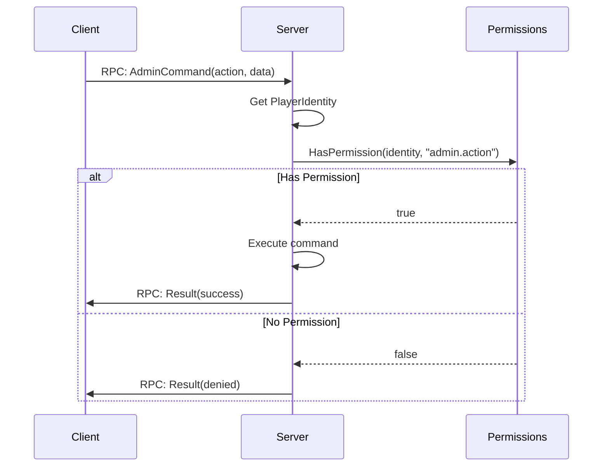

# Admin & Server Management

> **Summary:** The engine-level APIs that server administration is built on — reading the player list and identity, kicking and banning, writing the admin log, controlling time and weather, and reaching the Hive. Operational topics (server startup, launch parameters, `serverDZ.cfg`, BattlEye setup) live in Part 9; permission frameworks live in Part 7. Every code block here uses verified vanilla signatures, with a single worked example, **Lantern Admin**, showing how the pieces fit together.

---

## Table of Contents

- [Player Management](#player-management)
- [World Control](#world-control)
- [Permission Checks](#permission-checks)
- [Logging & Monitoring](#logging--monitoring)
- [Hive & Database](#hive--database)
- [Worked Example: Building Admin Features](#worked-example-building-admin-features)
- [Connection Events & Load Order](#connection-events--load-order)
- [BattlEye Notes](#battleye-notes)
- [Best Practices](#best-practices)
- [Common Mistakes](#common-mistakes)

---

## Introduction

Server administration in DayZ covers a broad set of responsibilities: managing connected players, enforcing rules, controlling world state (time, weather), logging events for audit trails, and integrating with persistence. Unlike most game engines that ship a built-in admin panel, DayZ exposes only low-level scripting APIs. Community admin tools such as **Community Online Tools (COT)**, **VPP Admin Tools**, and **DayZ-Expansion** build their panels entirely on top of these same engine APIs.

This chapter documents the engine-level admin APIs and the integration points that connect scripts to the Hive database and external services. Every signature is taken from the vanilla script source. Throughout the chapter, a small fictional framework called **Lantern Admin** (class prefix `LNT_`) is used to illustrate how the raw APIs combine into working features — its full framework code (`LNT_Permissions`, `LNT_RPC`, `LNT_ConfigBase`) lives in Part 7.

For operational setup — launch parameters, `serverDZ.cfg`, profile layout, mod load order — see **Part 9 (Server Administration)**, especially [9.1 Server Setup](../09-server-admin/01-server-setup.md) and [9.3 serverDZ.cfg](../09-server-admin/03-server-cfg.md).

---

## Player Management

### Getting All Online Players

The engine provides two equivalent ways to retrieve all connected player entities.

```c
// Via CGame (most common)
array<Man> players = new array<Man>();
GetGame().GetPlayers(players);

// Via World object (identical result)
array<Man> players = new array<Man>();
GetGame().GetWorld().GetPlayerList(players);
```

**Signatures** (from `3_Game/global/game.c` and `3_Game/global/world.c`):

```c
// CGame
proto native void GetPlayers(out array<Man> players);

// World
proto native void GetPlayerList(out array<Man> players);
```

Both populate an output array with `Man` references. Cast each to `PlayerBase` for full functionality:

```c
array<Man> players = new array<Man>();
GetGame().GetPlayers(players);

foreach (Man man : players)
{
    PlayerBase player = PlayerBase.Cast(man);
    if (player && player.GetIdentity())
    {
        string name = player.GetIdentity().GetName();
        string steamId = player.GetIdentity().GetPlainId();
        // ... admin logic
    }
}
```

### PlayerIdentity

Every connected player has a `PlayerIdentity` object that exposes identification and network statistics. Access it via `player.GetIdentity()`.

**Key methods** (from `3_Game/gameplay.c`):

```c
class PlayerIdentityBase : Managed
{
    // --- Identification ---
    proto string GetName();         // Nick (short) name of player
    proto string GetPlainName();    // Nick without any processing
    proto string GetFullName();     // Full name of player
    proto string GetId();           // Hashed unique id (BattlEye GUID) - use for DB/logs
    proto string GetPlainId();      // Plaintext unique id (Steam64 ID) - use for lookups
    proto int    GetPlayerId();     // Session id (reused after disconnect)

    // --- Network Stats ---
    proto int GetPingAct();         // Current ping
    proto int GetPingMin();         // Minimum ping
    proto int GetPingMax();         // Maximum ping
    proto int GetPingAvg();         // Average ping
    proto int GetBandwidthMin();    // Bandwidth estimation (kbps)
    proto int GetBandwidthMax();
    proto int GetBandwidthAvg();
    proto float GetOutputThrottle(); // Throttling on output (0-1)
    proto float GetInputThrottle();  // Throttling on input (0-1)

    // --- Associated Player ---
    proto Man GetPlayer();          // Get the player entity
}

// Moddable subclass (can be extended by mods)
class PlayerIdentity : PlayerIdentityBase {}
```

**Identity ID guidance:**

| Method | Returns | Use For |
|--------|---------|---------|
| `GetPlainId()` | Raw Steam64 ID (e.g. `"76561198012345678"`) | Admin lists, Steam profile lookups, display |
| `GetId()` | BattlEye GUID hash | Database keys, persistent storage, log files |
| `GetName()` | Display name (sanitized) | UI display, log messages |
| `GetPlayerId()` | Integer session ID | Network operations within current session |

### Kicking Players

DayZ does not expose a direct `KickPlayer()` script function. Instead, the engine provides `DisconnectPlayer()` which terminates the connection.

**Signature** (from `3_Game/global/game.c`):

```c
proto native void DisconnectPlayer(PlayerIdentity identity, string uid = "");
```

A bare disconnect gives the player no explanation. The usual approach is to send a reason to the client over RPC first, then disconnect on a short timer so the message arrives before the connection drops. The following is a self-contained `LNT_` helper (`LNT_RPC` is the example framework's RPC router — see [RPC Patterns](../07-patterns/03-rpc-patterns.md)):

```c
class LNT_KickService
{
    // Send the reason to the client, then disconnect after a brief delay
    void KickWithReason(PlayerBase target, string reason)
    {
        if (!target)
            return;

        PlayerIdentity identity = target.GetIdentity();
        if (!identity)
            return;

        // 1. Tell the client why (client shows it as a dialog)
        LNT_RPC.SendReason(identity, reason);

        // 2. Disconnect one second later, giving the RPC time to land
        GetGame().GetCallQueue(CALL_CATEGORY_SYSTEM).CallLater(this.DoDisconnect, 1000, false, identity);
    }

    void DoDisconnect(PlayerIdentity identity)
    {
        if (identity)
            GetGame().DisconnectPlayer(identity);
    }
}
```

Deferring the disconnect is important: a synchronous `DisconnectPlayer()` often drops the socket before the reason RPC is flushed, so the player never sees it.

The `EClientKicked` enum (from `3_Game/global/errormodulehandler/clientkickedmodule.c`) defines the kick reasons the engine itself recognizes:

```c
enum EClientKicked
{
    UNKNOWN = -1,
    OK = 0,
    SERVER_EXIT,        // Server shutting down
    KICK_ALL_ADMIN,     // Admin kicked all (RCON)
    KICK_ALL_SERVER,    // Server kicked all
    TIMEOUT,            // Network timeout
    LOGOUT,             // Player logged out
    KICK,               // Generic kick
    BAN,                // Player was banned
    PING,               // Ping limit exceeded
    MODIFIED_DATA,      // Modified game files
    UNSTABLE_NETWORK,   // Connection too unstable
    SERVER_SHUTDOWN,    // Server shutting down
    NOT_WHITELISTED,    // Not on whitelist
    NO_IDENTITY,        // No identity received
    NO_INPUT_INTERFACE, // No input interface for player
    INVALID_UID,        // UID incorrect while creating identity
    BANK_COUNT,         // Bank count changed
    ADMIN_KICK,         // Kicked by admin
    INVALID_ID,         // Invalid player ID
    INPUT_HACK,         // Sending more inputs than possible
    QUIT,               // Player closed the game
    LEAVE,              // Player pressed Leave button
    // ... large jumps follow for login machine errors (LOGIN_MACHINE_ERROR = 48),
    // DB errors, respawn, verification, auth, and PBO mismatch codes
    BATTLEYE = 240,     // BattlEye kick
}
```

### Ban Management

The vanilla engine has no script-level ban API. Bans are managed through:

1. **BattlEye** — RCON commands (`#kick`, `#ban`, `#exec ban`), handled outside Enforce Script (see [BattlEye Notes](#battleye-notes)).
2. **Server-side ban lists** — an admin mod maintains its own JSON ban file under `$profile:` and refuses banned players as they connect.

A script-side ban list is straightforward to build on vanilla file I/O. The `LNT_BanManager` below stores records — including a temporary-ban expiry — and persists them with `JsonFileLoader` (which writes to disk; it never returns a value, so you pass the object in):

```c
// One ban entry, serialized to JSON
class LNT_BanRecord
{
    string steamId;
    string playerName;
    string reason;
    bool   permanent;
    int    expiryDate;   // YYYYMMDD, ignored when permanent
    int    expiryTime;   // HHMM,     ignored when permanent
}

// The on-disk ban file
class LNT_BanList
{
    ref array<ref LNT_BanRecord> bans = new array<ref LNT_BanRecord>();
}

class LNT_BanManager
{
    protected ref LNT_BanList m_List;
    protected const string BAN_PATH = "$profile:LanternAdmin/bans.json";

    void LNT_BanManager()
    {
        MakeDirectory("$profile:LanternAdmin");
        Load();
    }

    void Load()
    {
        m_List = new LNT_BanList();
        if (FileExist(BAN_PATH))
            JsonFileLoader<LNT_BanList>.JsonLoadFile(BAN_PATH, m_List);
    }

    void Save()
    {
        JsonFileLoader<LNT_BanList>.JsonSaveFile(BAN_PATH, m_List);
    }

    // Build comparable YYYYMMDD / HHMM stamps from the current UTC clock
    void NowStamp(out int dateStamp, out int timeStamp)
    {
        int y, mo, d, h, mi, s;
        GetYearMonthDayUTC(y, mo, d);
        GetHourMinuteSecondUTC(h, mi, s);
        dateStamp = y * 10000 + mo * 100 + d;
        timeStamp = h * 100 + mi;
    }

    bool IsBanned(string steamId)
    {
        int nowDate, nowTime;
        NowStamp(nowDate, nowTime);

        foreach (LNT_BanRecord rec : m_List.bans)
        {
            if (rec.steamId != steamId)
                continue;
            if (rec.permanent)
                return true;
            // Temporary ban: still active until its expiry stamp passes
            if (rec.expiryDate > nowDate)
                return true;
            if (rec.expiryDate == nowDate && rec.expiryTime > nowTime)
                return true;
        }
        return false;
    }

    void Add(string steamId, string playerName, string reason, bool permanent, int expiryDate, int expiryTime)
    {
        LNT_BanRecord rec = new LNT_BanRecord();
        rec.steamId = steamId;
        rec.playerName = playerName;
        rec.reason = reason;
        rec.permanent = permanent;
        rec.expiryDate = expiryDate;
        rec.expiryTime = expiryTime;
        m_List.bans.Insert(rec);
        Save();
    }
}
```

Enforcement happens as the player connects. The mission's `OnClientPrepareEvent` (see [Connection Events](#connection-events--load-order)) runs before the character finishes loading, so a banned player can be checked against `IsBanned()` and dropped early. To ban someone already in-game, call `Add()` and then reuse the deferred kick from the previous section.

---

## World Control

### Admin Log

The engine provides a native method to write to the server's admin log file (`*.ADM` file in the server profile).

**Signature** (from `3_Game/global/game.c`):

```c
proto native void AdminLog(string text);
```

**Usage:**

```c
// Direct engine call
GetGame().AdminLog("Admin action: player teleported");

// Through PluginAdminLog (vanilla pattern)
PluginAdminLog adm = PluginAdminLog.Cast(GetPlugin(PluginAdminLog));
if (adm)
    adm.DirectAdminLogPrint("Custom admin event occurred");
```

The vanilla `PluginAdminLog` class wraps `AdminLog()` and provides structured logging for player events:

| Method | Logged Event |
|--------|-------------|
| `PlayerKilled(player, source)` | Kill with weapon, distance, attacker |
| `PlayerHitBy(damageResult, ...)` | Hit details: zone, damage, ammo type |
| `UnconStart(player)` / `UnconStop(player)` | Unconsciousness transitions |
| `Suicide(player)` | Suicide via emote |
| `BleedingOut(player)` | Death by bleeding |
| `OnPlacementComplete(player, item)` | Item placement (tents, traps) |
| `OnContinouousAction(action_data)` | Build/dismantle/destroy actions |
| `PlayerList()` | Periodic dump of all players with positions |
| `PlayerTeleportedLog(player, from, to, reason)` | Teleportation events |

The plugin is controlled by `serverDZ.cfg` settings, read through the engine's `ServerConfigGetInt()`:

```c
// Read in the PluginAdminLog constructor
m_HitFilter = g_Game.ServerConfigGetInt("adminLogPlayerHitsOnly");   // 1 = player hits only
m_PlacementFilter = g_Game.ServerConfigGetInt("adminLogPlacement");  // 1 = log placements
m_ActionsFilter = g_Game.ServerConfigGetInt("adminLogBuildActions"); // 1 = log build actions
m_PlayerListFilter = g_Game.ServerConfigGetInt("adminLogPlayerList"); // 1 = periodic list
```

The `serverDZ.cfg` keys themselves are documented in [9.3 serverDZ.cfg](../09-server-admin/03-server-cfg.md).

### Chat Messages

**Signatures** (from `3_Game/global/game.c`):

```c
// Print text to local chat (client-side)
proto native void Chat(string text, string colorClass);

// Send chat from server to a specific recipient
proto native void ChatMP(Man recipient, string text, string colorClass);

// Send a player chat message (server context)
proto native void ChatPlayer(string text);
```

The `colorClass` parameter maps to config entries. Common values are `"colorAction"`, `"colorFriendly"`, `"colorImportant"`.

### Time & Date Control

The `World` class provides direct control over the in-game date and time.

**Signatures** (from `3_Game/global/world.c`):

```c
class World : Managed
{
    // Read current date/time
    proto void GetDate(out int year, out int month, out int day, out int hour, out int minute);

    // Set date/time (server-side only, syncs to clients)
    proto native void SetDate(int year, int month, int day, int hour, int minute);

    // Time acceleration multiplier (0-64, -1 to reset to config)
    proto native void SetTimeMultiplier(float timeMultiplier);

    // Day/night queries
    proto native bool IsNight();
    proto native float GetSunOrMoon(); // 0 = sun, 1 = moon
}
```

**Example usage:**

```c
// Read current time
int year, month, day, hour, minute;
GetGame().GetWorld().GetDate(year, month, day, hour, minute);

// Set to noon
GetGame().GetWorld().SetDate(year, month, day, 12, 0);

// Speed up time (2x acceleration)
GetGame().GetWorld().SetTimeMultiplier(2.0);
```

Also available from `CGame`:

```c
proto native float GetDayTime(); // Current daytime in hours (0-24)
```

### Weather Control

The `Weather` class (accessed via `GetGame().GetWeather()`) exposes phenomenon objects for overcast, rain, fog, snowfall, and wind. This section covers the admin-facing calls; for the full weather model see [Weather](./03-weather.md).

**Core structure** (from `3_Game/weather.c`):

```c
class Weather
{
    proto native Overcast       GetOvercast();
    proto native Fog            GetFog();
    proto native Rain           GetRain();
    proto native Snowfall       GetSnowfall();
    proto native WindDirection   GetWindDirection();
    proto native WindMagnitude   GetWindMagnitude();

    proto native void SetStorm(float density, float threshold, float timeOut);
    proto native void SetWind(vector wind);
    proto native float GetWindSpeed();

    void MissionWeather(bool use);  // Enable mission-controlled weather
}
```

Each phenomenon (Overcast, Rain, Fog, etc.) extends `WeatherPhenomenon`:

```c
class WeatherPhenomenon
{
    proto native float GetActual();     // Current value (0-1)
    proto native float GetForecast();   // Target value

    // Set forecast: value, interpolation time (seconds), minimum duration (seconds)
    proto native void Set(float forecast, float time = 0, float minDuration = 0);

    // Control auto-change behavior
    proto native void SetLimits(float fnMin, float fnMax);
    proto native void SetForecastChangeLimits(float fcMin, float fcMax);
    proto native void SetForecastTimeLimits(float ftMin, float ftMax);
    proto native float GetNextChange();
    proto native void SetNextChange(float time);
}
```

**Admin weather control example:**

```c
Weather weather = GetGame().GetWeather();

// Force clear skies over 60 seconds, hold for 10 minutes
weather.GetOvercast().Set(0.0, 60, 600);

// Stop rain immediately
weather.GetRain().Set(0.0, 0, 300);

// Dense fog over 30 seconds
weather.GetFog().Set(0.8, 30, 600);

// Thunderstorm: high density, triggers above 0.6 overcast, 10s between strikes
weather.SetStorm(1.0, 0.6, 10);

// Take full control (prevents automatic weather changes)
weather.MissionWeather(true);
weather.GetOvercast().SetLimits(0.0, 0.2);   // Lock to clear
weather.GetRain().SetLimits(0.0, 0.0);       // No rain
```

---

## Permission Checks

Any RPC handler that performs a privileged action must confirm the sender is allowed to do it — **server-side, every time**. Client-side UI checks are cosmetic; a modified client can send any RPC. This section covers the admin-specific plumbing; a reusable, dot-separated permission framework (`LNT_Permissions`) is built end to end in [Permissions](../07-patterns/05-permissions.md).



### UID-Based Admin Detection

The simplest check compares a player's Steam64 ID against a file-loaded list:

```c
class LNT_AdminList
{
    protected ref array<string> m_AdminUIDs = new array<string>();

    void Load()
    {
        // One Steam64 ID per line at $profile:LanternAdmin/admins.txt
        FileHandle file = OpenFile("$profile:LanternAdmin/admins.txt", FileMode.READ);
        if (file == 0)
            return;

        string line;
        while (FGets(file, line) >= 0)
        {
            line = line.Trim();
            if (line.Length() > 0)
                m_AdminUIDs.Insert(line);
        }
        CloseFile(file);
    }

    bool IsAdmin(PlayerIdentity identity)
    {
        if (!identity)
            return false;
        return m_AdminUIDs.Find(identity.GetPlainId()) != -1;
    }
}
```

A UID list answers only "admin or not". Real tools grade access with **hierarchical, dot-separated permissions** (`"admin.player.teleport"`, `"admin.world.weather"`) so a moderator can teleport but not spawn items. That model — registration, wildcard `"*"` super-admin, per-group storage — is the subject of the [Permissions](../07-patterns/05-permissions.md) chapter; the snippets below assume a `LNT_Permissions.HasPermission(uid, node)` from there.

### Server-Side Validation in RPC Handlers

Validate the sender before touching game state:

```c
// Server-side RPC handler
void OnKickRequest(ParamsReadContext ctx, PlayerIdentity sender)
{
    Param1<string> data = new Param1<string>("");
    if (!ctx.Read(data))
        return;

    // ALWAYS verify permissions server-side, using the sender's real UID
    if (!LNT_Permissions.HasPermission(sender.GetPlainId(), "admin.player.kick"))
        return;

    string targetUid = data.param1;
    PlayerBase target = LNT_FindPlayerByUID(targetUid);
    if (target)
        GetGame().DisconnectPlayer(target.GetIdentity());
}
```

Never trust a client-side permission check alone. Always re-validate on the server, keyed on `sender.GetPlainId()` (the identity the engine attaches to the RPC), never on any UID the client puts in the payload.

### Permission & Data Storage

Keep all admin data under one profile subfolder so operators can back it up or wipe it in one place:

```
$profile:LanternAdmin/
    admins.txt          -- Steam64 IDs, one per line
    bans.json           -- LNT_BanManager records
    permissions/        -- Groups and per-UID grants (see Part 7 Permissions)
    logs/               -- Session log files
```

The `$profile:` prefix resolves to whatever directory the operator set with `-profiles=` — never hardcode absolute paths.

---

## Logging & Monitoring

### Admin Log (ADM Files)

The primary server-side audit log. Controlled by `serverDZ.cfg` settings (`adminLogPlayerHitsOnly`, `adminLogPlacement`, `adminLogBuildActions`, `adminLogPlayerList`) and written to `$profile:` as `.ADM` files.

```c
// Write directly
GetGame().AdminLog("Custom message to ADM file");
```

`PluginAdminLog` automatically formats a player prefix with name, Steam ID, and position:

```c
// Vanilla prefix format (from PluginAdminLog.GetPlayerPrefix):
// Player "PlayerName" (id=SteamGUID pos=<X, Y, Z>)
```

### Script Log (RPT Files)

The script runtime log, used for debugging. Written via:

```c
Print("Debug message");                              // Standard output
PrintFormat("Player %1 at pos %2", name, pos);       // Formatted output
Error("Something went wrong");                        // Error-level output
```

### Custom Log Files

For mod-specific logging, use the file I/O API. A dedicated log file keeps admin activity separate from the noise in the ADM/RPT logs — and can optionally mirror to the ADM log so operators see everything in one place:

```c
class LNT_AdminLog
{
    protected FileHandle m_File;
    protected bool m_MirrorToADM;

    void Open(bool mirrorToADM)
    {
        m_MirrorToADM = mirrorToADM;

        MakeDirectory("$profile:LanternAdmin");
        MakeDirectory("$profile:LanternAdmin/logs");

        int y, mo, d;
        GetYearMonthDayUTC(y, mo, d);

        string fileName = string.Format("$profile:LanternAdmin/logs/Log_%1-%2-%3.txt", y, mo, d);
        m_File = OpenFile(fileName, FileMode.APPEND);
    }

    void Write(string message)
    {
        int h, mi, s;
        GetHourMinuteSecondUTC(h, mi, s);
        string stamp = string.Format("[%1:%2:%3] ", h, mi, s);

        // Own log file
        if (m_File != 0)
            FPrintln(m_File, stamp + message);

        // Optionally also into the engine admin log
        if (m_MirrorToADM)
            GetGame().AdminLog("[Lantern] " + message);
    }

    void Close()
    {
        if (m_File != 0)
            CloseFile(m_File);
    }
}
```

Note `FileMode.APPEND` — opening with `FileMode.WRITE` truncates the file each session.

### Discord Webhooks

The DayZ engine ships a **native HTTP client**: the `RestApi` class in `3_Game/http/restapi.c`. You do **not** need any external framework to POST to a Discord webhook — Community Framework's `RestApi` is a thin convenience wrapper around this same vanilla system, not a substitute for a missing engine feature.

Build the JSON payload with `JsonSerializer` rather than string concatenation — that avoids escaping quotes by hand (escaped quotes inside string literals break the Enforce parser):

```c
// Serializable body matching Discord's webhook schema
class LNT_DiscordPayload
{
    string content;
}

// POST a message to a Discord webhook using the vanilla RestApi
void LNT_PostDiscord(string webhookUrl, string message)
{
    RestApi api = GetRestApi();
    if (!api)
        return;

    RestContext ctx = api.GetRestContext(webhookUrl);
    if (!ctx)
        return;

    ctx.SetHeader("application/json");

    LNT_DiscordPayload payload = new LNT_DiscordPayload();
    payload.content = message;

    string body;
    JsonSerializer serializer = new JsonSerializer();
    serializer.WriteToString(payload, false, body);

    // The request path is empty because the full webhook URL is the context
    ctx.POST(new RestCallback(), "", body);
}
```

`RestContext.POST()` takes a `RestCallback` whose `OnSuccess` / `OnError` methods you can override to react to the HTTP result. Because `RestApi` is a server-side network feature, restrict webhook posting to server context. Store the webhook URL in your `$profile:` config rather than hardcoding it.

---

## Hive & Database

### What Is the Hive

The Hive is DayZ's persistence layer — a native C++ system that stores character data, world objects (tents, barrels, vehicles), and server state to disk. It is not directly accessible from script beyond a small set of `proto native` methods.

**Hive class** (from `3_Game/hive/hive.c`):

```c
class Hive
{
    proto native void InitOnline(string ceSetup, string host = "");
    proto native void InitOffline();
    proto native void InitSandbox();
    proto native bool IsIdleMode();
    proto native void SetShardID(string shard);
    proto native void SetEnviroment(string env);
    proto native void CharacterSave(Man player);
    proto native void CharacterKill(Man player);
    proto native void CharacterExit(Man player);
    proto native void CallUpdater(string content);
    proto native bool CharacterIsLoginPositionChanged(Man player);
}

proto native Hive CreateHive();
proto native void DestroyHive();
proto native Hive GetHive();
```

### Character Persistence

The Hive manages character lifecycle through these methods:

```c
// Save character state (called periodically and on disconnect)
GetHive().CharacterSave(player);

// Mark character as dead in database
GetHive().CharacterKill(player);

// Mark character as exited (disconnect without death)
GetHive().CharacterExit(player);
```

These are called automatically by `MissionServer` during connection and disconnection events:

```c
// From MissionServer.OnClientDisconnectedEvent()
if (GetHive())
{
    GetHive().CharacterExit(player);
}
```

### Object Persistence

World objects (tents, barrels, buried stashes, vehicles) persist through the Central Economy (CE) system, not through direct script calls. The CE reads and writes the `storage_1/` folder in the server profile. Scripts can force a save through the Hive but cannot query the persistence database directly. See [Central Economy](./10-central-economy.md).

### Hive Initialization Modes

| Mode | Method | Use Case |
|------|--------|----------|
| Online | `InitOnline(ceSetup)` | Normal dedicated server with persistence |
| Offline | `InitOffline()` | Singleplayer / listen server, local storage |
| Sandbox | `InitSandbox()` | Testing, no persistence at all |

The Hive mode is set in `init.c` before the mission starts. If no Hive is created, `GetHive()` returns null and the server runs without any persistence.

---

## Worked Example: Building Admin Features

The remaining features admin panels are known for — teleport, object spawning, weather/time toggles, on-screen overlays — are all thin wrappers over vanilla APIs. The `LNT_` code below is a single, self-contained example of how they wire together. (Lantern Admin is the wiki's teaching mod, not a shipped product.)

### Teleport

A teleport is a server-side `SetPosition()` plus a log entry. Naming the three common moves as an enum keeps call sites readable:

```c
enum LNT_Teleport
{
    GOTO,    // admin moves to the target
    BRING,   // target is moved to the admin
    RETURN   // target is sent back to a saved position
}

// Server-side: move the player and record it in the ADM log
void LNT_TeleportPlayer(PlayerBase player, vector destination, string reason)
{
    if (!player)
        return;
    if (!player.IsAlive())
        return;

    vector from = player.GetPosition();
    player.SetPosition(destination);

    PluginAdminLog adm = PluginAdminLog.Cast(GetPlugin(PluginAdminLog));
    if (adm)
        adm.PlayerTeleportedLog(player, from, destination, reason);
}
```

A "teleport to where I'm looking" hotkey resolves the destination on the client with a camera raycast, then sends the hit point to the server (which calls `LNT_TeleportPlayer`). The raycast uses the current camera transform and `DayZPhysics.RaycastRV`:

```c
// CLIENT: find the world point under the crosshair
vector rayStart = GetGame().GetCurrentCameraPosition();
vector rayEnd = rayStart + GetGame().GetCurrentCameraDirection() * 1000.0;

vector hitPos;
vector hitNormal;
int hitComponent;
bool hit = DayZPhysics.RaycastRV(rayStart, rayEnd, hitPos, hitNormal, hitComponent);
if (hit)
{
    // Send hitPos to the server via RPC; the server validates and teleports
    LNT_RPC.RequestTeleport(hitPos);
}
```

### Object Spawner

Spawning any item or entity is `CreateObjectEx` with the flags that place it on the ground, followed by an optional health set:

```c
// Server-side: spawn an item on the surface, optionally at a set health
Object LNT_SpawnItem(string className, vector position, float health)
{
    Object obj = GetGame().CreateObjectEx(className, position, ECE_PLACE_ON_SURFACE);

    EntityAI entity = EntityAI.Cast(obj);
    if (entity && health >= 0)
        entity.SetHealth("", "", health);

    return obj;
}
```

The relevant engine signatures (from `3_Game/global/game.c`):

```c
proto native Object CreateObject(string type, vector pos, bool create_local = false, bool init_ai = false, bool create_physics = true);

proto native Object CreateObjectEx(string type, vector pos, int iFlags, int iRotation = RF_DEFAULT);
```

`ECE_PLACE_ON_SURFACE` (defined in `3_Game/ce/centraleconomy.c`) combines the create-physics, path-graph-update, and surface-trace flags, so the object drops onto terrain correctly.

### Weather & Time Actions

Admin weather and time panels are direct calls into the APIs shown under [World Control](#world-control):

```c
// Apply a weather preset (server-side)
void LNT_ApplyWeather(float overcast, float rain, float fog, float interpTime, float duration)
{
    Weather w = GetGame().GetWeather();
    w.MissionWeather(true);   // take control so the auto-controller does not override
    w.GetOvercast().Set(overcast, interpTime, duration);
    w.GetRain().Set(rain, interpTime, duration);
    w.GetFog().Set(fog, interpTime, duration);
}

// Apply a date/time preset (server-side)
void LNT_ApplyDate(int year, int month, int day, int hour, int minute)
{
    GetGame().GetWorld().SetDate(year, month, day, hour, minute);
}
```

### Player Overlays (ESP)

An "ESP" overlay draws player names, distance, and health above heads on the admin's screen. It is a **world-overlay tooling** problem, not an admin-API one: the server sends positions and stats to the admin client over RPC on a timer (1–5 seconds, never per-frame, to keep traffic sane), and the client projects each world position to screen space with `GetGame().GetScreenPos()` / `GetScreenPosRelative()` and draws a widget there. The widget-projection technique is covered in [Advanced Widgets](../03-gui-system/10-advanced-widgets.md).

### Player Stats Viewer

An admin panel reads live player stats through the `PlayerBase` API (see [Player System](./14-player-system.md)):

```c
// Common stats read for an admin panel (server-side)
float health = player.GetHealth("", "Health");
float blood  = player.GetHealth("", "Blood");
float shock  = player.GetHealth("", "Shock");
float water  = player.GetStatWater().Get();
float energy = player.GetStatEnergy().Get();
vector pos   = player.GetPosition();
int bleedSources = player.GetBleedingManagerServer().GetBleedingSourcesCount();
```

---

## Connection Events & Load Order

`MissionServer` (extending `MissionBase`) dispatches connection events through its `OnEvent()` handler. These are the primary hook points for admin logic — a ban check on prepare, a welcome message on ready, a Hive save on disconnect:

| Event Type | Method | When |
|------------|--------|------|
| `ClientPrepareEventTypeID` | `OnClientPrepareEvent()` | Player begins connecting |
| `ClientNewEventTypeID` | `OnClientNewEvent()` | New character created |
| `ClientReadyEventTypeID` | `OnClientReadyEvent()` | Existing character loaded |
| `ClientReconnectEventTypeID` | `OnClientReconnectEvent()` | Reconnecting to existing character |
| `ClientDisconnectedEventTypeID` | `OnClientDisconnectedEvent()` | Player disconnecting |

The mechanics of `modded class MissionServer` and each event's parameters are covered in [Mission Hooks](./11-mission-hooks.md); the server startup path (`init.c`, `CreateCustomMission`, launch parameters) is covered in [9.1 Server Setup](../09-server-admin/01-server-setup.md).

**Load order matters.** Admin tools are among the heaviest users of `modded class MissionServer` — **COT**, **VPP**, and **DayZ-Expansion** all intercept these connection events. When several mods override the same hook, only cooperative overrides survive:

- Any override of `OnEvent()` or a specific `On*Event()` method **must call `super`**, or every mod loaded after it stops receiving that event.
- If multiple mods override the same vanilla plugin (for example `PluginAdminLog`), each override must call `super` in every overridden method, or only the last-loaded one runs.
- All admin commands are server-authoritative. Client mods provide UI only; a `-servermod=` package can run admin logic without shipping scripts to clients, but cannot draw in-game UI.

---

## BattlEye Notes

BattlEye is DayZ's anti-cheat. It runs as a separate process and is configured outside Enforce Script — full setup (RCON, restriction files, exception entries) belongs in [9.9 Access Control](../09-server-admin/09-access-control.md). Two facts matter from the script side:

- **RCON is not scriptable.** Commands like `#kick`, `#ban`, and `#shutdown` are handled by BattlEye directly and cannot be called from Enforce Script. To drop a player from script, use `DisconnectPlayer()` (above); to ban from script, maintain your own list (above).
- **Custom RPCs need BattlEye exceptions.** BattlEye's `scripts.txt` / `remoteexec.txt` filters can log or kick on script calls that match a restriction. Any custom admin RPC must have a matching exception entry, which is why admin mods ship BattlEye exception files. Your RPCs should go through the vanilla RPC system (`GetGame().RPC` / `ScriptRPC`) or your framework's router — see [Networking](./09-networking.md) and [RPC Patterns](../07-patterns/03-rpc-patterns.md).

The chat system exposes a BattlEye channel for RCON/system messages:

```c
// From chat.c - BattlEye/system messages are displayed differently
if (channel & CCSystem || channel & CCBattlEye)
{
    // Display as a system message (different color/style)
}
```

---

## Best Practices

- **Always validate permissions server-side.** Client-side checks are cosmetic. Any RPC handler that performs a privileged action must run a permission check before executing — the client can be modified to skip UI-level checks.
- **Use `GetPlainId()` for admin UID lists, `GetId()` for persistent data.** `GetPlainId()` returns the Steam64 ID administrators actually know and use. `GetId()` returns the BattlEye GUID hash DayZ uses internally for character persistence.
- **Null-check `GetIdentity()` in every admin operation.** During the connection handshake and disconnect teardown, player entities exist without identity objects. Iterating players must handle this gracefully.
- **Log every admin action with both admin and target identifiers.** Record the admin's name and Steam ID, the action, and the target. This audit trail helps resolve disputes and detect admin abuse.
- **Use `$profile:` for all server-side file storage.** Never hardcode absolute paths. The `$profile:` prefix adapts to whatever profile directory the operator configured.
- **Defer kicks with `CallLater` when sending a reason.** A synchronous disconnect can drop the socket before the reason RPC is flushed. A short delay ensures the message arrives first.
- **Call `MissionWeather(true)` before locking weather values.** Without this flag, the engine's automatic weather controller overrides your settings at the next forecast change.

---

## Common Mistakes

### 1. Trusting Client-Side Permission Checks

Never rely solely on client-side UI to prevent unauthorized actions. A modified client can send any RPC.

```c
// WRONG - only checking on the client
if (m_IsAdmin)
    LNT_RPC.RequestKick(targetId);

// CORRECT - the client check is cosmetic; the server re-validates
// Client:
if (m_IsAdmin)
    LNT_RPC.RequestKick(targetId);

// Server RPC handler:
void OnKickRequest(ParamsReadContext ctx, PlayerIdentity sender)
{
    // Re-validate on the server, keyed on the sender's real UID
    if (!LNT_Permissions.HasPermission(sender.GetPlainId(), "admin.player.kick"))
        return;
    // ... proceed
}
```

### 2. Not Handling Null Identity During Connection Events

During `ClientPrepareEvent`, the player entity may not exist yet. During `ClientDisconnectedEvent`, the identity may already be null.

```c
// WRONG
void OnClientDisconnectedEvent(PlayerIdentity identity, PlayerBase player, int logoutTime, bool authFailed)
{
    string name = identity.GetName(); // identity can be null!
}

// CORRECT
void OnClientDisconnectedEvent(PlayerIdentity identity, PlayerBase player, int logoutTime, bool authFailed)
{
    string name = "Unknown";
    if (identity)
        name = identity.GetName();
    // Continue with a safe fallback
}
```

### 3. Setting Weather Without the MissionWeather Flag

If you set weather values without calling `MissionWeather(true)`, the engine's automatic weather controller overrides your changes at the next forecast computation.

```c
// WRONG - changes will be overridden
GetGame().GetWeather().GetOvercast().Set(0.0, 0, 600);

// CORRECT - take control first
GetGame().GetWeather().MissionWeather(true);
GetGame().GetWeather().GetOvercast().Set(0.0, 0, 600);
```

### 4. Using GetGame().GetPlayer() on the Server

`GetGame().GetPlayer()` returns the local player entity. On a dedicated server there is no local player.

```c
// WRONG - always null on a dedicated server
PlayerBase admin = PlayerBase.Cast(GetGame().GetPlayer());

// CORRECT - use GetPlayers() or track players via connection events
array<Man> players = new array<Man>();
GetGame().GetPlayers(players);
```

### 5. Writing Files Without Creating Directories First

`OpenFile()` fails silently if the parent directory does not exist.

```c
// WRONG - directory may not exist
FileHandle f = OpenFile("$profile:LanternAdmin/logs/session.txt", FileMode.WRITE);

// CORRECT - ensure the directory exists first
MakeDirectory("$profile:LanternAdmin");
MakeDirectory("$profile:LanternAdmin/logs");
FileHandle f = OpenFile("$profile:LanternAdmin/logs/session.txt", FileMode.WRITE);
```
