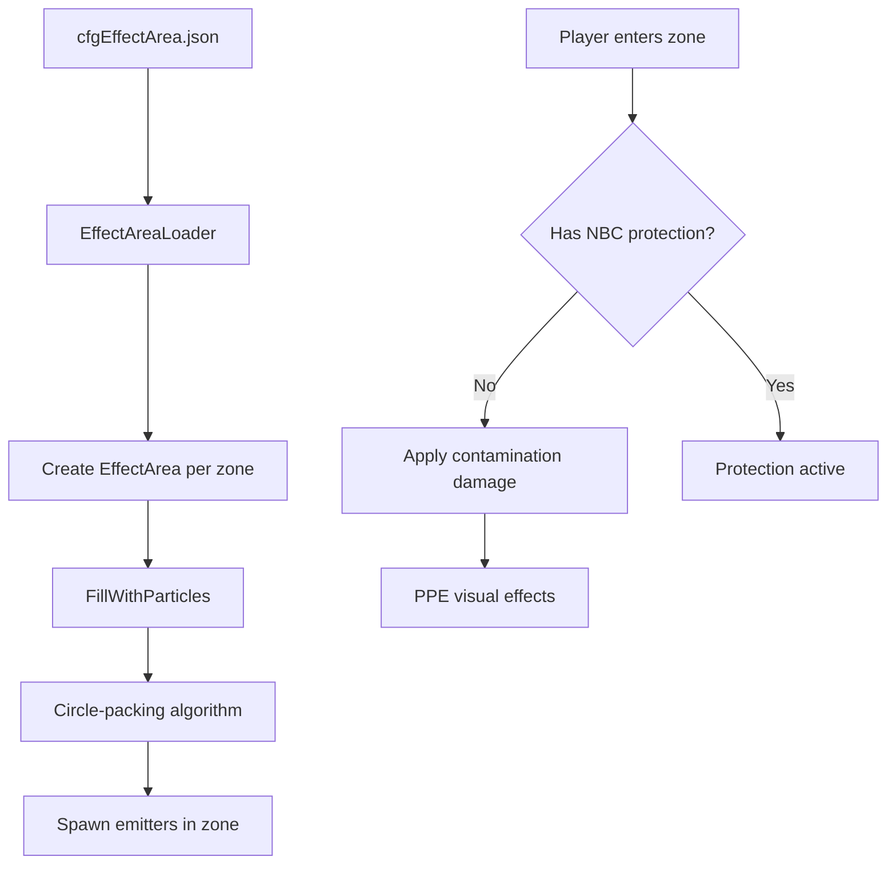

# World Configuration Systems


---

## Introduction

DayZ provides several JSON and XML configuration files that control world-level systems without requiring script modifications. These files live in the **mission folder** and are loaded at server start, allowing server owners to customize contaminated areas, underground darkness, weather behavior, gameplay rules, and object placement without code changes for supported options. Persistence impact depends on the system and settings; this is not a blanket no-wipe guarantee. The supplied extraction has no confirmed release identity.

This chapter covers five mission-folder configuration systems:

1. **Contaminated Areas** (`cfgEffectArea.json`) --- toxic gas zones with particles, PPE, and player damage
2. **Underground Areas** (`cfgundergroundtriggers.json`) --- eye accommodation (darkness simulation) for caves and bunkers
3. **Weather Configuration** (`cfgweather.xml`) --- declarative weather parameter overrides
4. **Gameplay Settings** (`cfgGameplay.json`) --- stamina, building, navigation, and other gameplay tweaks
5. **Object Spawner** --- JSON-based world object placement at mission start

---

## Contaminated Areas (cfgEffectArea.json)



Contaminated areas are toxic gas zones that damage players without protective equipment. They are configured through `cfgEffectArea.json` in the mission folder.

### Key Concepts

- **Static areas** are defined in the JSON file and created at mission start. Vanilla static areas are **not persistent** entities, so between server restarts they can be added or removed with **no wipe required** ([DayZ:Contaminated_Areas_Configuration](https://community.bistudio.com/wiki/DayZ:Contaminated_Areas_Configuration), accessed 2026-09-11). A modded `EffectArea` subclass can add its own persistence, so verify a custom `Type` separately.
- **Dynamic areas** are spawned through the Central Economy as dynamic events (configured separately through CE files, not covered here).
- To disable **JSON-listed static areas**, Bohemia documents placing an empty file --- literally an opening and closing brace, `{}` --- in the mission folder ([DayZ:Contaminated_Areas_Configuration](https://community.bistudio.com/wiki/DayZ:Contaminated_Areas_Configuration), accessed 2026-09-11). This audit recommends the explicit `{"Areas": []}` instead, because `JsonDataContaminatedAreas.Areas` is declared without an initializer (`jsondatacontaminatedarea.c:4`) and `EffectAreaLoader.CreateZones` calls `Areas.Count()` with no null check (`contaminatedarealoader.c:34`). Either way, this does not disable CE dynamic events.

### File Structure (v1.28+)

As of version 1.28 the static contaminated-zone configuration changed, introducing `FillWithParticles(vector pos, float areaRadius, float outwardsBleed, float partSize, int partId)` ([DayZ:Contaminated_Areas_Configuration](https://community.bistudio.com/wiki/DayZ:Contaminated_Areas_Configuration), accessed 2026-09-11). That matches the inspected source: `ContaminatedArea_Static.InitZoneClient` calls `FillWithParticles()` (`contaminatedarea.c:65-71`), declared at `effectarea.c:334`. Choose the schema for your installed build.

```json
{
    "Areas":
    [
        {
            "AreaName": "Radunin-Village",
            "Type": "ContaminatedArea_Static",
            "TriggerType": "ContaminatedTrigger",
            "Data": {
                "Pos": [ 7347, 0, 6410 ],
                "Radius": 150,
                "PosHeight": 20,
                "NegHeight": 10,
                "InnerPartDist": 100,
                "OuterOffset": 30,
                "ParticleName": "graphics/particles/contaminated_area_gas_bigass_debug"
            },
            "PlayerData": {
                "AroundPartName": "graphics/particles/contaminated_area_gas_around",
                "TinyPartName": "graphics/particles/contaminated_area_gas_around_tiny",
                "PPERequesterType": "PPERequester_ContaminatedAreaTint"
            }
        }
    ]
}
```

### Area Fields

| Field | Type | Description |
|-------|------|-------------|
| `AreaName` | string | Human-readable identifier for the zone (also used in debug) |
| `Type` | string | Class name of the EffectArea subclass to spawn (`ContaminatedArea_Static`) |
| `TriggerType` | string | Trigger class name (`ContaminatedTrigger`). **An empty string does not disable the trigger** --- see the conflict note below |
| `Pos` | float[3] | World position `[X, Y, Z]`. If Y is 0, the entity snaps to ground |
| `Radius` | float | Radius of the zone in meters |
| `PosHeight` | float | Height of the cylinder above the anchor position (meters) |
| `NegHeight` | float | Height of the cylinder below the anchor position (meters) |

> **Documentation conflict --- `TriggerType: ""`.** Bohemia's legacy example comments this field `"leave empty if no trigger desired"` ([DayZ:Contaminated_Areas_Configuration](https://community.bistudio.com/wiki/DayZ:Contaminated_Areas_Configuration), accessed 2026-09-11). The inspected source does not behave that way: `EffectArea.m_TriggerType` is initialised to `"ContaminatedTrigger"` (`effectarea.c:87`) and `SetupZoneData` overwrites it **only when the parameter is non-empty** (`effectarea.c:128-129`), so an empty string leaves the default trigger in place and the zone still damages players. Do not rely on an empty `TriggerType` to disable damage --- use an `EffectArea` subclass that suits your intent instead.

### Particle Fields (v1.28+)

The new system uses `FillWithParticles(pos, areaRadius, outwardsBleed, partSize, partId)`:

| Field | Maps To | Description |
|-------|---------|-------------|
| `InnerPartDist` | `partSize` | Perceived particle size in meters. Controls spacing between emitters |
| `OuterOffset` | `outwardsBleed` | Distance beyond the radius where particles remain visible (meters) |
| `ParticleName` | --- | Full path to the particle effect definition, including the `graphics/particles/` prefix (exact-match lookup, `particlelist.c:497-503`) |

The algorithm uses a naive circle-packing approach: given the area circle of radius `R = Radius + OuterOffset` and particle circles of radius `Rp = InnerPartDist / 2`, emitters are packed with some overlap margin.

> **Performance Warning:** As of version 1.28 the maximum number of emitters is clamped to 1000 per zone ([DayZ:Contaminated_Areas_Configuration](https://community.bistudio.com/wiki/DayZ:Contaminated_Areas_Configuration), accessed 2026-09-11), matching `EffectArea.PARTICLES_MAX = 1000` at `effectarea.c:84`. More emitters means worse performance. Keep `InnerPartDist` large enough to avoid exceeding this limit.

### Particle Fields (Pre-1.28, Legacy)

The inspected source retains the older `PlaceParticles()` ring routine (`effectarea.c:246`). Merely including old keys does not switch `ContaminatedArea_Static` back to it: that class calls `FillWithParticles()`. Bohemia states the same --- pre-1.28 config is read for backwards compatibility, but to fully revert to the old system you must overload `InitZoneClient()` in `ContaminatedArea.c` back with `PlaceParticles()` ([DayZ:Contaminated_Areas_Configuration](https://community.bistudio.com/wiki/DayZ:Contaminated_Areas_Configuration), accessed 2026-09-11). These fields describe the older routine and retained data, not a guaranteed compatibility mode:

| Field | Type | Description |
|-------|------|-------------|
| `InnerRingCount` | int | Number of concentric rings inside the area (excludes outer ring) |
| `InnerPartDist` | int | Distance between emitters on inner rings (straight-line meters) |
| `OuterRingToggle` | bool | Whether an outer ring of emitters is generated |
| `OuterPartDist` | int | Distance between emitters on the outer ring |
| `OuterOffset` | int | Offset from radius for the outer ring (negative pushes it outside) |
| `VerticalLayers` | int | Additional vertical layers above ground level |
| `VerticalOffset` | int | Vertical distance between layers (meters) |
| `ParticleName` | string | Full particle registry path, **including the `graphics/particles/` prefix**. `ParticleList.GetParticleID()` looks the string up by exact full-path match against `m_ParticlePaths` (`particlelist.c:497-503`), which stores `GetPathToParticles()` + filename, i.e. `graphics/particles/<name>` (`:466`, `:515-518`). Bohemia's legacy example on the BIKI omits the prefix and would not resolve in the inspected build |

**Legacy emitter count formula:**

```
emitters_per_ring = 2 * PI / ACOS(1 - (spacing^2 / (2 * ring_radius^2)))
```

For inner rings, the ring radius is calculated as: `area_radius / (inner_ring_count + 1) * ring_index`. The actual routine additionally handles the optional outer ring, layer loop, height bounds, and emitter cap; this formula is not a complete emitter-count predictor.

### Player Data (PPE & Particles)

| Field | Description |
|-------|-------------|
| `AroundPartName` | Particle effect spawned around the player when inside the trigger zone |
| `TinyPartName` | Smaller particle effect spawned near the player inside the trigger |
| `PPERequesterType` | Post-process effect class applied to the player's camera (`PPERequester_ContaminatedAreaTint`) |

### Player Health Impact

When a player is inside a contaminated trigger zone without proper protection:

- The contamination agent is applied, causing progressive health damage
- The PPE effect tints the player's vision (green/yellow tint by default)
- Gas particles appear around the player character

**Protection:** Gas masks with intact filters and NBC suits provide protection. `ContaminatedTrigger.OnStayServerEvent` applies `AI_CONTAMINATION_DMG_PER_SEC` to **AI creatures**, not players. Player gas exposure and protection are handled through player area-exposure/modifier logic and worn equipment --- neither is set in the JSON configuration.

### Multiple Zones

Add multiple objects to the `Areas` array. Each zone is independent:

```json
{
    "Areas":
    [
        {
            "AreaName": "Zone-Alpha",
            "Type": "ContaminatedArea_Static",
            "TriggerType": "ContaminatedTrigger",
            "Data": { "Pos": [ 4581, 0, 9592 ], "Radius": 300, "PosHeight": 25, "NegHeight": 10, "InnerPartDist": 100, "OuterOffset": 30, "ParticleName": "graphics/particles/contaminated_area_gas_bigass_debug" },
            "PlayerData": { "AroundPartName": "graphics/particles/contaminated_area_gas_around", "TinyPartName": "graphics/particles/contaminated_area_gas_around_tiny", "PPERequesterType": "PPERequester_ContaminatedAreaTint" }
        },
        {
            "AreaName": "Zone-Bravo",
            "Type": "ContaminatedArea_Static",
            "TriggerType": "ContaminatedTrigger",
            "Data": { "Pos": [ 4036, 0, 11712 ], "Radius": 150, "PosHeight": 30, "NegHeight": 60, "InnerPartDist": 80, "OuterOffset": 20, "ParticleName": "graphics/particles/contaminated_area_gas_bigass_debug" },
            "PlayerData": { "AroundPartName": "graphics/particles/contaminated_area_gas_around", "TinyPartName": "graphics/particles/contaminated_area_gas_around_tiny", "PPERequesterType": "PPERequester_ContaminatedAreaTint" }
        }
    ]
}
```

---

## Underground Areas (cfgundergroundtriggers.json)

Underground areas use trigger volumes and breadcrumb waypoints to simulate darkness in caves, bunkers, and other enclosed spaces. The system controls **eye accommodation** --- the degree to which the player can see without artificial light sources.

- Eye accommodation `1.0` = normal visibility (surface)
- Eye accommodation `0.0` = complete darkness (deep underground)

Configuration is stored in `cfgundergroundtriggers.json` in the mission folder. For a working example, see the [official DayZ Central Economy repository](https://github.com/BohemiaInteractive/DayZ-Central-Economy).

> The trigger snippets below are individual entries in the top-level `{"Triggers": [...]}` object. Keep production JSON syntactically valid.

### Configuration Objects

The file defines two types of objects:

1. **Triggers** --- box-shaped volumes that detect player presence and manage eye accommodation level and ambient sound
2. **Breadcrumbs** --- point-and-radius waypoints that influence eye accommodation gradually within transitional triggers

### Trigger Types

There are three trigger types, determined automatically by their configuration:

| Type | Breadcrumbs? | EyeAccommodation | Purpose |
|------|-------------|-------------------|---------|
| **Outer** | Empty array | `1.0` | Switches night-only lights (chemlights) to work during daytime. Placed just outside the entrance |
| **Transitional** | Has entries | Any | Gradual eye accommodation change via breadcrumbs. Placed between outer and inner triggers |
| **Inner** | Empty array | `< 1.0` (typically `0.0`) | Constant darkness deep underground. Eye accommodation is fixed at the configured value |

### Outer Trigger

Any trigger with an empty `Breadcrumbs` array and `EyeAccommodation` set to `1` becomes an Outer trigger. Place these just outside the underground entrance:

```json
{
    "Position": [ 749.738708, 533.460144, 1228.527954 ],
    "Orientation": [ 0, 0, 0 ],
    "Size": [ 15, 5.6, 10.8 ],
    "EyeAccommodation": 1,
    "Breadcrumbs": [],
    "InterpolationSpeed": 1
}
```

| Field | Type | Description |
|-------|------|-------------|
| `Position` | float[3] | World position of the trigger center |
| `Orientation` | float[3] | Rotation as Yaw, Pitch, Roll (degrees) |
| `Size` | float[3] | Dimensions in X, Y, Z (meters) |
| `EyeAccommodation` | float | Target eye accommodation level (0.0 - 1.0) |
| `Breadcrumbs` | array | Empty for outer/inner triggers |
| `InterpolationSpeed` | float | Speed of transition from previous accommodation value to target |

### Transitional Trigger

Any trigger **with breadcrumbs** automatically becomes a Transitional trigger. These handle the gradual light-to-dark transition:

```json
{
    "Position": [ 735.0, 533.7, 1229.1 ],
    "Orientation": [ 0, 0, 0 ],
    "Size": [ 15, 5.6, 10.8 ],
    "EyeAccommodation": 0,
    "Breadcrumbs":
    [
        {
            "Position": [ 741.294556, 531.522729, 1227.548218 ],
            "EyeAccommodation": 1,
            "UseRaycast": 0,
            "Radius": -1
        },
        {
            "Position": [ 739.904, 531.6, 1230.51 ],
            "EyeAccommodation": 0.7,
            "UseRaycast": 1,
            "Radius": -1
        }
    ]
}
```

### Inner Trigger

Any trigger with an empty `Breadcrumbs` array and `EyeAccommodation` less than `1` becomes an Inner trigger. Use these for deep underground areas:

```json
{
    "Position": [ 701.8, 535.1, 1184.5 ],
    "Orientation": [ 0, 0, 0 ],
    "Size": [ 55.6, 8.6, 104.6 ],
    "EyeAccommodation": 0,
    "Breadcrumbs": [],
    "InterpolationSpeed": 1
}
```

### Breadcrumb Configuration

Breadcrumbs are positioned along the player's expected path through the transitional trigger. The default breadcrumb mode weights contributions by distance, with radius and raycast exclusions and a per-breadcrumb ratio cap of 0.9. `UseLinePointFade` selects a separate interpolation path. The trigger reports an error above 32 breadcrumbs; stay within that limit.

```json
{
    "Position": [ 741.294556, 531.522729, 1227.548218 ],
    "EyeAccommodation": 1,
    "UseRaycast": 0,
    "Radius": -1
}
```

| Field | Type | Description |
|-------|------|-------------|
| `Position` | float[3] | World position of the breadcrumb |
| `EyeAccommodation` | float | The accommodation weight this breadcrumb contributes (0.0 - 1.0) |
| `UseRaycast` | int | If `1`, a ray is cast from player to breadcrumb; it only contributes if the trace is unobstructed |
| `Radius` | float | Influence radius in meters. Set to `-1` for the script default of 5 meters |

**Recommended breadcrumb layout for a transitional trigger:**

1. Near the entrance (close to the outer trigger): `EyeAccommodation: 1.0`
2. Midway through the transition: `EyeAccommodation: 0.5`
3. Near the inner trigger: `EyeAccommodation: 0.0`

The exact number and placement depends on the geometry of the transitional area.

> **Tip:** When using `UseRaycast: 1`, raise the breadcrumb position slightly off the floor (a few centimeters in the Y axis) to avoid the ray being blocked by the ground surface.

### Sound Management

Transitional triggers also handle the **underground ambient sound** volume fade. As the player moves deeper, the ambient sound fades in. As they move back toward the surface, it fades out. This is tied to the same trigger system --- the schema also exposes `AmbientSoundType` and `AmbientSoundSet` for sound selection.

### Interpolation

The `InterpolationSpeed` field on outer and inner triggers controls how quickly the eye accommodation transitions from its previous value to the target. Higher values produce faster transitions. Combined with the breadcrumb weighting in transitional triggers, this creates a smooth visual experience as players move between surface and underground.

### Debugging Underground Areas

Using `DayZDiag_x64`, the following diag menu options are available:

| Diag Menu Path | Function |
|----------------|----------|
| Script > Triggers > Show Triggers | Display active triggers and their coverage areas |
| Script > Underground Areas > Show Breadcrumbs | Display all active breadcrumbs |
| Script > Underground Areas > Disable Darkening | Toggle the darkening effect (also via `Ctrl+F`) |

---

## Weather Configuration (cfgweather.xml)

While Chapter 6.3 covers the Weather script API in detail, this section documents the `cfgweather.xml` mission-folder file for declarative weather configuration without scripting.

### Overview

There are three ways to adjust weather behavior in DayZ:

1. **Script weather state machine** --- override `WorldData::WeatherOnBeforeChange()` (see `4_World/Classes/Worlds/Enoch.c` for an example)
2. **Mission init script** --- call `MissionWeather(true)` in `init.c` and use the Weather API
3. **cfgweather.xml** --- place an XML file in the mission folder (recommended for server admins)

By default, all vanilla server-side missions use the scripted weather state machine; to adjust weather behavior Bohemia recommends using `cfgweather.xml` ([DayZ:Weather_Configuration](https://community.bistudio.com/wiki/DayZ:Weather_Configuration), accessed 2026-09-11).

World scripts and mission initialization can both affect weather. `MissionWeather(true)` makes `WeatherPhenomenon.OnBeforeChange()` return `false` before it reaches the WorldData callback (`3_game/weather.c:125-133`), so the state machine stops driving that phenomenon --- it does not freeze native forecasts.

### Full cfgweather.xml Structure

```xml
<?xml version="1.0" encoding="UTF-8" standalone="yes" ?>
<weather reset="0" enable="1">
    <overcast>
        <current actual="0.45" time="120" duration="240" />
        <limits min="0.0" max="1.0" />
        <timelimits min="900" max="1800" />
        <changelimits min="0.0" max="1.0" />
    </overcast>
    <fog>
        <current actual="0.1" time="120" duration="240" />
        <limits min="0.0" max="1.0" />
        <timelimits min="900" max="1800" />
        <changelimits min="0.0" max="1.0" />
    </fog>
    <rain>
        <current actual="0.0" time="120" duration="240" />
        <limits min="0.0" max="1.0" />
        <timelimits min="300" max="600" />
        <changelimits min="0.0" max="1.0" />
        <thresholds min="0.5" max="1.0" end="120" />
    </rain>
    <windMagnitude>
        <current actual="8.0" time="120" duration="240" />
        <limits min="0.0" max="20.0" />
        <timelimits min="120" max="240" />
        <changelimits min="0.0" max="20.0" />
    </windMagnitude>
    <windDirection>
        <current actual="0.0" time="120" duration="240" />
        <limits min="-3.14" max="3.14" />
        <timelimits min="60" max="120" />
        <changelimits min="-1.0" max="1.0" />
    </windDirection>
    <snowfall>
        <current actual="0.0" time="0" duration="32768" />
        <limits min="0.0" max="0.0" />
        <timelimits min="300" max="3600" />
        <changelimits min="0.0" max="0.0" />
        <thresholds min="1.0" max="1.0" end="120" />
    </snowfall>
    <storm density="1.0" threshold="0.7" timeout="25"/>
</weather>
```

### Root Element Attributes

| Attribute | Type | Default | Description |
|-----------|------|---------|-------------|
| `reset` | bool | `false` | Whether to discard stored weather state on server start |
| `enable` | bool | `true` | Whether this file is active |

`reset` and `enable` are booleans and accept `0`/`1`, `true`/`false`, or `yes`/`no`; `reset` defaults to `false` and `enable` to `true` ([DayZ:Weather_Configuration](https://community.bistudio.com/wiki/DayZ:Weather_Configuration), accessed 2026-09-11; the same spellings appear in the official CE `cfgweather.xml` comments). Every other value in the file is a float.

### Phenomenon Parameters

Each phenomenon (`overcast`, `fog`, `rain`, `snowfall`, `windMagnitude`, `windDirection`) supports these child elements:

| Element | Attributes | Description |
|---------|------------|-------------|
| `current` | `actual`, `time`, `duration` | Initial value, seconds to reach it, seconds it holds |
| `limits` | `min`, `max` | Range of the phenomenon value |
| `timelimits` | `min`, `max` | Range for how long (seconds) a transition takes |
| `changelimits` | `min`, `max` | Range for how much the value can change per transition |
| `thresholds` | `min`, `max`, `end` | Overcast range that allows this phenomenon; `end` = seconds to stop if outside range |

`thresholds` applies to **rain** and **snowfall** only --- these phenomena require sufficient overcast to appear.

### Thunderstorm Configuration

```xml
<storm density="1.0" threshold="0.7" timeout="25"/>
```

| Attribute | Description |
|-----------|-------------|
| `density` | Lightning frequency (0.0 - 1.0) |
| `threshold` | Minimum overcast level for lightning to appear (0.0 - 1.0) |
| `timeout` | Seconds between lightning strikes |

### Alternative XML Formatting

Everything except `reset` and `enable` is a float and can be read either as an attribute or as an element, so the file may be written either way --- or as a mix of both ([DayZ:Weather_Configuration](https://community.bistudio.com/wiki/DayZ:Weather_Configuration), accessed 2026-09-11). The official CE sample uses the attribute form:

```xml
<!-- Attribute style (compact) -->
<limits min="0" max="1"/>

<!-- Element style (verbose) -->
<limits>
    <min>0</min>
    <max>1</max>
</limits>
```

The equivalence and the freedom to mix the two styles are stated by the vendor documentation above; this audit read the documentation and the script API, and did not execute the XML parser to measure it.

### Common Weather Profiles

**Clear-sky starting profile (very light fog allowed):**

```xml
<weather reset="1" enable="1">
    <overcast>
        <current actual="0.0" time="0" duration="32768" />
        <limits min="0.0" max="0.2" />
    </overcast>
    <rain>
        <limits min="0.0" max="0.0" />
    </rain>
    <fog>
        <limits min="0.0" max="0.1" />
    </fog>
</weather>
```

**Winter starting profile (use on a terrain/build supporting snowfall):**

```xml
<weather reset="1" enable="1">
    <overcast>
        <current actual="0.8" time="0" duration="32768" />
        <limits min="0.6" max="1.0" />
    </overcast>
    <rain>
        <limits min="0.0" max="0.0" />
    </rain>
    <snowfall>
        <current actual="0.7" time="60" duration="3600" />
        <limits min="0.3" max="1.0" />
        <thresholds min="0.5" max="1.0" end="120" />
    </snowfall>
</weather>
```

> **Note:** You only need to include the phenomena you want to override. Omitted phenomena retain the state or defaults selected by the mission, persistence, and weather controller.

---

## Gameplay Settings (cfgGameplay.json)

The `cfgGameplay.json` file provides server admins with a way to tweak gameplay behavior without modding scripts. The tables combine **example values**, not universal defaults: official CE mission files and `CfgGameplayJson` initializers differ. Preserve the nested structure from your target mission template; the keys below are not all top-level fields.

### Initial Setup

1. Copy `cfgGameplay.json` from `DZ/worlds/chernarusplus/ce/` (or the [DayZ Central Economy GitHub](https://github.com/BohemiaInteractive/DayZ-Central-Economy)) to your mission folder
2. Add `enableCfgGameplayFile = 1;` to your `serverDZ.cfg`
3. Modify values as needed and restart the server

### General Settings

| Type | Parameter | Example | Description |
|------|-----------|---------|-------------|
| int | `version` | Current | Internal version tracker |
| string[] | `spawnGearPresetFiles` | `[]` | Player spawn gear JSON config files to load |
| string[] | `objectSpawnersArr` | `[]` | Object Spawner JSON files (see Object Spawner section below) |
| bool | `disableRespawnDialog` | `false` | Disable the respawn type selection UI |
| bool | `disableRespawnInUnconsciousness` | `false` | Remove the "Respawn" button when unconscious |
| bool | `disablePersonalLight` | `false` | Disable the subtle personal light during nighttime |
| int | `lightingConfig` | `1` | Nighttime lighting (0 = bright, 1 = dark) |
| float[] | `wetnessWeightModifiers` | `[1.0, 1.0, 1.33, 1.66, 2.0]` | Item weight multipliers by wetness level: Dry, Damp, Wet, Soaked, Drenched |
| float | `boatDecayMultiplier` | `1` | Multiplier for boat decay speed |
| string[] | `playerRestrictedAreaFiles` | `["pra/warheadstorage.json"]` | Player restricted area config files |

The general table spans `GeneralData`, `PlayerData`, `WorldsData`, and `VehicleData`. The Chernarus CE file uses `lightingConfig = 0`; restricted-area paths are terrain-specific and must exist on your server.

### Stamina Settings

| Type | Parameter | Example | Description |
|------|-----------|---------|-------------|
| float | `sprintStaminaModifierErc` | `1.0` | Stamina consumption rate during standing sprint |
| float | `sprintStaminaModifierCro` | `1.0` | Stamina consumption rate during crouched sprint |
| float | `staminaWeightLimitThreshold` | `6000.0` | Carried-weight threshold in grams (6000 g = 6 kg) below which load does not penalize stamina |
| float | `staminaMax` | `100.0` | Maximum stamina (do not set to 0) |
| float | `staminaKgToStaminaPercentPenalty` | `1.75` | Multiplier for stamina deduction based on player load |
| float | `staminaMinCap` | `5.0` | Minimum stamina cap (do not set to 0) |
| float | `sprintSwimmingStaminaModifier` | `1.0` | Stamina consumption during fast swimming |
| float | `sprintLadderStaminaModifier` | `1.0` | Stamina consumption during fast ladder climbing |
| float | `meleeStaminaModifier` | `1.0` | Stamina consumed by heavy melee and evasion |
| float | `obstacleTraversalStaminaModifier` | `1.0` | Stamina consumed by jumping, climbing, vaulting |
| float | `holdBreathStaminaModifier` | `1.0` | Stamina consumption when holding breath |

### Shock Settings

| Type | Parameter | Example | Description |
|------|-----------|---------|-------------|
| float | `shockRefillSpeedConscious` | `5.0` | Shock recovery per second while conscious |
| float | `shockRefillSpeedUnconscious` | `1.0` | Shock recovery per second while unconscious |
| bool | `allowRefillSpeedModifier` | `true` | Allow ammo-type-based shock recovery modifier |

Stamina and shock keys belong under `PlayerData.StaminaData` and `PlayerData.ShockHandlingData`.

### Inertia Settings

| Type | Parameter | Example | Description |
|------|-----------|---------|-------------|
| float | `timeToStrafeJog` | `0.1` | Time to blend strafing while jogging (example value; native minimum unverified) |
| float | `rotationSpeedJog` | `0.15` | Character rotation speed while jogging (example value; native minimum unverified) |
| float | `timeToSprint` | `0.45` | Time to reach sprint from jog (example value; native minimum unverified) |
| float | `timeToStrafeSprint` | `0.3` | Time to blend strafing while sprinting (example value; native minimum unverified) |
| float | `rotationSpeedSprint` | `0.15` | Rotation speed while sprinting (example value; native minimum unverified) |
| bool | `allowStaminaAffectInertia` | `true` | Allow stamina to influence inertia |

Use `PlayerData.MovementData` for inertia. The script initializer uses `rotationSpeedJog = 0.15`, while the pinned Chernarus CE template uses `0.3`; select intentionally.

### Base Building & Object Placement

The damage flags belong to `GeneralData`; placement checks belong to `BaseBuildingData.HologramData`, and the final construction checks to `BaseBuildingData.ConstructionData`. The pinned CE file spells the cold-area key `disableColdAreaBuildingCheck`, while this extraction reads `disableColdAreaPlacementCheck`; this source-version discrepancy requires matching your actual server build.

| Parameter | Example | What It Disables |
|-----------|---------|------------------|
| `disableBaseDamage` | `false` | Damage to base-building structures (`GeneralData`) |
| `disableContainerDamage` | `false` | Damage to supported containers (`GeneralData`) |
| `disableIsCollidingBBoxCheck` | `false` | Bounding-box collision with world objects |
| `disableIsCollidingPlayerCheck` | `false` | Collision with players |
| `disableIsClippingRoofCheck` | `false` | Clipping with roofs |
| `disableIsBaseViableCheck` | `false` | Placement on dynamic/incompatible surfaces |
| `disableIsCollidingGPlotCheck` | `false` | Garden plot surface type restriction |
| `disableIsCollidingAngleCheck` | `false` | Roll/pitch/yaw limit check |
| `disableIsPlacementPermittedCheck` | `false` | Rudimentary placement permission |
| `disableHeightPlacementCheck` | `false` | Height space restriction |
| `disableIsUnderwaterCheck` | `false` | Underwater placement restriction |
| `disableIsInTerrainCheck` | `false` | Terrain clipping restriction |
| `disableColdAreaPlacementCheck` | `false` | Garden plot frozen ground restriction |
| `disablePerformRoofCheck` | `false` | Construction roof clipping |
| `disableIsCollidingCheck` | `false` | Construction world-object collision |
| `disableDistanceCheck` | `false` | Construction minimum distance |
| `disallowedTypesInUnderground` | `["FenceKit", "TerritoryFlagKit", "WatchtowerKit"]` | Item types prohibited underground (includes inherited) |

### Navigation Settings

| Type | Parameter | Example | Description |
|------|-----------|---------|-------------|
| bool | `use3DMap` | `false` | Use 3D map only (disables 2D overlay) |
| bool | `ignoreMapOwnership` | `false` | Open map with "M" key without having one in inventory |
| bool | `ignoreNavItemsOwnership` | `false` | Show compass/GPS helpers without owning the items |
| bool | `displayPlayerPosition` | `false` | Show red player position marker on map |
| bool | `displayNavInfo` | `true` | Show GPS/compass UI in map legend |

`use3DMap` belongs to `UIData`; the other navigation fields belong to `MapData`.

### Hit Indicator Settings

| Type | Parameter | Example | Description |
|------|-----------|---------|-------------|
| bool | `hitDirectionOverrideEnabled` | `false` | Enable custom hit indicator settings |
| int | `hitDirectionBehaviour` | `1` | 0 = Disabled, 1 = Static, 2 = Dynamic |
| int | `hitDirectionStyle` | `0` | 0 = Splash, 1 = Spike, 2 = Arrow |
| string | `hitDirectionIndicatorColorStr` | `"0xffbb0a1e"` | Indicator color in ARGB hex format |
| float | `hitDirectionMaxDuration` | `2.0` | Maximum display duration in seconds |
| float | `hitDirectionBreakPointRelative` | `0.2` | Fraction of duration before fade-out begins |
| float | `hitDirectionScatter` | `10.0` | Inaccuracy scatter in degrees (applied +/-) |
| bool | `hitIndicationPostProcessEnabled` | `true` | Enable the red flash hit effect |

Hit fields belong to `UIData.HitIndicationData`. The CE example enables post-process indication, but the script initializer sets it false; this is another example/default distinction.

### Drowning Settings

| Type | Parameter | Example | Description |
|------|-----------|---------|-------------|
| float | `staminaDepletionSpeed` | `10.0` | Stamina lost per second while drowning |
| float | `healthDepletionSpeed` | `10.0` | Health lost per second while drowning |
| float | `shockDepletionSpeed` | `10.0` | Shock lost per second while drowning |

Drowning keys belong to `PlayerData.DrowningData`.

### Environment Settings

| Type | Parameter | Example | Description |
|------|-----------|---------|-------------|
| float[12] | `environmentMinTemps` | `[-3, -2, 0, 4, 9, 14, 18, 17, 12, 7, 4, 0]` | Minimum temperature per month (Jan-Dec) |
| float[12] | `environmentMaxTemps` | `[3, 5, 7, 14, 19, 24, 26, 25, 21, 16, 10, 5]` | Maximum temperature per month (Jan-Dec) |

Temperature arrays belong to `WorldsData` and depend on terrain. The arrays below are illustrative, not verified universal climate defaults.

### Weapon Obstruction Settings

| Type | Parameter | Example | Description |
|------|-----------|---------|-------------|
| int | `staticMode` | `1` | Static entity obstruction (0 = Off, 1 = On, 2 = Always) |
| int | `dynamicMode` | `1` | Dynamic entity obstruction (0 = Off, 1 = On, 2 = Always) |

Obstruction keys belong to `PlayerData.WeaponObstructionData`; mode 0 still permits weapon lifting, mode 1 obstructs then lifts, and mode 2 obstructs without lifting.

### ARGB Color Format

The `hitDirectionIndicatorColorStr` uses ARGB hexadecimal format as a string:

```
"0xAARRGGBB"
```

- `AA` = Alpha (00-FF)
- `RR` = Red (00-FF)
- `GG` = Green (00-FF)
- `BB` = Blue (00-FF)

Example: `"0xffbb0a1e"` = fully opaque dark red. The value is not case-sensitive.

---

## Object Spawner

The Object Spawner allows server admins to place world objects through JSON files, loaded at mission start.

### Setup

1. Enable `cfgGameplay.json` (see above)
2. Create a JSON file (e.g., `spawnerData.json`) in the mission folder
3. Merge the `WorldsData.objectSpawnersArr` value into your complete `cfgGameplay.json` template (the following shows only that nesting):

```json
{"WorldsData": {"objectSpawnersArr": ["spawnerData.json"]}}
```

Multiple files are supported:

```json
{"WorldsData": {"objectSpawnersArr": ["mySpawnData1.json", "mySpawnData2.json", "mySpawnData3.json"]}}
```

### File Structure

```json
{
    "Objects": [
        {
            "name": "Land_Wall_Gate_FenR",
            "pos": [ 4395.167480, 339.012421, 10353.140625 ],
            "ypr": [ 0.0, 0.0, 0.0 ],
            "scale": 1
        },
        {
            "name": "Land_Wall_Gate_FenR",
            "pos": [ 4395.501953, 339.736824, 10356.338867 ],
            "ypr": [ 90.0, 0.0, 0.0 ],
            "scale": 2
        },
        {
            "name": "Apple",
            "pos": [ 4395.501953, 339.736824, 10362.338867 ],
            "ypr": [ 0.0, 0.0, 0.0 ],
            "scale": 1,
            "enableCEPersistency": true
        }
    ]
}
```

### Object Parameters

| Type | Field | Description |
|------|-------|-------------|
| string | `name` | Class name (e.g., `"Land_Wall_Gate_FenR"`) or p3d model path (e.g., `"DZ/plants/tree/t_BetulaPendula_1fb.p3d"`) |
| float[3] | `pos` | World position `[X, Y, Z]` |
| float[3] | `ypr` | Orientation as Yaw, Pitch, Roll (degrees) |
| float | `scale` | Size multiplier (1.0 = original size) |
| bool | `enableCEPersistency` | When `true`, removes `ECE_DYNAMIC_PERSISTENCY` and `ECE_NOLIFETIME` so normal CE persistence/lifetime rules can apply; interaction-deferred persistence belongs to the default false path |
| string | `customString` | Custom user data, handled by overriding `OnSpawnByObjectSpawner()` on the item's script class |

### P3D Model Path Limitations

Only these paths are supported for direct p3d spawning:

- `DZ/plants`, `DZ/plants_bliss`, `DZ/plants_sakhal`
- `DZ/rocks`, `DZ/rocks_bliss`, `DZ/rocks_sakhal`

### Custom Data Handling

To process `customString`, override `OnSpawnByObjectSpawner()` on the spawned item's script class. See `StaticFlagPole` in vanilla scripts for an example where the custom string specifies which flag to spawn on the pole.

> **Performance Warning:** Spawning a large number of objects through this system impacts both server and client performance. Use it for detail objects and small additions, not for large-scale world modifications.

---

## Best Practices

### Contaminated Areas

- **Start with large `InnerPartDist` values** (80-100) to keep emitter counts low. Decrease only if visual coverage is insufficient.
- **Test particle performance** with your target player count. Each zone with many emitters has a measurable client-side FPS impact.
- **Match your installed area implementation.** The inspected static class uses circle packing; retained legacy fields do not prove an automatic legacy renderer switch.
- **Do not use empty `TriggerType` to disable damage.** `SetupZoneData` retains the default trigger; visual-only behavior needs an appropriate area subclass.

### Underground Areas

- **Layer triggers correctly:** Outer (at entrance) -> Transitional (corridor) -> Inner (deep area). They should be adjacent with slight overlap.
- **Typically place 3 breadcrumbs** in transitional triggers: one near the entrance (`EyeAccommodation: 1.0`), one midway (`0.5`), and one near the inner trigger (`0.0`). Bohemia states a minimum of **1** breadcrumb near the entrance and gives this three-position layout as the **typical** configuration ([DayZ:Underground_Areas_Configuration](https://community.bistudio.com/wiki/DayZ:Underground_Areas_Configuration), accessed 2026-09-11); how many you actually need depends on the transitional area's layout.
- **Raise raycast breadcrumbs** slightly off the floor in the Y axis to prevent ground interference.
- **Use the diag menu** to visualize trigger volumes and breadcrumb positions during development: `Script > Triggers > Show Triggers`, `Script > Underground Areas > Show Breadcrumbs`, and `Script > Underground Areas > Disable Darkening` (also bound to `Ctrl + F`) --- [DayZ:Underground_Areas_Configuration](https://community.bistudio.com/wiki/DayZ:Underground_Areas_Configuration), accessed 2026-09-11.

### Weather (cfgweather.xml)

- **Only include phenomena you want to change.** Omitted phenomena retain the state or defaults selected by the mission, persistence, and weather controller.
- **Set `reset="1"`** when you want a clean weather state on every restart, ignoring stored persistence.
- **Rain requires overcast.** If your overcast `limits max` is below the rain `thresholds min`, rain will never appear.
- **Snowfall and rain share overcast thresholds** but are typically mutually exclusive by threshold ranges.

### Gameplay Settings

- **Always copy the latest `cfgGameplay.json`** from the official Central Economy repository. The file format evolves with game updates.
- **Do not set `staminaMax` or `staminaMinCap` to 0** --- this produces unexpected behavior.
- **Use sensible positive inertia values.** The inspected JSON validator does not enforce the claimed universal 0.01 clamp; native lower bounds were not tested.
- **Test base-building disable flags carefully.** Disabling collision checks can allow players to build inside terrain or walls.

### Object Spawner

- **Keep object counts reasonable.** Every spawned object consumes server and client resources.
- **Use class names over p3d paths** when possible --- p3d paths are limited to specific directories.
- **Each object entry except the last must end with a comma** in the JSON array.

---

## Common Mistakes

| Mistake | Consequence | Fix |
|---------|-------------|-----|
| JSON comments (`//` or `/* */`) in config files | Invalid JSON may fail parsing; loaders can log errors | Remove all comments from production JSON files |
| Invalid number format (`0150` instead of `150`) | JSON parse error | Use standard integer/float notation |
| Missing `enableCfgGameplayFile = 1` in `serverDZ.cfg` | `cfgGameplay.json` is completely ignored | Add the parameter to server config |
| Setting overcast max below rain threshold | Rain never appears despite configuration | Ensure overcast `limits max` >= rain `thresholds min` |
| Too many particle emitters per zone | Client FPS drops significantly | Increase `InnerPartDist` or reduce `Radius` |
| Breadcrumbs placed on the floor with `UseRaycast: 1` | Raycast blocked by ground; breadcrumb has no effect | Raise breadcrumb Y position by a few centimeters |
| Overlapping inner triggers with different `EyeAccommodation` | Trigger selection may differ from the intended layout; no flicker test was run | Ensure inner triggers do not overlap |
| Missing comma between JSON array entries | Parse error; entire file fails to load | Validate JSON before deploying |
| Setting `staminaMax` to 0 | Script validation rejects zero and reinitializes the stamina maximum | Use a positive value appropriate to your server |
| Spawning hundreds of objects via Object Spawner | Server and client performance degradation | Keep spawned object counts minimal |

---

## Compatibility & Impact

### Contaminated Areas

- **Static definitions are read on initialization and are not persistent.** Vanilla static zones can be added or removed between restarts with no wipe required ([DayZ:Contaminated_Areas_Configuration](https://community.bistudio.com/wiki/DayZ:Contaminated_Areas_Configuration), accessed 2026-09-11). Review a modded `EffectArea` subclass separately --- it can introduce its own persistence.
- **Mod compatibility:** Mods that override `ContaminatedArea_Static` or `ContaminatedTrigger` classes will affect all configured zones. Only one override chain runs per class.
- **Dynamic zones** (CE-spawned) use script defaults and are configured through the Central Economy, not `cfgEffectArea.json`.

### Underground Areas

- **Triggers are engine-level.** They work with any terrain/map mod that has underground geometry.
- **Review interacting lighting and player mods.** Trigger classes are not the only way to affect underground presentation.
- **Diag-menu debugging since 1.20.** Since the 1.20 update the `DayZDiag_x64` diag menu can debug configured underground areas ([DayZ:Underground_Areas_Configuration](https://community.bistudio.com/wiki/DayZ:Underground_Areas_Configuration), accessed 2026-09-11). That is a statement about diagnostic support, not about when the underground feature itself was introduced --- this extraction does not establish an introduction release.

### Weather (cfgweather.xml)

- **Overrides the script state machine.** If both `cfgweather.xml` and a scripted `WeatherOnBeforeChange()` override are active, the XML limits apply and the script operates within those limits.
- **Only one cfgweather.xml is loaded** per mission folder. Multiple weather mods cannot stack XML files.

### Gameplay Settings

- **One cfgGameplay.json per mission.** Values are global --- they affect all players on the server.
- **Match the template/schema to the installed build.** The JSON `version` field is a schema marker, not a game-release identity; the inspected loader does not compare it to an executable version. Missing fields can have zero or initializer defaults.
- **Mod interactions:** Mods that override stamina, base building, or navigation systems in script may conflict with or override cfgGameplay.json values.

### Object Spawner

- **Spawner entries are processed on startup.** The false/default branch sets dynamic-persistence/no-lifetime flags; true removes them. Assess duplication and cleanup under your CE configuration before deploying persistent spawner entries.
- **The spawner runs from the gameplay-data-loaded callback.** Its flag choices can affect CE treatment; this is not a guarantee of independence from CE settings.
- **Failed spawns** (invalid class name or p3d path) produce "Object spawner failed to spawn" in the server RPT log.

---

## Summary

| System | File | Location | Purpose |
|--------|------|----------|---------|
| Contaminated Areas | `cfgEffectArea.json` | Mission folder | Toxic gas zones with particles, PPE, and damage |
| Underground Areas | `cfgundergroundtriggers.json` | Mission folder | Eye accommodation (darkness) for caves/bunkers |
| Weather | `cfgweather.xml` | Mission folder | Declarative weather parameter overrides |
| Gameplay Settings | `cfgGameplay.json` | Mission folder | Stamina, building, navigation, combat tweaks |
| Object Spawner | Custom JSON files | Mission folder | Static object placement at mission start |

All five systems share these characteristics:
- Configured through files in the **mission folder**
- Loaded at **server start** (changes require restart)
- Require **no script modifications** for basic use
- Can be **combined with scripting** for advanced behavior

---

## Audit Sources and Limits

Checked 2026-09-11. Vanilla paths below are relative to `D:/DayZ Projects/scripts/`; the extraction's release identity is unconfirmed.

- `4_world/classes/contaminatedarea/contaminatedarealoader.c`, `effectarea.c`, `contaminatedarea.c`, `jsondatacontaminatedarea.c`: schema, default trigger handling and actual particle routine.
- `4_world/entities/scriptedentities/triggers/contaminatedtrigger.c` and `4_world/classes/playermodifiers/modifiers/conditions/areaexposure.c`: distinct AI damage and player exposure paths.
- `3_game/undergroundarealoader.c`, `4_world/entities/scriptedentities/triggers/undergroundtrigger.c`, `4_world/classes/undergroundhandlerclient.c`: trigger schema, classification, breadcrumb cutoff/weighting and interpolation.
- `3_game/cfggameplaydatajson.c`, `cfggameplayhandler.c`, `objectspawner.c`, `ce/centraleconomy.c`: nested gameplay schema, validation, spawner lifecycle and persistence flags.
- [Official CE weather file](https://github.com/BohemiaInteractive/DayZ-Central-Economy/blob/9a21bb9f5fb9c62a7ce2761402196091588133e6/dayzOffline.chernarusplus/cfgweather.xml) and [gameplay template](https://github.com/BohemiaInteractive/DayZ-Central-Economy/blob/9a21bb9f5fb9c62a7ce2761402196091588133e6/dayzOffline.chernarusplus/cfggameplay.json): attribute semantics and mission example values at a pinned commit, not universal defaults.

BIKI weather/contamination retrieval returned HTTP 403 during this audit. Historical release boundaries, alternative XML element syntax, exact visual results and native persistence outcomes were not runtime-tested. Preserve the source/version differences described above when adapting these examples.
