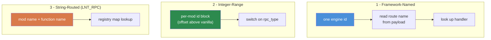

# RPC Communication Patterns

> **Summary:** Remote Procedure Calls are the only structured way for server and client to exchange data in DayZ. This chapter is the pattern reference: the request/validate/respond roundtrip, config and state synchronization, the central dispatch hook, and the three routing styles the community uses. It builds on the `ScriptRPC` API covered in Chapter 6.9 and defines the `LNT_RPC` router used elsewhere in this wiki.

---

## Introduction

Every admin panel, every synced HUD, every server-to-client notification, and every client-to-server action request flows through RPCs. Getting them right --- matched serialization order, a single central dispatch point, permission checks on the server --- is what separates a mod that works on a listen server from one that works on a live dedicated server.

The raw `ScriptRPC` class, its `Send()` parameters, and the list of serializable types are documented in [Chapter 6.9 (Networking)](../06-engine-api/09-networking.md). This chapter assumes that foundation and focuses on the *patterns* built on top of it. Where a pattern needs a router, it uses **`LNT_RPC`**, the string-routed dispatcher defined at the end of this chapter and reused across Part 7.

---

## Table of Contents

- [ScriptRPC in Brief](#scriptrpc-in-brief)
- [Request, Validate, Respond](#request-validate-respond)
- [Config Sync (Server to Client)](#config-sync-server-to-client)
- [Entity State Sync](#entity-state-sync)
- [Central Dispatch: The modded OnRPC Hook](#central-dispatch-the-modded-onrpc-hook)
- [Permission Checks](#permission-checks)
- [Error Handling and Notifications](#error-handling-and-notifications)
- [The Read/Write Contract](#the-readwrite-contract)
- [Three RPC Routing Approaches](#three-rpc-routing-approaches)
- [Common Mistakes](#common-mistakes)
- [Best Practices](#best-practices)
- [Compatibility and Impact](#compatibility-and-impact)
- [Theory vs Practice](#theory-vs-practice)

---

## ScriptRPC in Brief

Every RPC uses the `ScriptRPC` class. The shape is always the same: create, write fields, send.

```c
void SendDamageReport(PlayerIdentity target, string weaponName, float damage)
{
    ScriptRPC rpc = new ScriptRPC();

    // Write fields in a specific order
    rpc.Write(weaponName);    // field 1: string
    rpc.Write(damage);        // field 2: float

    // Send: target object, RPC id, guaranteed delivery, recipient
    rpc.Send(null, LNT_RPC_DAMAGE_REPORT, true, target);
}
```

The receiver reads fields back in the **exact same order** they were written:

```c
void OnRPC_DamageReport(PlayerIdentity sender, Object target, ParamsReadContext ctx)
{
    string weaponName;
    if (!ctx.Read(weaponName)) return;  // field 1: string

    float damage;
    if (!ctx.Read(damage)) return;      // field 2: float

    Print("Hit by " + weaponName + " for " + damage.ToString() + " damage");
}
```

Two `Send()` details matter for every pattern below (the full parameter reference is in Chapter 6.9):

- **`guaranteed`** --- `true` is reliable (retransmits on packet loss); use it for config changes, permission grants, teleports, bans. `false` is fire-and-forget; use it only for rapid, self-correcting updates (position, effects) where a dropped packet is harmless.
- **`recipient`** --- from a **client**, `null` sends to the server. From the **server**, `null` broadcasts to all clients, and a specific `PlayerIdentity` unicasts to one client. This asymmetry, confirmed in the engine header for `ScriptRPC.Send` (`3_game/gameplay.c`), is the basis of the roundtrip pattern.

---

## Request, Validate, Respond

The most common RPC pattern is the roundtrip: the client requests an action, the server validates and executes it, then the server sends the result back. **Never trust the client** --- the request is only a suggestion until the server approves it.

```
CLIENT                          SERVER
  |                               |
  |  1. Request RPC ----------->  |
  |     (action + params)         |
  |                               |  2. Validate permission
  |                               |  3. Validate the data
  |                               |  4. Execute the action
  |  <----------- 5. Response RPC |
  |     (result + data)           |
  |                               |
  |  6. Update UI                 |
```

**Client sends the request:**

```c
class LNT_TeleportClient
{
    void RequestTeleport(vector position)
    {
        ScriptRPC rpc = new ScriptRPC();
        rpc.Write(position);
        rpc.Send(null, LNT_RPC_TELEPORT, true, null);  // null recipient = send to server
    }
};
```

**Server receives, validates, executes, responds:**

```c
class LNT_TeleportServer
{
    void OnRPC_TeleportRequest(PlayerIdentity sender, Object target, ParamsReadContext ctx)
    {
        // 1. Read the request data
        vector position;
        if (!ctx.Read(position)) return;

        // 2. Validate permission (the permission model is Chapter 7.5)
        if (!LNT_Permissions.GetInstance().HasPermission(sender.GetPlainId(), "Lantern.Admin.Teleport"))
        {
            SendError(sender, "No permission to teleport");
            return;
        }

        // 3. Validate the data
        if (position[1] < 0 || position[1] > 1000)
        {
            SendError(sender, "Invalid teleport height");
            return;
        }

        // 4. Execute the action
        PlayerBase player = PlayerBase.Cast(sender.GetPlayer());
        if (!player) return;

        player.SetPosition(position);

        // 5. Send success response back to the requesting client
        ScriptRPC response = new ScriptRPC();
        response.Write(true);           // success flag
        response.Write(position);       // echo back the position
        response.Send(null, LNT_RPC_TELEPORT_RESULT, true, sender);
    }
};
```

**Client receives the response:**

```c
class LNT_TeleportClient
{
    void OnRPC_TeleportResult(PlayerIdentity sender, Object target, ParamsReadContext ctx)
    {
        bool success;
        if (!ctx.Read(success)) return;

        vector position;
        if (!ctx.Read(position)) return;

        if (success)
        {
            // Update UI: "Teleported to X, Y, Z"
        }
    }
};
```

---

## Config Sync (Server to Client)

The server owns the configuration. When a client is ready, the server pushes the settings that affect client display so the client can adjust its HUD and UI. The grounded place to do this is `OnClientReadyEvent` --- the vanilla `MissionServer` fires it once the client is fully connected and able to receive RPCs (`5_mission/mission/missionserver.c`), and vanilla itself uses that hook to sync per-client state.

```c
// ---------------------------------------------------------------
// Server: push display settings when the client is ready
// ---------------------------------------------------------------
modded class MissionServer
{
    override void OnClientReadyEvent(PlayerIdentity identity, PlayerBase player)
    {
        super.OnClientReadyEvent(identity, player);

        if (!identity)
            return;

        ScriptRPC rpc = new ScriptRPC();
        rpc.Write(m_ShowHUD);       // bool
        rpc.Write(m_HUDColor);      // int (ARGB)
        rpc.Write(m_MaxDistance);   // float
        rpc.Send(null, LNT_RPC_SYNC_CONFIG, true, identity);  // unicast to this client
    }
};
```

The client receives the settings and applies them locally. Because the receiver references only its own fields, no client-only types leak into shared code:

```c
// ---------------------------------------------------------------
// Client: receive and apply config
// ---------------------------------------------------------------
class LNT_ClientConfig
{
    bool  m_ShowHUD;
    int   m_HUDColor;
    float m_MaxDistance;

    void OnConfigReceived(ParamsReadContext ctx)
    {
        if (!ctx.Read(m_ShowHUD)) return;
        if (!ctx.Read(m_HUDColor)) return;
        if (!ctx.Read(m_MaxDistance)) return;

        // Apply to the local HUD
        UpdateHUDVisibility();
    }
}
```

---

## Entity State Sync

Entities exist on both sides, but only the server computes authoritative state. When that state changes, the server pushes it to the clients that can see the entity. Attach the RPC to the entity (pass it as the `target`) so the engine routes it to the right object.

Here `LNT_PatrolEntity` is a minimal server-driven entity --- a patrolling AI whose behavior state the server owns and the client only renders:

```c
// ---------------------------------------------------------------
// 4_World: an entity whose state is server-authoritative
// ---------------------------------------------------------------
class LNT_PatrolEntity extends DayZCreatureAI
{
    protected int  m_BehaviorState;   // server computes this
    protected bool m_InCombat;

    int GetBehaviorState()  { return m_BehaviorState; }
    bool IsInCombat()       { return m_InCombat; }

    void SetClientState(int behaviorState, bool inCombat)
    {
        m_BehaviorState = behaviorState;
        m_InCombat = inCombat;
        // ... drive local animation / material from these values
    }
}
```

```c
// ---------------------------------------------------------------
// Server: broadcast the entity's state to nearby clients
// ---------------------------------------------------------------
void SyncStateToClients(LNT_PatrolEntity ai)
{
    if (!GetGame().IsServer())
        return;

    ScriptRPC rpc = new ScriptRPC();
    rpc.Write(ai.GetBehaviorState());
    rpc.Write(ai.IsInCombat());

    // target = the entity: the engine delivers to clients that have it
    rpc.Send(ai, LNT_RPC_SYNC_STATE, true, null);
}
```

```c
// ---------------------------------------------------------------
// Client: receive and apply the entity's state
// ---------------------------------------------------------------
void OnStateReceived(LNT_PatrolEntity ai, ParamsReadContext ctx)
{
    if (!GetGame().IsClient())
        return;

    int behaviorState;
    if (!ctx.Read(behaviorState)) return;

    bool inCombat;
    if (!ctx.Read(inCombat)) return;

    ai.SetClientState(behaviorState, inCombat);
}
```

For rapidly changing state (position-like values that refresh every frame), send with `guaranteed = false` --- the next update corrects any dropped packet, and you avoid clogging the reliable queue.

---

## Central Dispatch: The modded OnRPC Hook

Every incoming RPC arrives at one engine entry point. In vanilla, `DayZGame.OnRPC(PlayerIdentity sender, Object target, int rpc_type, ParamsReadContext ctx)` receives it, and if a `target` object was set, forwards to that object's `OnRPC`; otherwise it `switch`es on `rpc_type` (`3_game/dayzgame.c`). Your mod hooks in by extending that method.

**The one rule that keeps mods from breaking each other:** handle the IDs you own, and call `super.OnRPC()` for everything else so vanilla and other mods still receive theirs.

Integer-range style --- one `case` per ID you own:

```c
modded class DayZGame
{
    override void OnRPC(PlayerIdentity sender, Object target, int rpc_type, ParamsReadContext ctx)
    {
        switch (rpc_type)
        {
            case LNT_RPC_SPAWN_ITEM:
                HandleSpawnItem(sender, ctx);
                return;
            case LNT_RPC_DELETE_ITEM:
                HandleDeleteItem(sender, ctx);
                return;
        }

        super.OnRPC(sender, target, rpc_type, ctx);  // not ours -> pass it on
    }
}
```

Single-ID style --- your mod reserves **one** engine id and multiplexes inside it. Return early for that id (so vanilla never tries to read your payload) and pass everything else to `super`:

```c
modded class DayZGame
{
    override void OnRPC(PlayerIdentity sender, Object target, int rpc_type, ParamsReadContext ctx)
    {
        if (rpc_type == LNT_RPC.LNT_RPC_ENGINE_ID)
        {
            LNT_RPC.Dispatch(sender, target, ctx);
            return;
        }

        super.OnRPC(sender, target, rpc_type, ctx);
    }
}
```

The single-ID form is the recommended default: it hooks the engine exactly once and moves all routing into your own registry, where it is easy to inspect and clean up. That registry (`LNT_RPC`) is built in [Three RPC Routing Approaches](#three-rpc-routing-approaches).

---

## Permission Checks

Every server-side handler that performs a privileged action must verify the caller **before** doing anything else. The permission model itself --- hierarchical strings, wildcards, caching --- is [Chapter 7.5](05-permissions.md); from an RPC handler's point of view there are just two rules.

**Check before you read.** Rejecting an unauthorized caller first avoids parsing attacker-supplied bytes:

```c
void OnRPC_AdminAction(PlayerIdentity sender, Object target, ParamsReadContext ctx)
{
    if (!sender) return;

    if (!LNT_Permissions.GetInstance().HasPermission(sender.GetPlainId(), "Lantern.Admin.Ban"))
    {
        LNT_Log.Warning("BanRPC", "Unauthorized ban attempt from " + sender.GetName());
        return;
    }

    string targetUid;
    if (!ctx.Read(targetUid)) return;

    // ... execute the ban
}
```

**Log every denial.** A rejected privileged RPC is a signal. Recording the sender's name and id gives server owners an audit trail and an early warning of probing.

---

## Error Handling and Notifications

RPCs fail in several ways: dropped packets, malformed data, server-side validation failures. Robust handlers account for all three.

### Read Failures

Every `ctx.Read()` can fail, and a failed read leaves the stream misaligned so **every** later read is garbage. Check the return value each time:

```c
// BAD: ignoring read failures
string name;
ctx.Read(name);     // if this fails, name is "" and the offset is now wrong
int count;
ctx.Read(count);    // reads the wrong bytes -- everything after is corrupt

// GOOD: early return on any failure
string name;
if (!ctx.Read(name)) return;
int count;
if (!ctx.Read(count)) return;
```

### Error Response Pattern

When the server rejects a request, send a structured error back so the client UI can show it:

```c
// Server: send an error
void SendError(PlayerIdentity target, string errorMsg)
{
    ScriptRPC rpc = new ScriptRPC();
    rpc.Write(false);        // success = false
    rpc.Write(errorMsg);     // reason
    rpc.Send(null, LNT_RPC_RESPONSE, true, target);
}

// Client: handle the error
void OnRPC_Response(PlayerIdentity sender, Object target, ParamsReadContext ctx)
{
    bool success;
    if (!ctx.Read(success)) return;

    if (!success)
    {
        string errorMsg;
        if (!ctx.Read(errorMsg)) return;

        LNT_Log.Warning("Lantern", "Server error: " + errorMsg);
        return;
    }

    // ... handle success
}
```

### Notification Broadcasts

For events every client should see --- killfeed, announcements, weather changes --- the server broadcasts with `recipient = null`:

```c
// Server: broadcast to all clients
void BroadcastAnnouncement(string message)
{
    ScriptRPC rpc = new ScriptRPC();
    rpc.Write(message);
    rpc.Send(null, LNT_RPC_ANNOUNCEMENT, true, null);  // null = all clients
}
```

---

## The Read/Write Contract

The single most important rule of DayZ RPCs: **the read order must exactly match the write order, type for type.**

```c
// SENDER writes:
rpc.Write("hello");      // 1. string
rpc.Write(42);           // 2. int
rpc.Write(3.14);         // 3. float
rpc.Write(true);         // 4. bool

// RECEIVER reads in the SAME order:
string s;   ctx.Read(s);     // 1. string
int i;      ctx.Read(i);     // 2. int
float f;    ctx.Read(f);     // 3. float
bool b;     ctx.Read(b);     // 4. bool
```

If you swap the order, the deserializer interprets bytes meant for one type as another. The engine throws no exception; it silently returns wrong data or makes `Read()` return `false`, and every field after the mismatch is offset. The list of serializable types (`int`, `float`, `bool`, `string`, `vector`, arrays, and more) is in Chapter 6.9.

### Serializing Collections

`ScriptRPC.Write()` serializes arrays directly --- one call each side:

```c
// SENDER
array<string> names = {"Alice", "Bob", "Charlie"};
rpc.Write(names);

// RECEIVER
array<string> names = new array<string>();
if (!ctx.Read(names)) return;
```

For mixed-type payloads, write the count first, then each element:

```c
// SENDER (manual)
array<string> names = {"Alice", "Bob", "Charlie"};
rpc.Write(names.Count());
int i;
for (i = 0; i < names.Count(); i++)
{
    rpc.Write(names[i]);
}

// RECEIVER (manual)
int count;
if (!ctx.Read(count)) return;

array<string> received = new array<string>();
int j;
for (j = 0; j < count; j++)
{
    string name;
    if (!ctx.Read(name)) return;
    received.Insert(name);
}
```

### Serializing Complex Objects

Flatten objects into primitives; do not try to pass an object reference through `Write()`:

```c
// SENDER: flatten
rpc.Write(player.GetIdentity().GetName());
rpc.Write(player.GetHealth());
rpc.Write(player.GetPosition());

// RECEIVER: reconstruct
string name;    if (!ctx.Read(name)) return;
float health;   if (!ctx.Read(health)) return;
vector pos;     if (!ctx.Read(pos)) return;
```

---

## Three RPC Routing Approaches

The community uses three fundamentally different ways to route RPCs to the right handler. Each has trade-offs.



### 1. Named RPCs via a Framework

Some frameworks route RPCs by human-readable names instead of raw integers. **Community Framework** ([CF](https://github.com/Arkensor/DayZ-CommunityFramework)) popularized this style in the DayZ community, exposing an RPC manager where you register a handler under a name and send by that name. The appeal is readability: `"SpawnItem"` is easier to reason about than `90001`.

The mechanism underneath is simple, and writing a minimal version is the clearest way to understand it. Reserve one engine id, write the route name as the first field, then let one central override read the name and branch:

```c
// One engine id shared by every named RPC in the mod
const int LNT_NAMED_RPC_ID = 1000042;

// SEND: route name first, then the payload
void SendNamed(string route, string className, PlayerIdentity recipient)
{
    ScriptRPC rpc = new ScriptRPC();
    rpc.Write(route);       // routing header
    rpc.Write(className);   // payload
    rpc.Send(null, LNT_NAMED_RPC_ID, true, recipient);
}

// RECEIVE: one override reads the route and dispatches by name
modded class DayZGame
{
    override void OnRPC(PlayerIdentity sender, Object target, int rpc_type, ParamsReadContext ctx)
    {
        if (rpc_type == LNT_NAMED_RPC_ID)
        {
            string route;
            if (!ctx.Read(route)) return;

            if (route == "SpawnItem")
                OnSpawnItem(sender, ctx);
            else if (route == "TeleportPlayer")
                OnTeleportPlayer(sender, ctx);

            return;
        }

        super.OnRPC(sender, target, rpc_type, ctx);
    }

    void OnSpawnItem(PlayerIdentity sender, ParamsReadContext ctx)
    {
        string className;
        if (!ctx.Read(className)) return;
        // ... server-side spawn
    }

    void OnTeleportPlayer(PlayerIdentity sender, ParamsReadContext ctx)
    {
        // ... read params and teleport
    }
}
```

A production framework replaces the `if / else if` chain with a lookup table (a `map` of names to handler objects, or script reflection via `GetGame().GameScript.CallFunctionParams`) so mods can register routes without editing the dispatcher. That table-driven form is Approach 3.

**Pros:** readable routing; a name is self-documenting. **Cons:** a framework dependency (if you use CF's manager), plus a string read on every dispatch.

### 2. Vanilla Integer-Range RPCs

Vanilla DayZ dispatches its own RPCs through the `ERPCs` enum (`3_game/enums/erpcs.c`), whose values run from `0` up to a `RPC_END` marker. A mod that wants no framework does the same thing: define an enum of integer ids and `switch` on them in a modded `OnRPC`.

The one convention that prevents disaster: **base your ids at a high offset**, well above the vanilla `ERPCs` range, so your integers never collide with the engine's:

```c
// Base high above the vanilla ERPCs range to avoid overlap
enum LNT_RpcId
{
    SPAWN_ITEM  = 1000100,
    DELETE_ITEM,        // 1000101
    TELEPORT            // 1000102
};

// Sending
ScriptRPC rpc = new ScriptRPC();
rpc.Write("AK74");
rpc.Send(null, LNT_RpcId.SPAWN_ITEM, true, null);
```

Dispatch is the integer-range `modded DayZGame.OnRPC` shown in [Central Dispatch](#central-dispatch-the-modded-onrpc-hook).

**Pros:** zero dependencies; integer comparison is fast; full control of the pipeline. **Cons:** collision risk --- two mods that pick overlapping ranges silently intercept each other's RPCs --- and a `switch` that grows unwieldy with many ids.

### 3. String-Routed RPCs (LNT_RPC)

`LNT_RPC` is this wiki's canonical router. It combines the readability of named routing with cross-mod collision-freedom by keying handlers on **mod name + function name**, and it hooks the engine through a **single** id (`LNT_RPC_ENGINE_ID = 1000042`). This is the router the other Part 7 chapters assume.

A handler is any object deriving from a common base:

```c
// 3_Game: the handler interface
class LNT_RpcHandler
{
    void OnReceive(PlayerIdentity sender, Object target, ParamsReadContext ctx) { }
}
```

The router keeps a registry, writes the routing header for you, and dispatches by lookup:

```c
// 3_Game: the router (one engine id for the whole framework)
class LNT_RPC
{
    static const int LNT_RPC_ENGINE_ID = 1000042;

    // key = "ModName.FunctionName" -> handler
    static ref map<string, ref LNT_RpcHandler> s_Handlers = new map<string, ref LNT_RpcHandler>();

    static void Register(string modName, string funcName, LNT_RpcHandler handler)
    {
        s_Handlers.Set(modName + "." + funcName, handler);
    }

    static void Unregister(string modName, string funcName)
    {
        s_Handlers.Remove(modName + "." + funcName);
    }

    // Begin an RPC: pre-write the routing header, hand back the rpc for payload
    static ScriptRPC CreateRPC(string modName, string funcName)
    {
        ScriptRPC rpc = new ScriptRPC();
        rpc.Write(modName);
        rpc.Write(funcName);
        return rpc;
    }

    // Called by the central dispatcher for LNT_RPC_ENGINE_ID
    static void Dispatch(PlayerIdentity sender, Object target, ParamsReadContext ctx)
    {
        string modName;
        if (!ctx.Read(modName)) return;

        string funcName;
        if (!ctx.Read(funcName)) return;

        LNT_RpcHandler handler = s_Handlers.Get(modName + "." + funcName);
        if (handler)
            handler.OnReceive(sender, target, ctx);
    }

    static void Cleanup()
    {
        s_Handlers.Clear();
    }
}
```

Using it end to end:

```c
// Register in OnInit
class LNT_SpawnModule extends LNT_RpcHandler
{
    void OnInit()
    {
        LNT_RPC.Register("Lantern", "SpawnItem", this);
    }

    override void OnReceive(PlayerIdentity sender, Object target, ParamsReadContext ctx)
    {
        string className;
        if (!ctx.Read(className)) return;

        int quantity;
        if (!ctx.Read(quantity)) return;

        // ... server-side spawn
    }
}
```

```c
// Send: CreateRPC writes the header, you write only the payload
ScriptRPC rpc = LNT_RPC.CreateRPC("Lantern", "SpawnItem");
rpc.Write("AK74");
rpc.Write(5);
rpc.Send(null, LNT_RPC.LNT_RPC_ENGINE_ID, true, null);
```

The dispatcher is the single-id `modded DayZGame.OnRPC` from [Central Dispatch](#central-dispatch-the-modded-onrpc-hook). Because the key includes the mod name, two independent mods can both register `"SpawnItem"` without clashing.

**Optional integration.** If Lantern Core is present you can bridge into its shared services with a compile-time guard, and fall back cleanly when it is not --- the same soft-dependency pattern used throughout Part 7:

```c
#ifdef LANTERN_CORE
    // Route through Lantern Core's shared logging / registry when available
#endif
```

**Pros:** zero collision risk (mod namespace + function name is globally unique); no framework dependency; the engine is hooked exactly once; `CreateRPC()` removes header-writing boilerplate; handlers are easy to enumerate and clean up (`s_Handlers`). **Cons:** two extra string reads per RPC, and other mods cannot discover your routes through a shared registry.

### Comparison

| Feature | Framework-Named | Integer-Range | String-Routed (LNT_RPC) |
|---------|-----------------|---------------|-------------------------|
| **Collision risk** | Low (named) | High | None (namespaced) |
| **Dependencies** | Framework (e.g. CF) | None | None |
| **Handler shape** | Named callback | `switch` case | Handler object |
| **Discoverability** | Framework registry | None | `LNT_RPC.s_Handlers` |
| **Dispatch cost** | String read | Integer switch | Two string reads + map lookup |
| **Engine hooks** | One id | One id per range | One id total |

### Which Should You Use?

- **Standalone mod, no dependencies:** integer-range for a handful of RPCs; graduate to a string-routed router like `LNT_RPC` once you have many.
- **Building a framework or a multi-mod family:** use a string-routed router --- the namespace key is what keeps sibling mods from stepping on each other.
- **Learning or prototyping:** integer-range is the simplest to trace end to end.
- **You must interoperate with CF-based mods:** register your handlers through their documented RPC manager so both sides speak the same protocol. Keep that dependency at the integration boundary, not in your core.

---

## Common Mistakes

### 1. Forgetting to Register the Handler

You send an RPC and nothing happens: the handler was never registered.

```c
// WRONG: no registration -- the dispatcher never knows about this handler
class LNT_Module extends LNT_RpcHandler
{
    override void OnReceive(PlayerIdentity sender, Object target, ParamsReadContext ctx) { }
};

// RIGHT: register in OnInit
class LNT_Module extends LNT_RpcHandler
{
    void OnInit()
    {
        LNT_RPC.Register("Lantern", "DoThing", this);
    }

    override void OnReceive(PlayerIdentity sender, Object target, ParamsReadContext ctx) { }
};
```

### 2. Read/Write Order Mismatch

The most common RPC bug. The sender writes `(string, int, float)` but the receiver reads `(string, float, int)`. No error --- just garbage. Document the wire format at both ends:

```c
// Wire format: [string weaponName] [int damage] [float distance]
```

### 3. Sending Client-Only Data to the Server

The server cannot read a client's widget state, input state, or local variables. Serialize the relevant value --- a string, an index, an id --- not the widget object.

### 4. Broadcasting When You Meant Unicast

```c
// WRONG: sends to ALL clients when you meant one
rpc.Send(null, LNT_RPC_RESULT, true, null);

// RIGHT: send to the specific client
rpc.Send(null, LNT_RPC_RESULT, true, targetIdentity);
```

### 5. Not Cleaning Up Handlers Across Mission Restarts

If a module registers a handler and is then destroyed on mission end, the registry still points at the dead object, and the next dispatch crashes. Clear the registry on shutdown:

```c
modded class MissionServer
{
    override void OnMissionFinish()
    {
        LNT_RPC.Cleanup();
        super.OnMissionFinish();
    }
}
```

---

## Best Practices

1. **Check every `ctx.Read()` return value.** Any read can fail; return immediately when one does.

2. **Validate the sender on the server.** Confirm `sender` is non-null and has the required permission (Chapter 7.5) before acting.

3. **Document the wire format.** At both send and receive sites, list the fields in order with their types.

4. **Use reliable delivery for state changes.** Reserve unreliable delivery for rapid, self-correcting updates.

5. **Keep payloads small.** DayZ has a practical per-RPC size ceiling; for large data (config sync, player lists), split across multiple RPCs or paginate.

6. **Register handlers early.** `OnInit()` is safest --- clients can connect before `OnMissionStart()` completes.

7. **Clean up on shutdown.** Clear the registry (or unregister individually) in `OnMissionFinish()`.

8. **Hook the engine once.** Prefer a single engine id plus your own router over scattering many `case` labels across a growing `switch`.

---

## Compatibility and Impact

- **Multi-Mod:** integer-range RPCs are collision-prone --- two mods choosing the same id silently intercept each other. Namespaced (string-routed) routing avoids this by keying on mod name plus function name.
- **Load Order:** when several mods `modded class DayZGame` and override `OnRPC`, each must call `super.OnRPC()` for ids it does not own, or downstream mods never receive theirs. A single-id router sidesteps the whole issue by hooking once.
- **Listen Server:** on a listen server, client and server run in one process, so an RPC the server sends with `recipient = null` is also received locally. Guard handlers with `GetGame().IsServer()` / `GetGame().IsClient()` as appropriate.
- **Performance:** dispatch overhead is minimal (an integer switch or a map lookup). The real cost is payload size; there is a practical per-RPC limit, so paginate large data.
- **Migration:** RPC ids are a mod-internal detail, unaffected by DayZ version updates. But if you change a wire format (add or remove fields), an old client talking to a new server will silently desync --- version your payloads or force client updates.

---

## Theory vs Practice

| Textbook Says | DayZ Reality |
|---------------|--------------|
| Use protocol buffers or schema-based serialization | Enforce Script has no protobuf support; you manually `Write`/`Read` primitives in matched order |
| Validate all inputs with schema enforcement | No schema validation exists; every `ctx.Read()` return value must be checked individually |
| RPCs should be idempotent | Practical only for query RPCs; mutation RPCs (spawn, delete, teleport) are inherently non-idempotent --- guard them with permission checks instead |
