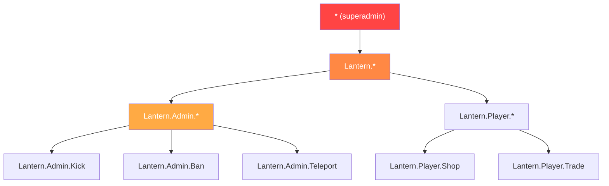

# Permission Systems

> **Summary:** Three access-control architectures for DayZ admin mods — a dot-separated permission hierarchy, named permission groups, and a three-state role tree — plus the server-side checking flow, JSON storage formats, wildcard/superadmin handling, and migration between systems.

---

## Introduction

Every admin tool, every privileged action, and every moderation feature in DayZ needs a permission system. The question is not whether to check permissions but how to structure them. Three architectures cover almost every DayZ admin mod: a dot-separated permission hierarchy, named permission groups, and a three-state role tree. These are the standard access-control shapes (ACL and RBAC) applied to Enforce Script. Each has different trade-offs in granularity, complexity, and server-owner experience.

This chapter covers all three architectures, the permission-checking flow, storage formats, and wildcard/superadmin handling. The example code uses the wiki's teaching framework, **Lantern** (class prefix `LNT_`); the concepts apply to any mod.

---

## Table of Contents

- [Why Permissions Matter](#why-permissions-matter)
- [Dot-Separated Hierarchy (Lantern pattern)](#dot-separated-hierarchy-lantern-pattern)
- [Group-Based Permissions](#group-based-permissions)
- [Three-State Role Trees](#three-state-role-trees)
- [Permission Checking Flow](#permission-checking-flow)
- [Storage Formats](#storage-formats)
- [Wildcard and Superadmin Patterns](#wildcard-and-superadmin-patterns)
- [Migration Between Systems](#migration-between-systems)
- [Best Practices](#best-practices)
- [Compatibility & Impact](#compatibility-impact)
- [Common Mistakes](#common-mistakes)
- [Theory vs Practice](#theory-vs-practice)

---

## Why Permissions Matter

Without a permission system, you have two options: either every player can do everything (chaos), or you hardcode Steam64 IDs in your scripts (unmaintainable). A permission system lets server owners define who can do what, without modifying code.

The three security rules:

1. **Never trust the client.** The client sends a request; the server decides whether to honor it.
2. **Default deny.** If a player is not explicitly granted a permission, they do not have it.
3. **Fail closed.** If the permission check itself fails (null identity, corrupted data), deny the action.

---

## Dot-Separated Hierarchy (Lantern pattern)

Lantern uses dot-separated permission strings organized in a tree hierarchy. Each permission is a path like `"Lantern.Admin.Teleport"` or `"Lantern.Missions.Start"`. Wildcards allow granting entire subtrees. This is the classic ACL (access-control list) shape, one string per capability.

### Permission Format

```
Lantern                          (root namespace)
├── Admin                        (admin tools)
│   ├── Panel                    (open admin panel)
│   ├── Teleport                 (teleport self/others)
│   ├── Kick                     (kick players)
│   ├── Ban                      (ban players)
│   └── Weather                  (change weather)
├── Missions                     (mission system)
│   ├── Start                    (start missions manually)
│   └── Stop                     (stop missions)
└── AI                           (AI system)
    ├── Spawn                    (spawn AI manually)
    └── Config                   (edit AI config)
```

### Data Model

Each player has an array of granted permission strings, keyed by their player identity.

> **Which identity do you key on?** `PlayerIdentity` offers two. Vanilla documents `GetId()` as the "unique id of player (hashed steamID, database Xbox id...)" that "can be used in database or logs", and `GetPlainId()` as the "plaintext unique id of player" that **cannot** be used in database or logs (`3_game/gameplay.c:366-371`). Community Online Tools follows that guidance and keys its permission store on `GetId()`. The examples below use the plaintext id because it is what a server owner can read and type into a JSON file by hand, which is the whole point of a hand-editable permission file -- but if you persist or log identities beyond that file, use `GetId()`, and never write a plaintext id into a log line.

The shape either way:

```c
class LNT_PermissionsData
{
    // key: Steam64 ID, value: array of permission strings
    ref map<string, ref TStringArray> Admins;

    void LNT_PermissionsData()
    {
        Admins = new map<string, ref TStringArray>();
    }
};
```

### Permission Check

The check walks the player's granted permissions and supports three match types: exact match, full wildcard (`"*"`), and prefix wildcard (`"Lantern.Admin.*"`):

```c
bool HasPermission(string plainId, string permission)
{
    if (plainId == "" || permission == "")
        return false;

    TStringArray perms;
    if (!m_Permissions.Find(plainId, perms))
        return false;

    for (int i = 0; i < perms.Count(); i++)
    {
        string granted = perms[i];

        // Full wildcard: superadmin
        if (granted == "*")
            return true;

        // Exact match
        if (granted == permission)
            return true;

        // Prefix wildcard: "Lantern.Admin.*" matches "Lantern.Admin.Teleport"
        if (granted.IndexOf("*") > 0)
        {
            string prefix = granted.Substring(0, granted.Length() - 1);
            if (permission.IndexOf(prefix) == 0)
                return true;
        }
    }

    return false;
}
```

### JSON Storage

```json
{
    "Admins": {
        "76561198000000001": ["*"],
        "76561198000000002": ["Lantern.Admin.Panel", "Lantern.Admin.Teleport"],
        "76561198000000003": ["Lantern.Missions.*"],
        "76561198000000004": ["Lantern.Admin.Kick", "Lantern.Admin.Ban"]
    }
}
```

### Strengths

- **Fine-grained:** you can grant exactly the permissions each admin needs
- **Hierarchical:** wildcards grant entire subtrees without listing every permission
- **Self-documenting:** the permission string tells you what it controls
- **Extensible:** new permissions are just new strings --- no schema changes

### Weaknesses

- **No named roles:** if 10 admins need the same set, you list it 10 times
- **String-based:** typos in permission strings fail silently (they just do not match)

---

## Group-Based Permissions

Instead of granting strings per player, you define named groups (roles), each holding a set of permissions, then assign players to groups. This is textbook RBAC (role-based access control): the permission-to-role mapping is defined once and reused across many players.

### Concept

```
Groups:
  "SuperAdmin"  → [all permissions]
  "Moderator"   → [kick, ban, mute, teleport]
  "Builder"     → [spawn objects, teleport, ESP]

Players:
  "76561198000000001" → "SuperAdmin"
  "76561198000000002" → "Moderator"
  "76561198000000003" → "Builder"
```

### Implementation Pattern

```c
class LNT_UserGroup
{
    string GroupName;
    ref array<string> Permissions;
    ref array<string> Members;  // Steam64 IDs

    bool HasPermission(string permission)
    {
        if (!Permissions) return false;

        for (int i = 0; i < Permissions.Count(); i++)
        {
            if (Permissions[i] == permission)
                return true;
            if (Permissions[i] == "*")
                return true;
        }
        return false;
    }
};

class LNT_GroupManager
{
    ref array<ref LNT_UserGroup> m_Groups;

    bool PlayerHasPermission(string plainId, string permission)
    {
        for (int i = 0; i < m_Groups.Count(); i++)
        {
            LNT_UserGroup group = m_Groups[i];

            // Check if player is in this group
            if (group.Members.Find(plainId) == -1)
                continue;

            if (group.HasPermission(permission))
                return true;
        }
        return false;
    }
};
```

### JSON Storage

```json
{
    "Groups": [
        {
            "GroupName": "SuperAdmin",
            "Permissions": ["*"],
            "Members": ["76561198000000001"]
        },
        {
            "GroupName": "Moderator",
            "Permissions": [
                "admin.kick",
                "admin.ban",
                "admin.mute",
                "admin.teleport"
            ],
            "Members": [
                "76561198000000002",
                "76561198000000003"
            ]
        },
        {
            "GroupName": "Builder",
            "Permissions": [
                "admin.spawn",
                "admin.teleport",
                "admin.esp"
            ],
            "Members": [
                "76561198000000004"
            ]
        }
    ]
}
```

### Strengths

- **Role-based:** define a role once, assign it to many players
- **Familiar:** server owners understand group/role systems from other games
- **Easy bulk changes:** change a group's permissions and all members are updated

### Weaknesses

- **Less granular without extra work:** giving one specific admin one extra permission means creating a new group or adding per-player overrides
- **Group inheritance is extra work:** a flat group list has no native hierarchy (e.g., "Admin" inheriting all "Moderator" permissions), so you either duplicate permissions across groups or layer an inheritance field on top yourself

---

## Three-State Role Trees

The most expressive architecture defines roles as a *tree* of nodes, where each node carries one of three states: **ALLOW**, **DENY**, or **INHERIT**. A node set to INHERIT takes its effective state from its parent. This lets you grant a broad category and then carve out a specific exception underneath it, something neither of the previous two architectures can express.

This is not a theoretical design. Community Online Tools ships it: `JMPermission` holds a `JMPermissionType` of `INHERIT`, `ALLOW` or `DISALLOW` per node, builds each node's full name by joining parent names with dots, and resolves checks against strings such as `"COT.View"` (`JM/COT/Scripts/4_World/CommunityOnlineTools/Classes/PermissionsOld/JMPermission.c:31-101`).

### Concept

Each permission node has a name, an optional list of child nodes, and a state. Players are assigned to a named role by Steam64 ID; resolving a permission walks the tree and folds INHERIT nodes into their parent's state:

```c
class LNT_PermNode
{
    string m_Name;
    ref array<ref LNT_PermNode> m_Children;
    int m_State;  // LNT_PermState.INHERIT, ALLOW, or DENY
};

class LNT_PermState
{
    static const int INHERIT = 0;
    static const int DENY    = 1;
    static const int ALLOW   = 2;
};
```

### Permission Tree

Each node can be explicitly allowed, denied, or left to inherit from its parent:

```
Root
├── Admin [ALLOW]
│   ├── Kick [INHERIT → ALLOW]
│   ├── Ban [INHERIT → ALLOW]
│   └── Teleport [DENY]        ← Explicitly denied even though Admin is ALLOW
└── ESP [ALLOW]
```

This three-state system (allow/deny/inherit) is more expressive than the binary (granted/not-granted) model used by the dot-separated and group-based architectures. It lets you grant a broad category and then carve out exceptions.

### JSON Storage

```json
{
    "Roles": {
        "Moderator": {
            "admin": {
                "kick": 2,
                "ban": 2,
                "teleport": 1
            }
        }
    },
    "Players": {
        "76561198000000001": {
            "Role": "SuperAdmin"
        }
    }
}
```

(Where `2 = ALLOW`, `1 = DENY`, `0 = INHERIT`)

### Strengths

- **Three-state permissions:** allow, deny, inherit gives maximum flexibility
- **Tree structure:** mirrors the hierarchical nature of permission paths
- **Exceptions are cheap:** grant a whole subtree and deny one leaf, no permission-string gymnastics

### Weaknesses

- **Complexity:** three states are harder for server owners to understand than a simple "granted"
- **More resolution logic:** walking the tree and folding INHERIT nodes is more code than a flat array scan

---

## Permission Checking Flow

Regardless of which system you use, the server-side permission check follows the same pattern:

```
Client sends RPC request
        │
        ▼
Server RPC handler receives it
        │
        ▼
    ┌─────────────────────────────────┐
    │ Is sender identity non-null?     │
    │ (Network-level validation)       │
    └───────────┬─────────────────────┘
                │ No → return (drop silently)
                │ Yes ▼
    ┌─────────────────────────────────┐
    │ Does sender have the required    │
    │ permission for this action?      │
    └───────────┬─────────────────────┘
                │ No → log warning, optionally send error to client, return
                │ Yes ▼
    ┌─────────────────────────────────┐
    │ Validate request data            │
    │ (read params, check bounds)      │
    └───────────┬─────────────────────┘
                │ Invalid → send error to client, return
                │ Valid ▼
    ┌─────────────────────────────────┐
    │ Execute the privileged action    │
    │ Log the action with admin ID     │
    │ Send success response            │
    └─────────────────────────────────┘
```

### Implementation

```c
void OnRPC_KickPlayer(PlayerIdentity sender, Object target, ParamsReadContext ctx)
{
    // Step 1: Validate sender
    if (!sender) return;

    // Step 2: Check permission
    if (!LNT_Permissions.GetInstance().HasPermission(sender.GetPlainId(), "Lantern.Admin.Kick"))
    {
        LNT_Log.Warning("Admin", "Unauthorized kick attempt: " + sender.GetName());
        return;
    }

    // Step 3: Read and validate data
    string targetUid;
    if (!ctx.Read(targetUid)) return;

    if (targetUid == sender.GetPlainId())
    {
        // Cannot kick yourself
        SendError(sender, "Cannot kick yourself");
        return;
    }

    // Step 4: Execute
    PlayerIdentity targetIdentity = FindPlayerByUid(targetUid);
    if (!targetIdentity)
    {
        SendError(sender, "Player not found");
        return;
    }

    GetGame().DisconnectPlayer(targetIdentity);

    // Step 5: Log and respond
    LNT_Log.Info("Admin", sender.GetName() + " kicked " + targetIdentity.GetName());
    SendSuccess(sender, "Player kicked");
}
```

---

## Storage Formats

All three systems store permissions in JSON. The differences are structural:

### Flat Per-Player

```json
{
    "Admins": {
        "STEAM64_ID": ["perm.a", "perm.b", "perm.c"]
    }
}
```

**File:** One file for all players.
**Pros:** Simple, easy to edit by hand.
**Cons:** Redundant if many players share the same permissions.

### Per-Player File

```json
// File: $profile:LanternAdmin/Players/76561198xxxxx.json
{
    "UID": "76561198xxxxx",
    "Permissions": ["perm.a", "perm.b"],
    "LastLogin": "2025-01-15 14:30:00"
}
```

**Pros:** Each player is independent; no locking concerns.
**Cons:** Many small files; searching "who has permission X?" requires scanning all files.

### Group-Based

```json
{
    "Groups": [
        {
            "GroupName": "RoleName",
            "Permissions": ["perm.a", "perm.b"],
            "Members": ["STEAM64_ID_1", "STEAM64_ID_2"]
        }
    ]
}
```

**Pros:** Role changes propagate to all members instantly.
**Cons:** A player cannot easily have per-player permission overrides without a dedicated group.

### Choosing a Format

| Factor | Flat Per-Player | Per-Player File | Group-Based |
|--------|----------------|-----------------|-------------|
| **Small server (1-5 admins)** | Best | Overkill | Overkill |
| **Medium server (5-20 admins)** | Good | Good | Best |
| **Large community (20+ roles)** | Redundant | Files multiply | Best |
| **Per-player customization** | Native | Native | Needs workaround |
| **Hand-editing** | Easy | Easy per player | Moderate |

---

## Wildcard and Superadmin Patterns



### Full Wildcard: `"*"`

Grants all permissions. This is the superadmin pattern. A player with `"*"` can do anything.

```c
if (granted == "*")
    return true;
```

**Convention:** `"*"` is the widely recognised spelling for "everything", and it is the one server owners will try first, so prefer it over inventing `"all"`, `"admin"` or `"root"`. It is not universal, though: Community Online Tools has no superadmin string at all, because its three-state tree expresses the same thing by setting a parent node to ALLOW. Document whichever spelling you choose.

### Prefix Wildcard: `"Lantern.Admin.*"`

Grants all permissions that start with `"Lantern.Admin."`. This allows granting an entire subsystem without listing every permission:

```c
// "Lantern.Admin.*" matches:
//   "Lantern.Admin.Teleport"  ✓
//   "Lantern.Admin.Kick"      ✓
//   "Lantern.Admin.Ban"       ✓
//   "Lantern.Missions.Start"  ✗ (different subtree)
```

### Implementation

```c
if (granted.IndexOf("*") > 0)
{
    // "Lantern.Admin.*" → prefix = "Lantern.Admin."
    string prefix = granted.Substring(0, granted.Length() - 1);
    if (permission.IndexOf(prefix) == 0)
        return true;
}
```

### No Negative Permissions (Dot-Separated / Group-Based)

Both the dot-separated and group-based architectures use additive-only permissions. You can grant permissions but not explicitly deny them. If a permission is not in the player's list, it is denied.

The three-state role tree is the exception: its ALLOW/DENY/INHERIT states support explicit denials.

### Superadmin Escape Hatch

Provide a way to check if someone is a superadmin without checking a specific permission. This is useful for bypass logic:

```c
bool IsSuperAdmin(string plainId)
{
    return HasPermission(plainId, "*");
}
```

---

## Migration Between Systems

If your mod needs to support servers migrating from one permission system to another (e.g., from a flat admin UID list to hierarchical permissions), implement automatic migration on load:

```c
void Load()
{
    if (!FileExist(PERMISSIONS_FILE))
    {
        CreateDefaultFile();
        return;
    }

    // Try new format first
    if (LoadNewFormat())
        return;

    // Fall back to legacy format and migrate
    LoadLegacyAndMigrate();
}

void LoadLegacyAndMigrate()
{
    // Read old format: { "AdminUIDs": ["uid1", "uid2"] }
    LegacyPermissionData legacyData = new LegacyPermissionData();
    JsonFileLoader<LegacyPermissionData>.JsonLoadFile(PERMISSIONS_FILE, legacyData);

    // Migrate: each legacy admin becomes a superadmin in the new system
    for (int i = 0; i < legacyData.AdminUIDs.Count(); i++)
    {
        string uid = legacyData.AdminUIDs[i];
        GrantPermission(uid, "*");
    }

    // Save in new format
    Save();
    string migratedCount = legacyData.AdminUIDs.Count().ToString();
    LNT_Log.Info("Permissions", "Migrated " + migratedCount + " admin(s) from legacy format");
}
```

This is the pattern Lantern uses to migrate a server from an original flat `AdminUIDs` array to the hierarchical `Admins` map: every legacy admin is promoted to a superadmin grant (`"*"`), which preserves their existing access while the server owner narrows the permissions later.

---

## Best Practices

1. **Default deny.** If a permission is not explicitly granted, the answer is "no".

2. **Check on the server, never the client.** Client-side permission checks are for UI convenience only (hiding buttons). The server must always re-verify.

3. **Use `"*"` for superadmin.** It is the universal convention. Do not invent `"all"`, `"admin"`, or `"root"`.

4. **Log every denied privileged action.** This is your security audit trail.

5. **Provide a default permissions file with a placeholder.** New server owners should see a clear example:

```json
{
    "Admins": {
        "PUT_STEAM64_ID_HERE": ["*"]
    }
}
```

6. **Namespace your permissions.** Use `"YourMod.Category.Action"` to avoid collisions with other mods.

7. **Support prefix wildcards.** Server owners should be able to grant `"YourMod.Admin.*"` instead of listing every admin permission individually.

8. **Keep the permissions file human-editable.** Server owners will edit it by hand. Use clear key names, one permission per line in the JSON, and document the available permissions somewhere in your mod's documentation.

9. **Implement migration from day one.** When your permission format changes (and it will), automatic migration prevents support tickets.

10. **Sync permissions to the client on connect.** The client needs to know its own permissions for UI purposes (showing/hiding admin buttons). Send a summary on connect; do not send the entire server permissions file.

---

## Compatibility & Impact

- **Multi-Mod:** Each mod can define its own permission namespace (`"ModA.Admin.Kick"`, `"ModB.Build.Spawn"`). The `"*"` wildcard grants superadmin across *all* mods that share the same permission store. If mods use independent permission files, `"*"` only applies within that mod's scope.
- **Load Order:** Permission files are loaded once during server startup. No cross-mod ordering issues as long as each mod reads its own file. If a shared framework manages permissions (as Lantern does for every mod that depends on it), all mods using that framework share the same permission tree.
- **Listen Server:** Permission checks should always run server-side. On listen servers, client-side code may call `HasPermission()` for UI gating (showing/hiding admin buttons), but the server-side check is the authoritative one.
- **Performance:** Permission checks are a string-array linear scan per player. With typical admin counts (1--20 admins, 5--30 permissions each), this is negligible. For extremely large permission sets, consider a `set<string>` instead of an array for O(1) lookups.
- **Migration:** Adding new permission strings is non-breaking --- existing admins simply do not have the new permission until granted. Renaming permissions breaks existing grants silently. Use config versioning to auto-migrate renamed permission strings.

---

## Common Mistakes

| Mistake | Impact | Fix |
|---------|--------|-----|
| Trusting client-sent permission data | Exploited clients send `"I am admin"` and the server believes them; full server compromise | Never read permissions from an RPC payload; always look up `sender.GetPlainId()` in the server-side permission store |
| Missing default deny | A missing permission check grants access to everyone; accidental privilege escalation | Every RPC handler for a privileged action must check `HasPermission()` and return early on failure |
| Typo in permission string fails silently | `"Lantern.Amin.Kick"` (typo) never matches --- admin cannot kick, no error is logged | Define permission strings as `static const` variables; reference the constant, never a raw string literal |
| Sending the full permissions file to the client | Exposes all admin Steam64 IDs and their permission sets to any connected client | Send only the requesting player's own permission list, never the full server file |
| No wildcard support in HasPermission | Server owners must list every single permission per admin; tedious and error-prone | Implement prefix wildcards (`"Lantern.Admin.*"`) and full wildcard (`"*"`) from day one |

---

## Theory vs Practice

| Textbook Says | DayZ Reality |
|---------------|-------------|
| Use RBAC (role-based access control) with group inheritance | Three-state (allow/deny/inherit) trees are the most powerful option, but most mods ship flat per-player grants for simplicity |
| Permissions should be stored in a database | No database access; JSON files in `$profile:` are the only option |
| Use cryptographic tokens for authorization | No crypto libraries in Enforce Script; trust rests on the `PlayerIdentity` the engine hands your RPC handler. Read the id from that object -- never from the RPC payload |
