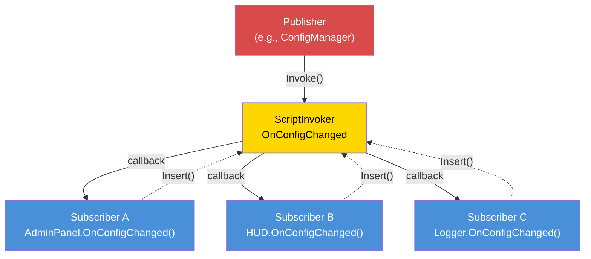

# Event-Driven Architecture


---

## Introduction

Event-driven architecture decouples the producer of an event from its consumers. When a player connects, the connection handler does not need to know about the killfeed, the admin panel, the mission system, or the logging module --- it fires a "player connected" event, and each interested system subscribes independently. This is the foundation of extensible mod design: new features subscribe to existing events without modifying the code that fires them.

DayZ provides `ScriptInvoker` as its built-in event primitive. On top of it, professional mods build event buses with named topics, typed handlers, and lifecycle management. This chapter covers all three major patterns and the critical discipline of memory-leak prevention.

---

## Table of Contents

- [ScriptInvoker Pattern](#scriptinvoker-pattern)
- [EventBus Pattern (String-Routed Topics)](#eventbus-pattern-string-routed-topics)
- [Typed Event-Args Handlers](#typed-event-args-handlers)
- [When to Use Events vs Direct Calls](#when-to-use-events-vs-direct-calls)
- [Memory Leak Prevention](#memory-leak-prevention)
- [Advanced: Custom Event Data](#advanced-custom-event-data)
- [Best Practices](#best-practices)

---

## ScriptInvoker Pattern

`ScriptInvoker` is the engine's built-in pub/sub primitive. It holds a list of function callbacks and invokes all of them when an event fires. This is the lowest-level event mechanism in DayZ.

### Creating an Event

```c
class WeatherManager
{
    // The event. Anyone can subscribe to be notified when weather changes.
    ref ScriptInvoker OnWeatherChanged = new ScriptInvoker();

    protected string m_CurrentWeather;

    void SetWeather(string newWeather)
    {
        m_CurrentWeather = newWeather;

        // Fire the event — all subscribers are notified
        OnWeatherChanged.Invoke(newWeather);
    }
};
```

### Subscribing to an Event

```c
class WeatherUI
{
    void Init(WeatherManager mgr)
    {
        // Subscribe: when weather changes, call our handler
        mgr.OnWeatherChanged.Insert(OnWeatherChanged);
    }

    void OnWeatherChanged(string newWeather)
    {
        // Update the UI
        m_WeatherLabel.SetText("Weather: " + newWeather);
    }

    void Cleanup(WeatherManager mgr)
    {
        // CRITICAL: Unsubscribe when done
        mgr.OnWeatherChanged.Remove(OnWeatherChanged);
    }
};
```

### ScriptInvoker API

| Method | Description |
|--------|-------------|
| `Insert(func)` | Add a callback to the subscriber list |
| `Remove(func)` | Remove a specific callback |
| `Invoke(...)` | Call all subscribed callbacks with the given arguments |
| `Clear()` | Remove all subscribers |

### Event-Driven Pattern



### How Insert/Remove Work

`Insert` adds a function reference to an internal list. `Remove` searches the list and removes matching entries. If you call `Insert` twice with the same function, it will be called twice on every `Invoke`. By default `Remove(fn)` uses `EScriptInvokerRemoveFlags.ALL`, so it removes every matching entry. To remove only the most recent single entry, call `Remove(fn, EScriptInvokerRemoveFlags.NONE)`.

```c
// Subscribing the same handler twice is a bug:
mgr.OnWeatherChanged.Insert(OnWeatherChanged);
mgr.OnWeatherChanged.Insert(OnWeatherChanged);  // Now called 2x per Invoke

// The default ALL flag removes every matching entry:
mgr.OnWeatherChanged.Remove(OnWeatherChanged);
// Called 0x per Invoke — both Inserts are gone.
// To leave one entry, pass NONE:
// mgr.OnWeatherChanged.Remove(OnWeatherChanged, EScriptInvokerRemoveFlags.NONE);
```

### Typed Signatures

`ScriptInvoker` does not enforce parameter types at compile time. The convention is to document the expected signature in a comment:

```c
// Signature: void(string weatherName, float temperature)
ref ScriptInvoker OnWeatherChanged = new ScriptInvoker();
```

If a subscriber has the wrong signature, the behavior is undefined at runtime --- it may crash, receive garbage values, or silently do nothing. Always match the documented signature exactly.

### ScriptInvoker on Vanilla Classes

Many vanilla DayZ classes expose `ScriptInvoker` events:

```c
// DayZPlayer exposes a ScriptInvoker via GetOnDeathStart()
DayZPlayer player = g_Game.GetPlayer();
player.GetOnDeathStart().Insert(OnPlayerDeath);  // Subscribe

// MissionBase has event hooks (virtual methods, not ScriptInvokers)
class MissionBase
{
    void OnUpdate(float timeslice);
    void OnEvent(EventType eventTypeId, Param params);
};
```

You can subscribe to these vanilla events from modded classes to react to engine-level state changes.

---

## EventBus Pattern (String-Routed Topics)

A `ScriptInvoker` is a single event channel. An EventBus is a collection of named channels, providing a central hub where any module can publish or subscribe to events by topic name.

The `LNT_EventBus` used throughout this section is the example bus we build in this chapter — the complete code is shown below, so you can drop it into a minimal mod and run it as-is. `LNT_` is the class prefix of *Lantern*, the wiki's constructed teaching framework; `LNT_ServerModule` and `LNT_Log` are its base module and logger.

### Custom EventBus Pattern

This pattern implements the EventBus as a static class with named `ScriptInvoker` fields for well-known events, plus a generic `OnCustomEvent` channel for ad-hoc topics:

```c
class LNT_EventBus
{
    // Well-known lifecycle events
    static ref ScriptInvoker OnPlayerConnected;      // void(PlayerIdentity)
    static ref ScriptInvoker OnPlayerDisconnected;    // void(PlayerIdentity)
    static ref ScriptInvoker OnPlayerReady;           // void(PlayerBase, PlayerIdentity)
    static ref ScriptInvoker OnConfigChanged;         // void(string modId, string field, string value)
    static ref ScriptInvoker OnAdminPanelToggled;     // void(bool opened)
    static ref ScriptInvoker OnMissionStarted;        // void(int missionId)
    static ref ScriptInvoker OnMissionCompleted;      // void(int missionId, int reason)
    static ref ScriptInvoker OnAdminDataSynced;       // void()

    // Generic custom event channel
    static ref ScriptInvoker OnCustomEvent;           // void(string eventName, Param params)

    protected static bool s_Initialized;

    // Creates all invokers. Safe to call more than once.
    static void Init()
    {
        if (s_Initialized)
            return;

        OnPlayerConnected    = new ScriptInvoker();
        OnPlayerDisconnected = new ScriptInvoker();
        OnPlayerReady        = new ScriptInvoker();
        OnConfigChanged      = new ScriptInvoker();
        OnAdminPanelToggled  = new ScriptInvoker();
        OnMissionStarted     = new ScriptInvoker();
        OnMissionCompleted   = new ScriptInvoker();
        OnAdminDataSynced    = new ScriptInvoker();
        OnCustomEvent        = new ScriptInvoker();

        s_Initialized = true;
    }

    // Nulls all invokers, dropping every subscriber reference at once.
    static void Cleanup()
    {
        OnPlayerConnected    = null;
        OnPlayerDisconnected = null;
        OnPlayerReady        = null;
        OnConfigChanged      = null;
        OnAdminPanelToggled  = null;
        OnMissionStarted     = null;
        OnMissionCompleted   = null;
        OnAdminDataSynced    = null;
        OnCustomEvent        = null;

        s_Initialized = false;
    }

    // Helper to fire a custom event
    static void Fire(string eventName, Param params)
    {
        if (!OnCustomEvent)
            Init();

        OnCustomEvent.Invoke(eventName, params);
    }
};
```

### Subscribing to the EventBus

```c
class LNT_MissionModule : LNT_ServerModule
{
    override void OnInit()
    {
        super.OnInit();

        // Subscribe to player lifecycle
        LNT_EventBus.OnPlayerConnected.Insert(OnPlayerJoined);
        LNT_EventBus.OnPlayerDisconnected.Insert(OnPlayerLeft);

        // Subscribe to config changes
        LNT_EventBus.OnConfigChanged.Insert(OnConfigChanged);
    }

    override void OnMissionFinish()
    {
        // Always unsubscribe on shutdown
        LNT_EventBus.OnPlayerConnected.Remove(OnPlayerJoined);
        LNT_EventBus.OnPlayerDisconnected.Remove(OnPlayerLeft);
        LNT_EventBus.OnConfigChanged.Remove(OnConfigChanged);
    }

    void OnPlayerJoined(PlayerIdentity identity)
    {
        LNT_Log.Info("Missions", "Player joined: " + identity.GetName());
    }

    void OnPlayerLeft(PlayerIdentity identity)
    {
        LNT_Log.Info("Missions", "Player left: " + identity.GetName());
    }

    void OnConfigChanged(string modId, string field, string value)
    {
        if (modId == "Lantern_Missions")
        {
            // Reload our config
            ReloadSettings();
        }
    }
};
```

### Using Custom Events

For one-off or mod-specific events that do not warrant a dedicated `ScriptInvoker` field:

```c
// Publisher (e.g., in the loot system):
LNT_EventBus.Fire("LootRespawned", new Param1<int>(spawnedCount));

// Subscriber (e.g., in a logging module):
LNT_EventBus.OnCustomEvent.Insert(OnCustomEvent);

void OnCustomEvent(string eventName, Param params)
{
    if (eventName == "LootRespawned")
    {
        Param1<int> data;
        if (Class.CastTo(data, params))
        {
            LNT_Log.Info("Loot", "Respawned " + data.param1.ToString() + " items");
        }
    }
}
```

### When to Use Named Fields vs Custom Events

| Approach | Use When |
|----------|----------|
| Named `ScriptInvoker` field | The event is well-known, frequently used, and has a stable signature |
| `OnCustomEvent` + string name | The event is mod-specific, experimental, or used by a single subscriber |

Named fields are type-safe by convention and discoverable by reading the class. Custom events are flexible but require string matching and casting.

---

## Typed Event-Args Handlers

A `ScriptInvoker` carries whatever arguments you `Invoke()` it with, and its signature lives only in a comment. A second pattern trades that raw flexibility for *typed payloads*: instead of firing loose arguments, you fire a single object whose class **is** the event, and subscribers are routed to it by that class. Every event's data lives in a named class you can extend, and adding a field to an event never changes any call signature.

The `LNT_` code below is an original, self-contained implementation you can drop into a minimal mod. Several established DayZ frameworks ship an equivalent typed-args dispatcher; the concept here is the same and depends on nothing but vanilla types.

### Concept

Define a base args class and one subclass per event. The dispatcher keys a `ScriptInvoker` channel by the args type name, so a handler subscribes to a *type*, not a string:

```c
// Base class for all typed event arguments.
class LNT_EventArgs
{
};

// A typed payload — carries the data for a player lifecycle event.
class LNT_PlayerEventArgs : LNT_EventArgs
{
    PlayerBase Player;
    PlayerIdentity Identity;
};

// Routes events to handlers by the runtime type of the args object.
class LNT_TypedEventManager
{
    // One channel per event-args type, keyed by type name.
    protected ref map<string, ref ScriptInvoker> m_Channels;

    void LNT_TypedEventManager()
    {
        m_Channels = new map<string, ref ScriptInvoker>();
    }

    // Subscribe a handler to every event carrying args of the given type.
    // Handler signature: void(LNT_EventArgs)
    void Subscribe(typename argsType, func handler)
    {
        string key = argsType.ToString();
        ScriptInvoker channel = m_Channels.Get(key);
        if (!channel)
        {
            channel = new ScriptInvoker();
            m_Channels.Set(key, channel);
        }
        channel.Insert(handler);
    }

    void Unsubscribe(typename argsType, func handler)
    {
        ScriptInvoker channel = m_Channels.Get(argsType.ToString());
        if (channel)
            channel.Remove(handler);
    }

    // Raise an event — routed by the runtime type of the args object.
    void Raise(LNT_EventArgs args)
    {
        ScriptInvoker channel = m_Channels.Get(args.Type().ToString());
        if (channel)
            channel.Invoke(args);
    }
};
```

A subscriber declares a handler that takes the base args type and casts to the concrete one:

```c
class LNT_JoinAnnouncer
{
    protected ref LNT_TypedEventManager m_Events;

    void Init(LNT_TypedEventManager events)
    {
        m_Events = events;
        m_Events.Subscribe(LNT_PlayerEventArgs, OnPlayerReady);
    }

    void Cleanup()
    {
        if (m_Events)
            m_Events.Unsubscribe(LNT_PlayerEventArgs, OnPlayerReady);
    }

    // Signature: void(LNT_EventArgs)
    void OnPlayerReady(LNT_EventArgs args)
    {
        LNT_PlayerEventArgs playerArgs;
        if (Class.CastTo(playerArgs, args))
        {
            Print("Ready: " + playerArgs.Identity.GetName());
        }
    }
};
```

The producer fills an args object and raises it — it never names any subscriber:

```c
LNT_PlayerEventArgs args = new LNT_PlayerEventArgs();
args.Player = player;
args.Identity = player.GetIdentity();
events.Raise(args);
```

### Key Differences from ScriptInvoker

| Feature | Bare `ScriptInvoker` | Typed Args Manager |
|---------|--------------|-----------------|
| **Type safety** | Convention only (comment) | One class per event; cast on receive |
| **Discovery** | Read comments | Read the args class fields |
| **Subscription** | `Insert()` / `Remove()` on a channel | `Subscribe()` / `Unsubscribe()` by type |
| **Custom data** | Param wrappers | A dedicated args subclass |
| **Adding a field** | Changes every `Invoke`/handler signature | Add a field to the args class; signatures unchanged |

The typed-args approach still requires you to unsubscribe (see [Memory Leak Prevention](#memory-leak-prevention)), but it makes each event's payload a real, extensible type instead of an untyped argument list.

---

## When to Use Events vs Direct Calls

### Use Events When:

1. **Multiple independent consumers** need to react to the same occurrence. Player connects? The killfeed, the admin panel, the mission system, and the logger all care.

2. **The producer should not know about the consumers.** The connection handler should not import the killfeed module.

3. **The set of consumers changes at runtime.** Modules can subscribe and unsubscribe dynamically.

4. **Cross-mod communication.** Mod A fires an event; Mod B subscribes to it. Neither imports the other.

### Use Direct Calls When:

1. **There is exactly one consumer** and it is known at compile time. If only the health system cares about a damage calculation, call it directly.

2. **Return values are needed.** Events are fire-and-forget. If you need a response ("should this action be allowed?"), use a direct method call.

3. **Order matters.** Event subscribers are called in insertion order, but depending on this order is fragile. If step B must happen after step A, call A then B explicitly.

4. **Performance is critical.** Events have overhead (iterating the subscriber list, calling via reflection). For per-frame, per-entity logic, direct calls are faster.

### Decision Guide

```
                    Does the producer need a return value?
                         /                    \
                       YES                     NO
                        |                       |
                   Direct call          How many consumers?
                                       /              \
                                     ONE            MULTIPLE
                                      |                |
                                 Direct call        EVENT
```

---

## Memory Leak Prevention

The single most dangerous aspect of event-driven architecture in Enforce Script is **subscriber leaks**. If an object subscribes to an event and is then destroyed without unsubscribing, one of two things happens:

1. **If the object extends `Managed`:** The weak reference in the invoker is automatically nulled. The invoker will call a null function --- which does nothing, but wastes cycles iterating dead entries.

2. **If the object does NOT extend `Managed`:** The invoker holds a dangling function pointer. When the event fires, it calls into freed memory. **Crash.**

### The Golden Rule

**Every `Insert()` must have a matching `Remove()`.** No exceptions.

### Pattern: Subscribe in OnInit, Unsubscribe in OnMissionFinish

```c
class LNT_Module : LNT_ServerModule
{
    override void OnInit()
    {
        super.OnInit();
        LNT_EventBus.OnPlayerConnected.Insert(HandlePlayerConnect);
    }

    override void OnMissionFinish()
    {
        LNT_EventBus.OnPlayerConnected.Remove(HandlePlayerConnect);
        // Then call super or do other cleanup
    }

    void HandlePlayerConnect(PlayerIdentity identity) { ... }
};
```

### Pattern: Subscribe in Constructor, Unsubscribe in Destructor

For objects with a clear ownership lifecycle:

```c
class PlayerTracker : Managed
{
    void PlayerTracker()
    {
        LNT_EventBus.OnPlayerConnected.Insert(OnPlayerConnected);
        LNT_EventBus.OnPlayerDisconnected.Insert(OnPlayerDisconnected);
    }

    void ~PlayerTracker()
    {
        if (LNT_EventBus.OnPlayerConnected)
            LNT_EventBus.OnPlayerConnected.Remove(OnPlayerConnected);
        if (LNT_EventBus.OnPlayerDisconnected)
            LNT_EventBus.OnPlayerDisconnected.Remove(OnPlayerDisconnected);
    }

    void OnPlayerConnected(PlayerIdentity identity) { ... }
    void OnPlayerDisconnected(PlayerIdentity identity) { ... }
};
```

**Note the null checks in the destructor.** During shutdown, `LNT_EventBus.Cleanup()` may have already run, setting all invokers to `null`. Calling `Remove()` on a `null` invoker crashes.

### Pattern: EventBus Cleanup Nulls Everything

The `LNT_EventBus.Cleanup()` method sets all invokers to `null`, which drops all subscriber references at once. This is the nuclear option --- it guarantees no stale subscribers survive across mission restarts:

```c
static void Cleanup()
{
    OnPlayerConnected    = null;
    OnPlayerDisconnected = null;
    OnConfigChanged      = null;
    // ... all other invokers
    s_Initialized = false;
}
```

This is called from `LanternCore.ShutdownAll()` during `OnMissionFinish`. Modules should still `Remove()` their own subscriptions for correctness, but the EventBus cleanup acts as a safety net.

### No Anonymous Functions

Enforce Script has no anonymous-function (lambda) syntax at all. The
following does **not** compile --- the CParser rejects it. It is shown
only to make the point that the construct does not exist:

```c
// INVALID PSEUDOCODE --- Enforce has no lambdas, this will not compile:
// LNT_EventBus.OnPlayerConnected.Insert(function(PlayerIdentity id) { ... });
```

Because there is no way to write an inline handler, every callback must
be a **named method** you pass by reference. That is also what lets you
unsubscribe later --- you hand the same method to `Remove()`:

```c
// Subscribe with a named method...
LNT_EventBus.OnPlayerConnected.Insert(OnPlayerConnected);

// ...and unsubscribe by passing the exact same method reference:
LNT_EventBus.OnPlayerConnected.Remove(OnPlayerConnected);
```

---

## Advanced: Custom Event Data

For events that carry complex payloads, use `Param` wrappers:

### Param Classes

DayZ provides `Param1<T>` through `Param4<T1, T2, T3, T4>` for wrapping typed data:

```c
// Firing with structured data:
Param2<string, int> data = new Param2<string, int>("AK74", 5);
LNT_EventBus.Fire("ItemSpawned", data);

// Receiving:
void OnCustomEvent(string eventName, Param params)
{
    if (eventName == "ItemSpawned")
    {
        Param2<string, int> data;
        if (Class.CastTo(data, params))
        {
            string className = data.param1;
            int quantity = data.param2;
        }
    }
}
```

### Custom Event Data Class

For events with many fields, create a dedicated data class:

```c
class KillEventData : Managed
{
    string KillerName;
    string VictimName;
    string WeaponName;
    float Distance;
    vector KillerPos;
    vector VictimPos;
};

// Fire:
KillEventData killData = new KillEventData();
killData.KillerName = killer.GetIdentity().GetName();
killData.VictimName = victim.GetIdentity().GetName();
killData.WeaponName = weapon.GetType();
killData.Distance = vector.Distance(killer.GetPosition(), victim.GetPosition());
OnKillEvent.Invoke(killData);
```

---

## Best Practices

1. **Every `Insert()` must have a matching `Remove()`.** Audit your code: search for every `Insert` call and verify it has a corresponding `Remove` in the cleanup path.

2. **Null-check the invoker before `Remove()` in destructors.** During shutdown, the EventBus may have already been cleaned up.

3. **Document event signatures.** Above every `ScriptInvoker` declaration, write a comment with the expected callback signature:
   ```c
   // Signature: void(PlayerBase player, float damage, string source)
   static ref ScriptInvoker OnPlayerDamaged;
   ```

4. **Do not rely on subscriber execution order.** If order matters, use direct calls instead.

5. **Keep event handlers fast.** If a handler needs to do expensive work, schedule it for the next tick rather than blocking all other subscribers.

6. **Use named events for stable APIs, custom events for experiments.** Named `ScriptInvoker` fields are discoverable and documented. String-routed custom events are flexible but harder to find.

7. **Initialize the EventBus early.** Events can fire before `OnMissionStart()`. Call `Init()` during `OnInit()` or use the lazy pattern (check for `null` before `Insert`).

8. **Clean up the EventBus on mission finish.** Null all invokers to prevent stale references across mission restarts.

9. **Never use anonymous functions as event subscribers.** You cannot unsubscribe them.

10. **Prefer events over polling.** Instead of checking "has the config changed?" every frame, subscribe to `OnConfigChanged` and react only when it fires.

---

## Compatibility & Impact

- **Multi-Mod:** Multiple mods can subscribe to the same EventBus topics without conflict. Each subscriber is called independently. However, if one subscriber throws an unrecoverable error (e.g., null reference), subsequent subscribers on that invoker may not execute.
- **Load Order:** Subscription order equals call order on `Invoke()`. Mods that load earlier register first and receive events first. Do not depend on this order --- if execution order matters, use direct calls instead.
- **Listen Server:** On listen servers, events fired from server-side code are visible to client-side subscribers if they share the same static `ScriptInvoker`. Use separate EventBus fields for server-only and client-only events, or guard handlers with `GetGame().IsServer()` / `GetGame().IsClient()`.
- **Performance:** `ScriptInvoker.Invoke()` iterates all subscribers linearly. With 5--15 subscribers per event, this is negligible. Avoid subscribing per-entity (100+ entities each subscribing to the same event) --- use a manager pattern instead.
- **Migration:** `ScriptInvoker` is a stable vanilla API unlikely to change between DayZ versions. Custom EventBus wrappers are your own code and migrate with your mod.

---

## Common Mistakes

| Mistake | Impact | Fix |
|---------|--------|-----|
| Subscribing with `Insert()` but never calling `Remove()` | Memory leak: the invoker holds a reference to the dead object; on `Invoke()`, calls into freed memory (crash) or no-ops with wasted iteration | Pair every `Insert()` with a `Remove()` in `OnMissionFinish` or the destructor |
| Calling `Remove()` on a null EventBus invoker during shutdown | `LNT_EventBus.Cleanup()` may have already nulled the invoker; calling `.Remove()` on null crashes | Always null-check the invoker before `Remove()`: `if (LNT_EventBus.OnPlayerConnected) LNT_EventBus.OnPlayerConnected.Remove(handler);` |
| Double `Insert()` of the same handler | Handler is called twice per `Invoke()`; a default `Remove()` (flag `ALL`) clears every entry at once, removing all subscriptions | Check before inserting, or ensure `Insert()` is only called once (e.g., in `OnInit` with a guard flag) |
| Using anonymous/lambda functions as handlers | Cannot be removed because there is no reference to pass to `Remove()` | Always use named methods as event handlers |
| Firing events with mismatched argument signatures | Subscribers receive garbage data or crash at runtime; no compile-time check | Document the expected signature above every `ScriptInvoker` declaration and match it exactly in all handlers |
