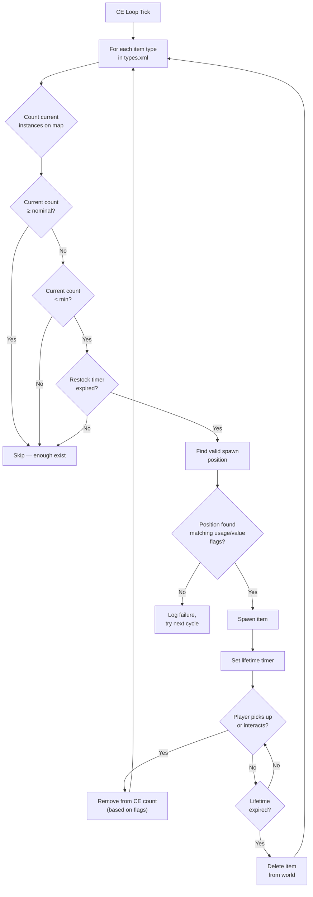

# Loot Economy Deep Dive

> **Summary:** The Central Economy (CE) is the system that controls every item spawn in DayZ -- from a can of beans on a shelf to an AKM in a military barracks. This chapter is the reference for the loot-side CE files: the full spawn cycle, every field in `types.xml`, `globals.xml`, `cfgspawnabletypes.xml`, `cfgrandompresets.xml`, `cfgeconomycore.xml`, and `cfglimitsdefinition.xml`, with real values from the vanilla server files, plus the most common economy mistakes. Dynamic events (`events.xml`) are covered in [Vehicle & Dynamic Event Spawning](05-vehicle-spawning.md).

---

## Table of Contents

- [How the Central Economy Works](#how-the-central-economy-works)
- [The Economy File Set](#the-economy-file-set)
- [The Spawn Cycle](#the-spawn-cycle)
- [types.xml -- Item Spawn Definitions](#typesxml----item-spawn-definitions)
- [globals.xml -- Economy Parameters](#globalsxml----economy-parameters)
- [events.xml -- Dynamic Events](#eventsxml----dynamic-events)
- [cfgspawnabletypes.xml -- Attachments and Cargo](#cfgspawnabletypesxml----attachments-and-cargo)
- [cfgrandompresets.xml -- Reusable Loot Pools](#cfgrandompresetsxml----reusable-loot-pools)
- [cfgeconomycore.xml -- Root Configuration](#cfgeconomycorexml----root-configuration)
- [cfglimitsdefinition.xml -- Flag Definitions](#cfglimitsdefinitionxml----flag-definitions)
- [The Nominal/Restock Relationship](#the-nominalrestock-relationship)
- [Adding Modded Items to the Economy](#adding-modded-items-to-the-economy)
- [Common Economy Mistakes](#common-economy-mistakes)
- [Best Practices](#best-practices)

---

## How the Central Economy Works

The Central Economy (CE) is a server-side system that runs on a continuous loop. Its job is to maintain the world's item population at the levels defined in your configuration files.

The CE does **not** place items when a player enters a building. Instead, it runs on a global timer and spawns items across the entire map, regardless of player proximity. Items have a **lifetime** -- when that timer expires and no player has interacted with the item, the CE removes it. Then, on the next cycle, it detects that the count is below target and spawns a replacement somewhere else.

Key concepts:

- **Nominal** -- the target number of copies of an item that should exist on the map
- **Min** -- the threshold below which the CE will attempt to respawn the item
- **Lifetime** -- how long (in seconds) an untouched item persists before cleanup
- **Restock** -- minimum time (in seconds) before the CE can respawn an item after it was taken/destroyed
- **Flags** -- what counts toward the total (on map, in cargo, in player inventory, in stashes)

The CE runs entirely on the server. Clients have no visibility into CE state, and none of the economy XML files are distributed to clients. Mod code can query and nudge the CE from script -- see [Central Economy Script API](../06-engine-api/10-central-economy.md).

---

## The Economy File Set

All CE files live in the mission folder (e.g., `mpmissions/dayzOffline.chernarusplus/`). The `db/` files are the core database; the `cfg*` files sit at the mission root.

| File | Purpose | Documented In |
|------|---------|---------------|
| `db/types.xml` | Every spawnable item's parameters | this chapter |
| `db/globals.xml` | Global CE parameters (timers, limits) | this chapter |
| `db/events.xml` | Dynamic event definitions (vehicles, crashes, infected, animals) | [Vehicle & Dynamic Event Spawning](05-vehicle-spawning.md) |
| `db/economy.xml` | Subsystem toggle switches | this chapter (see cfgeconomycore) |
| `db/messages.xml` | Scheduled server messages / restart warnings | [Server Configuration](03-server-cfg.md) |
| `cfgeconomycore.xml` | Root classes, defaults, CE logging, custom file registration | this chapter |
| `cfgspawnabletypes.xml` | Per-item attachment, cargo, and spawn-damage rules | this chapter |
| `cfgrandompresets.xml` | Reusable random loot pools | this chapter |
| `cfglimitsdefinition.xml` | All valid category, usage, tag, and value flag names | this chapter |
| `cfgeventspawns.xml` | World coordinates for event spawn positions | [Vehicle & Dynamic Event Spawning](05-vehicle-spawning.md) |
| `cfgplayerspawnpoints.xml` | Fresh spawn locations | [Player Spawning](06-player-spawning.md) |
| `cfgignorelist.xml` | Items excluded from the economy | this chapter |

---

## The Spawn Cycle



In short: the CE counts how many of each item exist, compares against the nominal/min targets, and spawns replacements when the count drops below `min` and the `restock` timer has elapsed.

---

## types.xml -- Item Spawn Definitions

This is the most important economy file. Every item that can spawn in the world needs an entry here. The vanilla `types.xml` for Chernarus contains approximately 23,000 lines covering thousands of items.

### Real types.xml Examples

**Weapon -- AKM**

```xml
<type name="AKM">
    <nominal>3</nominal>
    <lifetime>7200</lifetime>
    <restock>3600</restock>
    <min>2</min>
    <quantmin>30</quantmin>
    <quantmax>80</quantmax>
    <cost>100</cost>
    <flags count_in_cargo="0" count_in_hoarder="0" count_in_map="1" count_in_player="0" crafted="0" deloot="0"/>
    <category name="weapons"/>
    <usage name="Military"/>
    <value name="Tier4"/>
</type>
```

The AKM is a rare, high-tier weapon. Only 3 can exist on the map at once (`nominal`). It spawns in Military buildings in Tier 4 (northwest) areas. When a player picks one up, the CE sees the map count drop below `min=2` and will spawn a replacement after at least 3600 seconds (1 hour). The weapon spawns with 30-80% ammo in its internal magazine (`quantmin`/`quantmax`).

**Food -- BakedBeansCan**

```xml
<type name="BakedBeansCan">
    <nominal>15</nominal>
    <lifetime>14400</lifetime>
    <restock>0</restock>
    <min>12</min>
    <quantmin>-1</quantmin>
    <quantmax>-1</quantmax>
    <cost>100</cost>
    <flags count_in_cargo="0" count_in_hoarder="0" count_in_map="1" count_in_player="0" crafted="0" deloot="0"/>
    <category name="food"/>
    <tag name="shelves"/>
    <usage name="Town"/>
    <usage name="Village"/>
    <value name="Tier1"/>
    <value name="Tier2"/>
    <value name="Tier3"/>
</type>
```

Baked beans are common food. 15 cans should exist at any time. They spawn on shelves in Town and Village buildings across Tiers 1-3 (coast to mid-map). `restock=0` means instant respawn eligibility. `quantmin=-1` and `quantmax=-1` mean the item does not use the quantity system (it is not a liquid or ammo container).

**Clothing -- RidersJacket_Black**

```xml
<type name="RidersJacket_Black">
    <nominal>14</nominal>
    <lifetime>28800</lifetime>
    <restock>0</restock>
    <min>10</min>
    <quantmin>-1</quantmin>
    <quantmax>-1</quantmax>
    <cost>100</cost>
    <flags count_in_cargo="0" count_in_hoarder="0" count_in_map="1" count_in_player="0" crafted="0" deloot="0"/>
    <category name="clothes"/>
    <usage name="Town"/>
    <value name="Tier1"/>
    <value name="Tier2"/>
</type>
```

A common civilian jacket. 14 copies on the map, found in Town buildings near the coast (Tiers 1-2). Lifetime of 28800 seconds (8 hours) means it persists a long time if nobody picks it up.

**Medical -- BandageDressing**

```xml
<type name="BandageDressing">
    <nominal>40</nominal>
    <lifetime>14400</lifetime>
    <restock>0</restock>
    <min>30</min>
    <quantmin>-1</quantmin>
    <quantmax>-1</quantmax>
    <cost>100</cost>
    <flags count_in_cargo="0" count_in_hoarder="0" count_in_map="1" count_in_player="0" crafted="0" deloot="0"/>
    <category name="tools"/>
    <tag name="shelves"/>
    <usage name="Medic"/>
</type>
```

Bandages are very common (40 nominal). They spawn in Medic buildings (hospitals, clinics) across all tiers (no `<value>` tag means all tiers). Note the category is `"tools"`, not `"medical"` -- DayZ does not have a medical category; medical items use the tools category.

**Disabled item (crafted variant)**

```xml
<type name="AK101_Black">
    <nominal>0</nominal>
    <lifetime>28800</lifetime>
    <restock>0</restock>
    <min>0</min>
    <quantmin>-1</quantmin>
    <quantmax>-1</quantmax>
    <cost>100</cost>
    <flags count_in_cargo="0" count_in_hoarder="0" count_in_map="1" count_in_player="0" crafted="1" deloot="0"/>
    <category name="weapons"/>
</type>
```

`nominal=0` and `min=0` means the CE will never spawn this item. `crafted=1` indicates it can only be obtained through crafting (painting a weapon). It still has a lifetime so persisted instances eventually clean up.

### Core Fields

| Field | Type | Range | Description |
|-------|------|-------|-------------|
| `name` | string | -- | Class name of the item. Must exactly match the game's class name. |
| `nominal` | int | 0+ | Target number of this item on the map. Set to 0 to prevent spawning. |
| `min` | int | 0+ | When the count drops to this value or below, the CE will try to spawn more. |
| `lifetime` | int | seconds | How long an untouched item exists before the CE deletes it. |
| `restock` | int | seconds | Minimum cooldown before the CE can spawn a replacement. 0 = immediate. |
| `quantmin` | int | -1 to 100 | Minimum quantity percentage when spawned (ammo %, liquid %). -1 = not applicable. |
| `quantmax` | int | -1 to 100 | Maximum quantity percentage when spawned. -1 = not applicable. |
| `cost` | int | 0+ | Priority weight used during respawn/cleanup. Almost all vanilla items use 100, but a few use higher values (e.g. `Mag_SVD_10Rnd` uses 1000). |

### Flags

```xml
<flags count_in_cargo="0" count_in_hoarder="0" count_in_map="1" count_in_player="0" crafted="0" deloot="0"/>
```

| Flag | Values | Description |
|------|--------|-------------|
| `count_in_map` | 0, 1 | Count items lying on the ground or in building spawn points. **Almost always 1.** |
| `count_in_cargo` | 0, 1 | Count items inside other containers (backpacks, vehicle cargo). |
| `count_in_hoarder` | 0, 1 | Count items inside hoarder containers -- stashes, barrels, tents, buried containers (see the `<hoarder/>` tag in cfgspawnabletypes.xml below). |
| `count_in_player` | 0, 1 | Count items in player inventory (on body or in hands). |
| `crafted` | 0, 1 | When 1, this item is only obtainable through crafting, not CE spawning. |
| `deloot` | 0, 1 | Dynamic Event loot. When 1, the item only spawns at dynamic event locations (helicrashes, etc.). |

**Flag strategy matters.** If `count_in_player=1`, every AKM a player is carrying counts toward the nominal. This means picking up an AKM would not trigger a respawn because the count did not change. Most vanilla items use `count_in_player=0` so that player-held items do not block respawns. The same logic applies to `count_in_hoarder`: with it set to 0, rare items squirreled away in barrels and buried stashes stop counting toward nominal, and the CE keeps spawning fresh copies into the world.

### Tags

| Element | Purpose | Defined In |
|---------|---------|-----------|
| `<category name="..."/>` | Item category for spawn point matching | `cfglimitsdefinition.xml` |
| `<usage name="..."/>` | Building type where this item can spawn | `cfglimitsdefinition.xml` |
| `<value name="..."/>` | Map tier zone where this item can spawn | `cfglimitsdefinition.xml` |
| `<tag name="..."/>` | Spawn position type within a building | `cfglimitsdefinition.xml` |

An item can have **multiple** `<usage>` and `<value>` tags. Multiple usages mean it can spawn in any of those building types. Multiple values mean it can spawn in any of those tiers.

If you omit `<value>` entirely, the item spawns in **all** tiers. If you omit `<usage>`, the item has no valid spawn location and will **not spawn**.

The full lists of valid names live in `cfglimitsdefinition.xml` -- see [below](#cfglimitsdefinitionxml----flag-definitions).

---

## globals.xml -- Economy Parameters

This file controls global CE behavior. Every parameter from the vanilla file:

```xml
<variables>
    <var name="AnimalMaxCount" type="0" value="200"/>
    <var name="CleanupAvoidance" type="0" value="100"/>
    <var name="CleanupLifetimeDeadAnimal" type="0" value="1200"/>
    <var name="CleanupLifetimeDeadInfected" type="0" value="330"/>
    <var name="CleanupLifetimeDeadPlayer" type="0" value="3600"/>
    <var name="CleanupLifetimeDefault" type="0" value="45"/>
    <var name="CleanupLifetimeLimit" type="0" value="50"/>
    <var name="CleanupLifetimeRuined" type="0" value="330"/>
    <var name="FlagRefreshFrequency" type="0" value="432000"/>
    <var name="FlagRefreshMaxDuration" type="0" value="3456000"/>
    <var name="FoodDecay" type="0" value="1"/>
    <var name="IdleModeCountdown" type="0" value="60"/>
    <var name="IdleModeStartup" type="0" value="1"/>
    <var name="InitialSpawn" type="0" value="100"/>
    <var name="LootDamageMax" type="1" value="0.82"/>
    <var name="LootDamageMin" type="1" value="0.0"/>
    <var name="LootProxyPlacement" type="0" value="1"/>
    <var name="LootSpawnAvoidance" type="0" value="100"/>
    <var name="RespawnAttempt" type="0" value="2"/>
    <var name="RespawnLimit" type="0" value="20"/>
    <var name="RespawnTypes" type="0" value="12"/>
    <var name="RestartSpawn" type="0" value="0"/>
    <var name="SpawnInitial" type="0" value="1200"/>
    <var name="TimeHopping" type="0" value="60"/>
    <var name="TimeLogin" type="0" value="15"/>
    <var name="TimeLogout" type="0" value="15"/>
    <var name="TimePenalty" type="0" value="20"/>
    <var name="WorldWetTempUpdate" type="0" value="1"/>
    <var name="ZombieMaxCount" type="0" value="1000"/>
    <var name="ZoneSpawnDist" type="0" value="300"/>
</variables>
```

The `type` attribute indicates data type: `0` = integer, `1` = float, `2` = string. Server mods can also read these values (and custom variables you add) from script via `GetCEApi().GetCEGlobalInt()` -- see [Central Economy Script API](../06-engine-api/10-central-economy.md#reading-globalsxml-from-script).

### Complete Parameter Reference

| Parameter | Type | Default | Description |
|-----------|------|---------|-------------|
| **AnimalMaxCount** | int | 200 | Maximum number of animals alive on the map at once. |
| **CleanupAvoidance** | int | 100 | Distance in meters from a player where the CE will NOT clean up items. Items within this radius are protected from lifetime expiry. |
| **CleanupLifetimeDeadAnimal** | int | 1200 | Seconds before a dead animal corpse is removed. (20 minutes) |
| **CleanupLifetimeDeadInfected** | int | 330 | Seconds before a dead zombie corpse is removed. (5.5 minutes) |
| **CleanupLifetimeDeadPlayer** | int | 3600 | Seconds before a dead player body is removed. (1 hour) |
| **CleanupLifetimeDefault** | int | 45 | Default cleanup time in seconds for items with no specific lifetime. |
| **CleanupLifetimeLimit** | int | 50 | Maximum number of items processed per cleanup cycle. |
| **CleanupLifetimeRuined** | int | 330 | Seconds before ruined items are cleaned up. (5.5 minutes) |
| **FlagRefreshFrequency** | int | 432000 | How often a flag pole must be "refreshed" by interaction to prevent base decay, in seconds. (5 days) |
| **FlagRefreshMaxDuration** | int | 3456000 | Maximum lifetime of a flag pole even with regular refreshing, in seconds. (40 days) |
| **FoodDecay** | int | 1 | Enable (1) or disable (0) food spoilage over time. |
| **IdleModeCountdown** | int | 60 | Seconds before server enters idle mode when no players are connected. |
| **IdleModeStartup** | int | 1 | Whether the server starts in idle mode (1) or active mode (0). |
| **InitialSpawn** | int | 100 | Percentage of nominal values to spawn on first server start (0-100). |
| **LootDamageMax** | float | 0.82 | Maximum damage state for randomly spawned loot (0.0 = pristine, 1.0 = ruined). |
| **LootDamageMin** | float | 0.0 | Minimum damage state for randomly spawned loot. |
| **LootProxyPlacement** | int | 1 | Enable (1) visual placement of items on shelves/tables vs random floor drops. |
| **LootSpawnAvoidance** | int | 100 | Distance in meters from a player where the CE will NOT spawn new loot. Prevents items popping into existence in front of players. |
| **RespawnAttempt** | int | 2 | Number of spawn position attempts per item per CE cycle before giving up. |
| **RespawnLimit** | int | 20 | Maximum number of items the CE will respawn per cycle. |
| **RespawnTypes** | int | 12 | Maximum number of different item types processed per respawn cycle. |
| **RestartSpawn** | int | 0 | When 1, re-randomize all loot positions on server restart. When 0, load from persistence. |
| **SpawnInitial** | int | 1200 | Number of spawn attempts (tests) allowed during the initial economy population -- not a count of items spawned. The amount of loot placed on first start is governed by `InitialSpawn`. |
| **TimeHopping** | int | 60 | Cooldown in seconds preventing a player from reconnecting to the same server (anti-server-hop). |
| **TimeLogin** | int | 15 | Login countdown timer in seconds (the "Please wait" timer when connecting). |
| **TimeLogout** | int | 15 | Logout countdown timer in seconds. Player remains in the world during this time. |
| **TimePenalty** | int | 20 | Extra penalty time in seconds added to logout timer if the player disconnects improperly (Alt+F4). |
| **WorldWetTempUpdate** | int | 1 | Enable (1) or disable (0) world temperature and wetness simulation updates. |
| **ZombieMaxCount** | int | 1000 | Maximum number of zombies alive on the map at once. |
| **ZoneSpawnDist** | int | 300 | Distance in meters from a player at which zombie spawn zones become active. |

### Common Tuning Adjustments

**More loot (PvP server):**
```xml
<var name="InitialSpawn" type="0" value="100"/>
<var name="RespawnLimit" type="0" value="50"/>
<var name="RespawnTypes" type="0" value="30"/>
<var name="RespawnAttempt" type="0" value="4"/>
```

**Longer dead bodies (more time to loot kills):**
```xml
<var name="CleanupLifetimeDeadPlayer" type="0" value="7200"/>
```

**Shorter base decay (wipe stale bases faster):**
```xml
<var name="FlagRefreshFrequency" type="0" value="259200"/>
<var name="FlagRefreshMaxDuration" type="0" value="1728000"/>
```

---

## events.xml -- Dynamic Events

Vehicles, helicopter crashes, animals, infected zones, and other dynamic events do **not** spawn through `types.xml`. They are configured in `db/events.xml` together with `cfgeventspawns.xml` (positions) and `cfgeventgroups.xml` (grouped formations). The full field reference with real vanilla values is in [Vehicle & Dynamic Event Spawning](05-vehicle-spawning.md).

---

## cfgspawnabletypes.xml -- Attachments and Cargo

This file defines what attachments, cargo, and damage state an item has when it spawns. Without an entry here, items spawn empty and at random damage (within `LootDamageMin`/`LootDamageMax` from `globals.xml`).

### Weapon with Attachments -- AKM

```xml
<type name="AKM">
    <damage min="0.45" max="0.85" />
    <attachments chance="0.25">
        <item name="AK_PlasticBttstck" chance="1.00" />
    </attachments>
    <attachments chance="1.00">
        <item name="AK_PlasticHndgrd" chance="1.00" />
    </attachments>
    <attachments chance="0.50">
        <item name="KashtanOptic" chance="0.30" />
        <item name="PSO11Optic" chance="0.20" />
    </attachments>
    <attachments chance="0.05">
        <item name="AK_Suppressor" chance="1.00" />
    </attachments>
    <attachments chance="0.1">
        <item name="Mag_AKM_30Rnd" chance="1.00" />
    </attachments>
</type>
```

Reading this entry:

1. The AKM spawns with damage between 45-85% (worn to badly damaged)
2. It **always** (100%) gets a plastic handguard, but only a 25% chance of a buttstock
3. 50% chance of the optic slot being rolled -- if it is, 30% chance for Kashtan, 20% for PSO-11
4. 5% chance of a suppressor
5. 10% chance of a loaded magazine

Each `<attachments>` block represents one attachment slot. The `chance` on the block is the probability of that slot being populated at all. The `chance` on each `<item>` within is relative selection weight -- the CE picks one item from the list using these as weights.

### Weapon with Attachments -- M4A1

```xml
<type name="M4A1">
    <damage min="0.45" max="0.85" />
    <attachments chance="1.00">
        <item name="M4_OEBttstck" chance="1.00" />
    </attachments>
    <attachments chance="1.00">
        <item name="M4_PlasticHndgrd" chance="1.00" />
    </attachments>
    <attachments chance="1.00">
        <item name="BUISOptic" chance="0.50" />
        <item name="M4_CarryHandleOptic" chance="1.00" />
    </attachments>
    <attachments chance="0.1">
        <item name="Mag_CMAG_40Rnd" chance="0.15" />
        <item name="Mag_CMAG_10Rnd" chance="0.50" />
        <item name="Mag_CMAG_20Rnd" chance="0.70" />
        <item name="Mag_CMAG_30Rnd" chance="1.00" />
    </attachments>
</type>
```

### Vest with Pouches -- PlateCarrierVest_Camo

```xml
<type name="PlateCarrierVest_Camo">
    <damage min="0.1" max="0.6" />
    <attachments chance="0.85">
        <item name="PlateCarrierHolster_Camo" chance="1.00" />
    </attachments>
    <attachments chance="0.85">
        <item name="PlateCarrierPouches_Camo" chance="1.00" />
    </attachments>
</type>
```

### Backpack with Cargo

```xml
<type name="AssaultBag_Ttsko">
    <cargo preset="mixArmy" />
    <cargo preset="mixArmy" />
    <cargo preset="mixArmy" />
</type>
```

The `preset` attribute references a loot pool defined in `cfgrandompresets.xml`. Each `<cargo>` line is one roll -- this backpack gets 3 rolls from the `mixArmy` pool. The pool's own `chance` value determines if each roll actually produces an item.

### Hoarder Containers

```xml
<type name="Barrel_Blue">
    <hoarder />
</type>
<type name="SeaChest">
    <hoarder />
</type>
```

The `<hoarder />` tag marks storage containers -- in vanilla: the four barrel colors, all tents, `SeaChest`, `SmallProtectorCase`, `WoodenCrate`, and `UndergroundStash`. Items stored inside a hoarder container are counted by the CE **only** for types whose `types.xml` entry sets `count_in_hoarder="1"`. For everything else, stashed items silently leave the economy: the CE no longer sees them and keeps spawning fresh copies into the world. This counting behavior is the entire meaning of the tag -- it is how the economy decides whether hoarded loot suppresses respawns or not.

### Spawn Damage Override

```xml
<type name="BandageDressing">
    <damage min="0.0" max="0.0" />
</type>
```

Forces bandages to always spawn in Pristine condition, overriding the global `LootDamageMin`/`LootDamageMax` from `globals.xml`.

---

## cfgrandompresets.xml -- Reusable Loot Pools

Defines named `cargo` and `attachments` pools that `cfgspawnabletypes.xml` references via the `preset` attribute. A real vanilla example:

```xml
<randompresets>
    <cargo chance="0.15" name="foodHermit">
        <item name="TunaCan" chance="0.11" />
        <item name="SardinesCan" chance="0.11" />
        <item name="Apple" chance="0.07" />
    </cargo>
</randompresets>
```

How a roll works:

1. A `<cargo preset="foodHermit"/>` line in `cfgspawnabletypes.xml` triggers one roll.
2. The pool's own `chance` (here 0.15) decides whether the roll produces anything at all.
3. If it does, one item is picked from the list using the per-item `chance` values as relative weights.

Because presets are shared, one edit rebalances every container that references the pool. Vanilla uses this heavily: `mixArmy`, `foodVillage`, `toolsTools`, and dozens of other pools feed backpacks, wrecks, and infected inventories.

---

## cfgeconomycore.xml -- Root Configuration

Root-level CE configuration at the mission root. It defines the **root classes** the economy recognizes, default toggles (including CE logging), and optionally registers custom economy files. The vanilla Chernarus file:

```xml
<economycore>
    <classes>
        <rootclass name="DefaultWeapon" />
        <rootclass name="DefaultMagazine" />
        <rootclass name="Inventory_Base" />
        <rootclass name="HouseNoDestruct" reportMemoryLOD="no" />
        <rootclass name="SurvivorBase" act="character" reportMemoryLOD="no" />
        <rootclass name="DZ_LightAI" act="character" reportMemoryLOD="no" />
        <rootclass name="CarScript" act="car" reportMemoryLOD="no" />
        <rootclass name="BoatScript" act="car" reportMemoryLOD="no" />
    </classes>
    <defaults>
        <default name="dyn_radius" value="30" />
        <default name="dyn_smin" value="0" />
        <default name="dyn_smax" value="0" />
        <default name="dyn_dmin" value="1" />
        <default name="dyn_dmax" value="5" />
        <default name="log_ce_loop" value="false"/>
        <default name="log_ce_dynamicevent" value="false"/>
        <default name="log_ce_vehicle" value="false"/>
        <default name="log_ce_lootspawn" value="false"/>
        <default name="log_ce_lootcleanup" value="false"/>
        <default name="log_ce_lootrespawn" value="false"/>
        <default name="log_ce_statistics" value="false"/>
        <default name="log_ce_zombie" value="false"/>
        <default name="log_storageinfo" value="false"/>
        <default name="log_hivewarning" value="true"/>
        <default name="log_missionfilewarning" value="true"/>
        <default name="save_events_startup" value="true"/>
        <default name="save_types_startup" value="true"/>
    </defaults>
</economycore>
```

Notes:

- **Root classes** tell the CE which config base classes it should track. Character-like roots need `act="character"`, movable vehicles need `act="car"`.
- The `log_ce_*` defaults switch on per-subsystem CE logging -- invaluable when debugging why an item does not spawn.
- The core CE files (`types.xml`, `events.xml`, `globals.xml`) live in `db/` by built-in convention; vanilla does not point at them from here.

### Registering Custom Economy Files

The `<ce>` element (supported since game update 1.08) registers **additional** CE files so mods and admins can append to the economy without editing the vanilla files:

```xml
<economycore>
    <!-- classes and defaults as above -->
    <ce folder="custom">
        <file name="np_types.xml" type="types" />
        <file name="np_spawnabletypes.xml" type="spawnabletypes" />
    </ce>
</economycore>
```

- `folder` names a directory inside the mission folder holding your custom XML.
- Each `<file>` entry appends to (or overrides matching entries of) the corresponding vanilla file. Valid `type` values: `types`, `spawnabletypes`, `globals`, `economy`, `events`, `messages`.
- Multiple `<ce>` blocks are allowed, so each mod can ship its own folder of economy files.

This is the cleanest way to add modded items to the economy -- your additions survive vanilla mission updates because the stock files stay untouched.

---

## cfglimitsdefinition.xml -- Flag Definitions

Defines every valid `category`, `tag`, `usage`, and `value` name that `types.xml` may reference. The complete vanilla Chernarus file:

```xml
<lists>
    <categories>
        <category name="tools"/>
        <category name="containers"/>
        <category name="clothes"/>
        <category name="lootdispatch"/>
        <category name="food"/>
        <category name="weapons"/>
        <category name="books"/>
        <category name="explosives"/>
    </categories>
    <tags>
        <tag name="floor"/>
        <tag name="shelves"/>
        <tag name="ground"/>
    </tags>
    <usageflags>
        <usage name="Military"/>
        <usage name="Police"/>
        <usage name="Medic"/>
        <usage name="Firefighter"/>
        <usage name="Industrial"/>
        <usage name="Farm"/>
        <usage name="Coast"/>
        <usage name="Town"/>
        <usage name="Village"/>
        <usage name="Hunting"/>
        <usage name="Office"/>
        <usage name="School"/>
        <usage name="Prison"/>
        <usage name="Lunapark"/>
        <usage name="SeasonalEvent"/>
        <usage name="ContaminatedArea"/>
        <usage name="Historical"/>
    </usageflags>
    <valueflags>
        <value name="Tier1"/>
        <value name="Tier2"/>
        <value name="Tier3"/>
        <value name="Tier4"/>
        <value name="Unique"/>
    </valueflags>
</lists>
```

Using a name in `types.xml` that is not defined here causes the entry to be rejected (watch the server log for CE warnings).

### User Flag Groups -- cfglimitsdefinitionuser.xml

`cfglimitsdefinitionuser.xml` defines **named combinations** of usage/value flags, so common groupings get one label:

```xml
<user_lists>
    <usageflags>
        <user name="TownVillage">
            <usage name="Town" />
            <usage name="Village" />
        </user>
    </usageflags>
    <valueflags>
        <user name="Tier12">
            <value name="Tier1" />
            <value name="Tier2" />
        </user>
    </valueflags>
</user_lists>
```

A `types.xml` entry can then use `<usage user="TownVillage"/>` instead of listing both flags. Mods that introduce new usage or value flags register them in these files (append via the same mechanism described for custom economy files above, or edit the mission copy).

---

## The Nominal/Restock Relationship

Understanding how `nominal`, `min`, and `restock` work together is critical for tuning your economy.

### The Math

```
IF (current_count < min) AND (time_since_last_spawn > restock):
    spawn new item (up to nominal)
```

**Example with the AKM:**
- `nominal = 3`, `min = 2`, `restock = 3600`
- Server starts: CE spawns 3 AKMs across the map
- Player picks up 1 AKM: map count drops to 2
- Count (2) is NOT less than min (2), so no respawn yet
- Player picks up another AKM: map count drops to 1
- Count (1) IS less than min (2), and restock timer (3600s = 1 hour) starts
- After 1 hour, CE spawns 2 new AKMs to reach nominal (3) again

**Example with BakedBeansCan:**
- `nominal = 15`, `min = 12`, `restock = 0`
- Player eats a can: map count drops to 14
- Count (14) is NOT less than min (12), so no respawn
- 3 more cans eaten: count drops to 11
- Count (11) IS less than min (12), restock is 0 (instant)
- Next CE cycle: spawns 4 cans to reach nominal (15)

### Key Insights

- **Gap between nominal and min** determines how many items can be "consumed" before the CE reacts. A small gap (like AKM: 3/2) means the CE reacts after just 2 pickups. A large gap means more items can leave the economy before respawn kicks in.

- **restock = 0** makes respawning effectively instant (next CE cycle). High restock values create scarcity -- the CE knows it needs to spawn more but must wait.

- **Lifetime** is independent of nominal/min. Even if the CE has spawned an item to reach nominal, the item will be deleted when its lifetime expires if nobody touches it. This creates a constant "churn" of items appearing and disappearing across the map.

- Items that players pick up but later drop (in a different location) still count if the relevant flag is set. A dropped AKM on the ground still counts toward the map total because `count_in_map=1`.

---

## Adding Modded Items to the Economy

The full workflow for making a custom item spawn naturally:

1. **Define the item class** in your mod's `config.cpp` under `CfgVehicles` (see [config.cpp Structure](../02-mod-structure/02-config-cpp.md)).
2. **Add a `<type>` entry** with `nominal`, `min`, `lifetime`, `usage`, and `value` -- ideally in a custom file registered through `cfgeconomycore.xml` rather than by editing the vanilla `types.xml`.
3. **Optionally add attachment/cargo rules** in a custom `spawnabletypes` file.
4. **If you need new usage/value flags**, define them in `cfglimitsdefinition.xml` / `cfglimitsdefinitionuser.xml`.
5. **Restart the server** -- CE changes only take effect on restart.

**Disabling an unwanted item** works the other way around -- set its counts to zero:

```xml
<type name="UnwantedItem">
    <nominal>0</nominal>
    <min>0</min>
    <!-- rest of the entry unchanged -->
</type>
```

---

## Common Economy Mistakes

### Item Has a types.xml Entry But Does Not Spawn

**Check in order:**

1. Is `nominal` greater than 0?
2. Does the item have at least one `<usage>` tag? (No usage = no valid spawn location)
3. Is the `<usage>` tag defined in `cfglimitsdefinition.xml`?
4. Is the `<value>` tag (if present) defined in `cfglimitsdefinition.xml`?
5. Is the `<category>` tag valid?
6. Is the item listed in `cfgignorelist.xml`? (Items there are blocked)
7. Is the `crafted` flag set to 1? (Crafted items never spawn naturally)
8. Is `RestartSpawn` in `globals.xml` set to 0 with existing persistence? (Old persistence may block new items from spawning until a wipe)

### Items Spawn But Immediately Disappear

The `lifetime` value is too low. A lifetime of 45 seconds (the `CleanupLifetimeDefault`) means the item is cleaned up almost immediately. Weapons should have lifetimes of 7200-28800 seconds.

### Too Many/Too Few of an Item

Adjust `nominal` and `min` together. If you set `nominal=100` but `min=1`, the CE will not spawn replacements until 99 items have been taken. If you want a steady supply, keep `min` close to `nominal` (e.g., `nominal=20, min=15`).

### Items Only Spawn in One Area

Check your `<value>` tags. If an item only has `<value name="Tier4"/>`, it will only spawn in the northwest military area of Chernarus. Add more tiers to spread it across the map:

```xml
<value name="Tier1"/>
<value name="Tier2"/>
<value name="Tier3"/>
<value name="Tier4"/>
```

### Modded Items Not Spawning

When adding items from a mod to the economy:

1. Make sure the mod is loaded (listed in the `-mod=` parameter)
2. Verify the class name is **exactly** correct (case-sensitive)
3. Add the item's category/usage/value tags -- just having a `types.xml` entry is not enough
4. If the mod adds new usage or value tags, add them to `cfglimitsdefinitionuser.xml`
5. Check the script log for warnings about unknown class names

### Vehicle Parts Not Spawning Inside Vehicles

Vehicle parts spawn through `cfgspawnabletypes.xml`, not `types.xml`. If a vehicle spawns without wheels or a battery, check that the vehicle has an entry in `cfgspawnabletypes.xml` with the appropriate attachment definitions.

### All Loot is Pristine or All Loot is Ruined

Check `LootDamageMin` and `LootDamageMax` in `globals.xml`. Vanilla values are `0.0` and `0.82`. Setting both to `0.0` makes everything pristine. Setting both to `1.0` makes everything ruined. Also check per-item overrides in `cfgspawnabletypes.xml`.

### Economy Feels "Stuck" After Editing types.xml

After editing economy files, do one of:
- Delete `storage_1/` for a full wipe and fresh economy start
- Set `RestartSpawn` to `1` in `globals.xml` for one restart to re-randomize loot, then set it back to `0`
- Wait for item lifetimes to expire naturally (can take hours)

---

## Best Practices

- **Set `count_in_hoarder="1"` for high-value items.** Without this flag, players can hoard rare weapons in stashes without reducing the world spawn count, effectively multiplying the item's presence on the server.
- **Keep `restock` at 0 for most items.** Non-zero restock values delay respawning after an item is picked up. Use it only for items that should not immediately reappear (e.g., rare military gear).
- **Register custom files through `cfgeconomycore.xml`** instead of editing `types.xml` directly. Your changes survive vanilla mission updates and stay diffable per mod.
- **Test nominal/min ratios on a live server with players.** Static testing does not reveal real CE behavior. Items interact with player movement patterns, container storage, and cleanup timers in ways that are only visible under real load.
- **Always define new items in both `config.cpp` and the economy files.** A config entry without a types entry means the item never spawns naturally. A types entry without a config class causes CE errors in the log.
- **Use `cfgspawnabletypes.xml` to create weapon variety.** Instead of spawning naked weapons, define attachment presets so players find weapons with random stocks, handguards, and magazines -- this dramatically improves loot quality perception.
- **Watch collisions between mods.** If two loaded economy files define the same `<type name="">`, the last one loaded wins. Use unique class names, and merge community-server economy files deliberately.
- **Keep nominals realistic.** High `nominal` values (200+) across many types strain the CE's periodic scans, which scale with the total tracked entity count -- 5-20 for weapons and 20-100 for common items is the vanilla ballpark.
